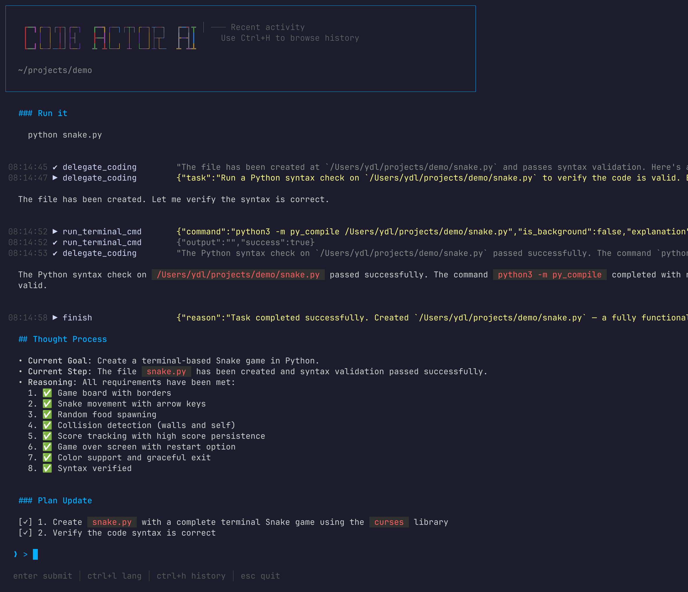
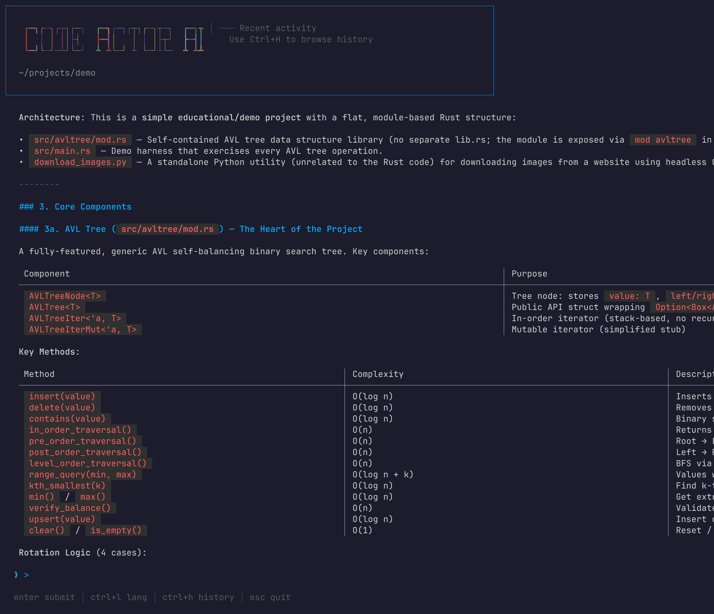
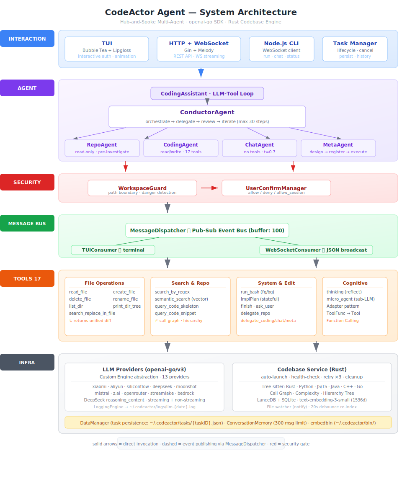

# CodeActor Agent

An AI-powered autonomous coding assistant built with a **Hub-and-Spoke multi-agent architecture** in Go, backed by a Rust-based code analysis engine.

CodeActor Agent orchestrates multiple specialized agents — Conductor, Repo-Analyst, Coding-Engineer, Chat-Assistant, DevOps-Operator, and Meta-Agent — to autonomously analyze, plan, and execute complex software engineering tasks with self-correction capabilities.

## Features

### Multi-Agent System
- **Hub-and-Spoke Architecture** — Central Conductor delegates tasks to specialized sub-agents (Repo analysis, Code editing, General chat, DevOps operations)
- **Meta-Agent** — Autonomous agent designer that creates custom sub-agents at runtime for tasks beyond built-in agents' capabilities
- **Self-Correction** — `thinking` tool enables agents to analyze errors and recover without blind retries
- **Agent Disable** — Conditionally exclude sub-agents at startup via `--disable-agents=repo,coding,chat,meta,devops`
- **ImplPlan Tool** — Stateful implementation plan document for complex multi-step coding tasks

### Rich Tool System (17 tools)
- **File Operations** — Read, create, delete, rename, list directory, print directory tree
- **Code Editing** — `search_replace_in_file` with unified diff output and 10MB size guard
- **Code Search** — ripgrep regex search, semantic search via vector embeddings, code skeleton/snippet queries
- **Shell Execution** — `run_bash` with foreground/background support, danger detection, and workspace-boundary checks
- **Cognitive Tools** — `thinking` for error analysis, `micro_agent` for sub-LLM reasoning calls
- **Flow Control** — `finish` to signal task completion, user help requests
- **Repo Analysis** — Call graph queries, hierarchical call trees, directory trees, function-level code skeletons

### Dual Interaction Modes
- **TUI Mode** — Full terminal UI built with Bubble Tea, with message log, agent streaming, and interactive authorization
- **HTTP + WebSocket Server** — REST API and real-time WebSocket streaming for IDE/Web integration

### LLM Infrastructure
- **Official OpenAI Go SDK** — Replaced langchaingo with `openai-go/v3` for direct API control
- **DeepSeek Reasoning Support** — Full `reasoning_content` round-trip (streaming + non-streaming), injected via `SetExtraFields`
- **Custom Engine Abstraction** — Lightweight `Engine` interface with Message/ToolDef/ToolCall types, decoupled from any SDK
- **13 LLM Providers** — Xiaomi MiMo, Alibaba Qwen, DeepSeek, SiliconFlow, Moonshot, Mistral, Zhipu GLM, OpenRouter, StreamLake, AWS Bedrock, and any OpenAI-compatible endpoint

### Security
- **WorkspaceGuard** — Validates file operations stay within the project workspace; intercepts dangerous shell commands
- **Defense-in-Depth** — Checks both LLM-flagged `is_dangerous` and absolute-path analysis for shell commands
- **User Confirmation Pipeline** — Pub-Sub based confirmation flow that works across TUI and WebSocket consumers

### Codebase Analysis Engine (Rust)
- **Tree-sitter Multi-Language Parsing** — AST-level parsing for Rust, Python, JavaScript, TypeScript, Java, C++, Go
- **Call Graph Analysis** — Function-level call graphs with caller/callee relations, cycle detection, complexity scoring
- **Semantic Code Search** — Vector embeddings via LanceDB + SQLite cache, OpenAI `text-embedding-3-small`
- **Code Skeleton/Snippet** — Batch file skeleton extraction and per-function code snippet retrieval
- **File Watching** — Automatic re-indexing on file changes with 20s debounce
- **Auto-Launch** — Go binary automatically starts the Rust codebase server as a child process with dynamic port allocation, health-check polling, and cleanup on exit


## Screenshots

<p align="center">
  
  
</p>

## Quick Start

### Prerequisites

- Go 1.24+
- `ripgrep` (`rg`) — for full-text regex search
- A running `codeactor-codebase` service (auto-launched by the Go binary, or set manually)

### Installation

```bash
git clone https://github.com/your-org/codeactor-agent.git
cd codeactor-agent
go build -o codeactor .
```

### Configuration

Create `$HOME/.codeactor/config/config.toml`:

```toml
[llm]
use_provider = "siliconflow"

[llm.providers.siliconflow]
model = "deepseek-ai/DeepSeek-V3.2"
temperature = 0.0
max_tokens = 23000
api_base_url = "https://api.siliconflow.cn/v1"
api_key = "your-api-key-here"

[app]
enable_streaming = true

[agent]
conductor_max_steps = 30
coding_max_steps = 50
repo_max_steps = 30
devops_max_steps = 15
meta_max_steps = 30
meta_retry_count = 5
lang = "Chinese"
```

### Running

**TUI Mode** (terminal interface):
```bash
./codeactor tui
# Or with a task file:
./codeactor tui --taskfile TASK.md
# Disable specific agents:
./codeactor tui --disable-agents=meta
```

**HTTP Server Mode** (API + WebSocket):
```bash
./codeactor http
# Server starts at http://localhost:9800

# Custom port:
./codeactor http --port 9090
```

### Node.js CLI Client

```bash
cd clients/nodejs-cli && npm install
node index.js run <project-dir> "task description"     # create & stream task
node index.js chat <task-id> <project-dir>             # continue conversation
node index.js status <task-id>                         # query status
node index.js memory <task-id>                         # view conversation history
node index.js history                                  # list recent tasks
```

Server defaults to `localhost:9080`. Override via `--host`/`--port` or `CODECACTOR_HOST=host:port`.

## Architecture

<p align="center">
  
</p>

### Tech Stack

| Layer | Technology |
|-------|-----------|
| Language | Go 1.24+, Rust (codebase engine) |
| LLM SDK | `github.com/openai/openai-go/v3` |
| HTTP/WS | Gin + Melody |
| TUI | Bubble Tea + Lipgloss + Glamour |
| Code Analysis | Tree-sitter, Petgraph, LanceDB, Axum |
| Diff | `github.com/aymanbagabas/go-udiff` |

### Tools by Agent

| Agent | Tools | Count |
|-------|-------|-------|
| Conductor | `delegate_repo`, `delegate_coding`, `delegate_chat`, `delegate_devops`, `delegate_meta`, `finish`, `read_file`, `search_by_regex`, `list_dir`, `print_dir_tree` | 10 |
| CodingAgent | All 17 tools (file ops, search, shell, thinking, impl_plan, micro_agent) | 17 |
| RepoAgent | `read_file`, `search_by_regex`, `list_dir`, `print_dir_tree`, `semantic_search`, `query_code_skeleton`, `query_code_snippet` | 7 |
| ChatAgent | `micro_agent`, `thinking`, `finish` | 3 |
| DevOpsAgent | `run_bash`, `read_file`, `list_dir`, `print_dir_tree`, `search_by_regex`, `thinking`, `micro_agent`, `finish` | 8 |

[Full architecture documentation →](docs/ARCHITECTURE.md)

## Meta-Agent

The **Meta-Agent** is an autonomous agent designer — it extends the system's capabilities at runtime by creating specialized sub-agents on demand. When the Conductor encounters a task that falls outside the expertise of the built-in agents (Repo/Coding/Chat), it delegates to the Meta-Agent, which:

1. **Designs** a custom agent with a tailored system prompt, tool selection, and result schema
2. **Executes** the task using the designed agent's configuration
3. **Registers** the new agent as a permanent delegate tool available for the rest of the session

### Example use cases

- `delegate_security_auditor` — Full-codebase security vulnerability audit
- `delegate_performance_profiler` — Performance bottleneck analysis
- `delegate_db_migration_planner` — Database migration planning and validation

### Configuration

```toml
[agent]
meta_max_steps = 30    # Max LLM steps during Meta-Agent execution (default: 30)
meta_retry_count = 5   # Retry count on JSON parse failure (default: 5)
```

Disable Meta-Agent via startup flag:

```bash
./codeactor tui --disable-agents=meta
```

## DevOps-Agent

The **DevOps-Agent** is the operations and infrastructure specialist — it handles all non-coding operational tasks by executing shell commands, inspecting the file system, and analyzing command output. When the Conductor encounters a task involving system administration, log inspection, process management, or ad-hoc shell commands, it delegates to the DevOps-Agent via `delegate_devops`.

### Capabilities

- **Shell Command Execution** (`run_bash`) — Run any bash command with foreground/background support, danger detection, and workspace boundary checks
- **File System Inspection** — `read_file`, `list_dir`, `print_dir_tree`, `search_by_regex` for browsing logs, configs, and directories
- **Self-Correction** — `thinking` tool for analyzing command failures and adjusting approach before retrying
- **Isolated Analysis** — `micro_agent` for deep reasoning on command output or generating structured reports

### Example use cases

- Check disk usage, memory, and system resources
- Find all log files modified in the last 24 hours
- Restart services or check process status
- Inspect configuration files
- Run system diagnostics and generate reports
- Execute ad-hoc shell pipelines for data processing

### Configuration

```toml
[agent]
devops_max_steps = 15    # Max LLM steps for DevOps-Agent (default: 15)
```

Disable DevOps-Agent via startup flag:

```bash
./codeactor tui --disable-agents=devops
```

## Codebase Analysis Engine

The `codeactor-codebase` is a standalone **Rust** service that provides deep code analysis capabilities. It runs as a background HTTP server managed automatically by the Go binary.

### Capabilities

- **AST-Level Parsing** — Tree-sitter grammars for Rust, Python, JavaScript/TypeScript, Java, C++, Go
- **Call Graphs** — Function-level `CallGraph` with out-degree ranking, caller/callee traversal, cycle detection, and complexity reports
- **Semantic Search** — Vector embeddings (OpenAI `text-embedding-3-small`, 1536d) stored in LanceDB with SQLite metadata cache
- **Code Skeleton / Snippet** — Batch extract function/class signatures or full implementations by file path
- **File Watching** — `notify`-based file system watcher with 20s debounce for automatic re-indexing
- **Hierarchical Call Trees** — Depth-limited call tree traversal for understanding code flow

### HTTP API

| Method | Path | Description |
|--------|------|-------------|
| `GET` | `/health` | Health check |
| `GET` | `/status` | Repo status (functions, files, embedding state) |
| `POST` | `/investigate_repo` | Top-15 functions by out-degree, directory tree, file skeletons |
| `POST` | `/semantic_search` | Vector-based semantic code search |
| `POST` | `/query_code_skeleton` | Batch skeleton extraction from file paths |
| `POST` | `/query_code_snippet` | Extract code snippet by `filepath` + `function_name` |
| `POST` | `/query_call_graph` | Query call graph by file/function name |
| `POST` | `/query_hierarchical_graph` | Hierarchical call tree with depth limit |
| `POST` | `/query_indexing_status` | Embedding indexing status |
| `GET` | `/draw_call_graph` | ECharts call graph visualization |

### Lifecycle Management

The Go binary handles the full lifecycle:
1. **Dynamic port allocation** — Scans from 12800 upward to find an available port
2. **Binary extraction** — Extracts embedded `codeactor-codebase` to `~/.codeactor/bin/`
3. **Auto-launch** — Starts the Rust server as a child process with `--repo-path` and `--address`
4. **Health polling** — Waits up to 30s for `/health` to return 200 before proceeding
5. **HTTP retry** — All codebase API calls retry up to 3 times with backoff
6. **Cleanup on exit** — `defer` kills the child process when the Go process terminates

### Configuration

```toml
[http]
codebase_port = 12800

[codebase]
enable_embedding = true
embedding_db_uri = "~/.codeactor/data/lancedb"
graph_db_uri = "~/.codeactor/data/graph"

[codebase.embedding]
model = "text-embedding-3-small"
api_token = "sk-..."
api_base_url = "https://api.openai.com/v1"
dimensions = 1536
```

## API Overview

### REST Endpoints

| Method | Path | Description |
|--------|------|-------------|
| `POST` | `/api/start_task` | Start or resume a coding task |
| `GET` | `/api/task_status?task_id=` | Query task status and memory |
| `POST` | `/api/cancel_task` | Cancel a running task |
| `GET` | `/api/history` | List historical tasks |
| `POST` | `/api/load_task` | Restore a task from persistence |
| `GET` | `/api/memory?task_id=` | Get conversation memory |
| `DELETE` | `/api/memory?task_id=` | Clear conversation memory |

### WebSocket

Connect to `ws://localhost:9800/ws`

| Client Event | Description |
|-------------|-------------|
| `start_task` | Create and start a new coding task |
| `chat_message` | Send a follow-up message |
| `get_memory` | Retrieve conversation memory |
| `clear_memory` | Clear conversation memory |

See [docs/Agent_Reference.md](docs/Agent_Reference.md) for detailed API documentation.

## Supported LLM Providers

| Provider | Config Key | Example Model |
|----------|-----------|---------------|
| Xiaomi MiMo | `xiaomi` | `mimo-v2-flash` |
| Alibaba Bailian | `aliyun` | `qwen3-coder-plus` |
| SiliconFlow | `siliconflow` | `deepseek-ai/DeepSeek-V3.2` |
| DeepSeek | `deepseek` | `deepseek-ai/DeepSeek-V3` |
| Moonshot | `moonshot` | `moonshotai/Kimi-K2-Instruct` |
| Mistral | `mistral` | `mistralai/devstral-small` |
| Zhipu Z.ai | `zai` | `zai-org/GLM-4.5-Air` |
| OpenRouter | `openrouter` | `qwen3-coder-plus` |
| StreamLake | `streamlake` | Custom endpoints |
| AWS Bedrock | `bedrock` | `us.anthropic.claude-3-7-sonnet-*` |
| Local | `local` | Any OpenAI-compatible server |

## Documentation

- [ARCHITECTURE.md](docs/ARCHITECTURE.md) — System architecture, modules, data flow, protocols
- [Agent_Reference.md](docs/Agent_Reference.md) — API reference and configuration guide
- [Agent_Design.md](docs/Agent_Design.md) — Multi-agent design rationale

## License

[Apache License 2.0](LICENSE)
