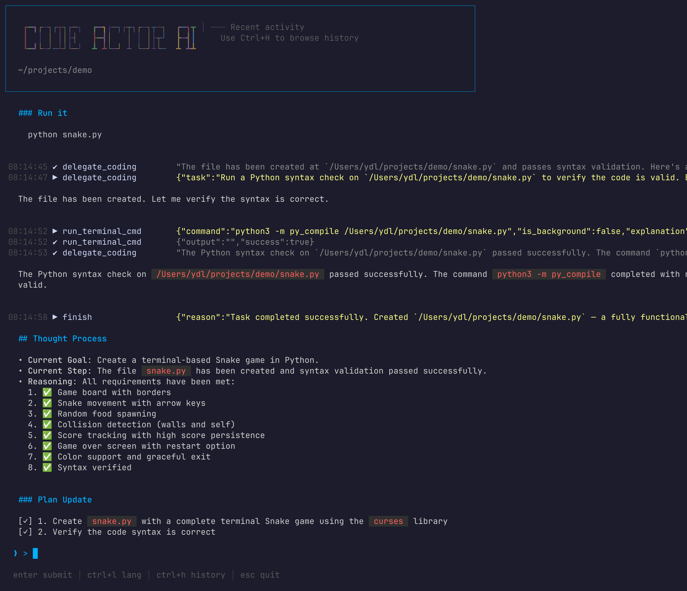
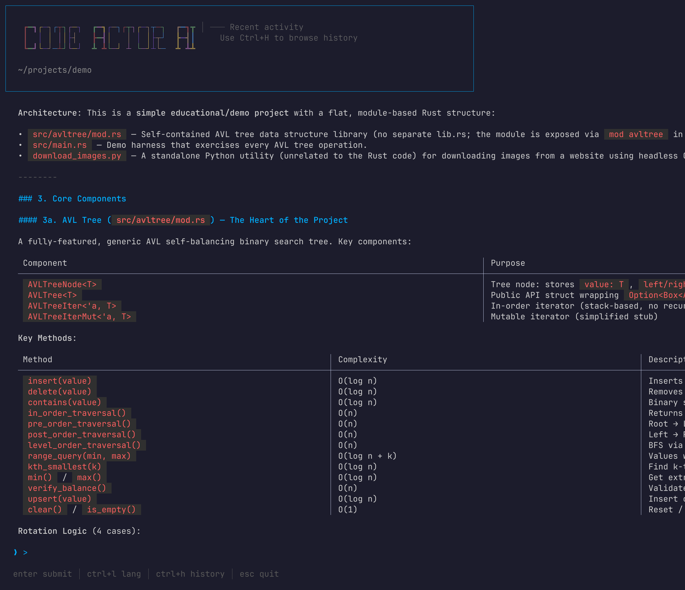
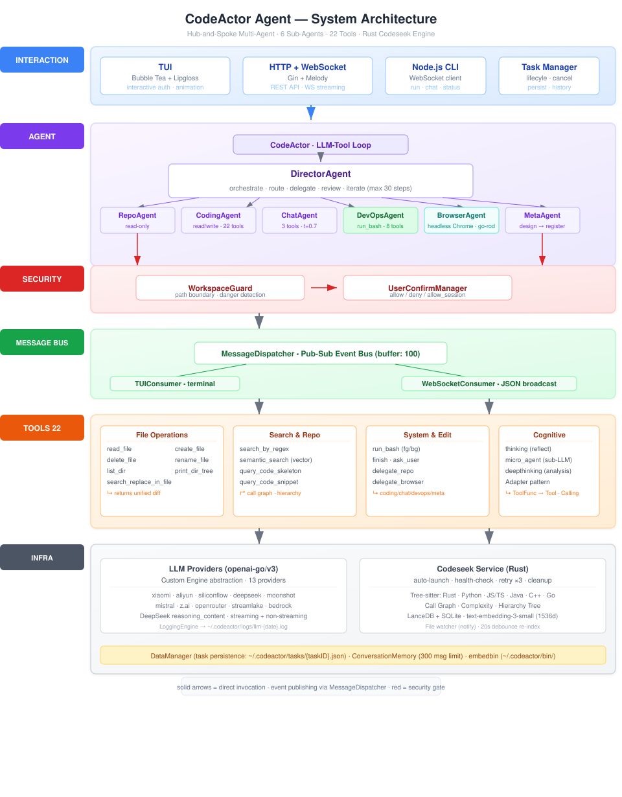

# CodeActor — Structural Code Intelligence for Autonomous AI Programming

> **Beyond text generation.** CodeActor builds a *mental model* of your codebase — call graphs, semantic search, and architectural analysis — so its agents navigate, understand, and evolve your code with precision.

**Tired of AI coding tools that just "see" text?**  
Traditional assistants treat code as a flat string, leading to hallucinations, uninformed edits, and an inability to answer "what depends on X?". CodeActor is different. Its **Repo-Agent** uses deep structural analysis to understand your software like a senior engineer — before a single line is written.

<p align="center">
  
  
</p>

## Why CodeActor?

Traditional AI coding assistants share a fundamental limitation: they see code as flat text. This leads to:

- ❌ **Hallucinated APIs** — Suggesting functions that don't exist in your codebase
- ❌ **No Architectural Awareness** — Changes that silently break distant, dependent modules
- ❌ **Blind Refactoring** — Cannot assess cross-file impact or detect circular dependencies
- ❌ **Keyword-Only Search** — Missing relevant code just because different variable names were used

CodeActor's **Repo-Agent** solves this at the root. Powered by a Rust-based code intelligence engine, it builds a rich structural model of your code — ASTs, call graphs, and semantic embeddings — so every agent in the system reasons about code the way a senior engineer does.

| Traditional AI Tools | CodeActor |
|---|---|
| Flat text matching | Semantic search by code *meaning* |
| File-by-file editing | Cross-file impact analysis via call graphs |
| No complexity insight | Cycle detection & complexity scoring |
| Regex-based search | Natural-language "find auth logic" queries |
| Single-agent | Hub-and-Spoke multi-agent with Meta-Agent runtime extension |
| 🌐 **Live Web Research** | Cannot autonomously browse the internet | Built-in Browser-Agent navigates the web to find latest docs, APIs, and issue discussions |

## Features

### Multi-Agent System
- **Hub-and-Spoke Architecture** — Central Conductor delegates tasks to specialized sub-agents (Repo analysis, Code editing, General chat, DevOps operations, Browser automation)
- **Meta-Agent** — Autonomous agent designer that creates custom sub-agents at runtime for tasks beyond built-in agents' capabilities
- **Self-Correction** — `thinking` tool enables agents to analyze errors and recover without blind retries
- **Agent Disable** — Conditionally exclude sub-agents at startup via `--disable-agents=repo,coding,chat,meta,devops,browser`

### Rich Tool System (22 tools)
- **File Operations** — Read, create, delete, rename, list directory, print directory tree
- **Code Editing** — `search_replace_in_file` with unified diff output and 10MB size guard
- **Code Search** — ripgrep regex search, semantic search via vector embeddings, code skeleton/snippet queries
- **Shell Execution** — `run_bash` with foreground/background support, danger detection, and workspace-boundary checks
- **Cognitive Tools** — `thinking` for error analysis, `micro_agent` for sub-LLM reasoning calls
- **Flow Control** — `finish` to signal task completion, user help requests
- **Browser Automation** — `delegate_browser` for headless Chrome web research, navigation, data extraction, screenshots, and PDF generation
- **Repo Analysis** — Call graph queries, hierarchical call trees, directory trees, function-level code skeletons

### Dual Interaction Modes
- **TUI Mode** — Full terminal UI built with Bubble Tea, with message log, agent streaming, and interactive authorization
- **HTTP + WebSocket Server** — REST API and real-time WebSocket streaming for IDE/Web integration

### 🌐 Browser-Agent: Autonomous Web Intelligence

> *"Your AI that can read the web for you — finding answers in live documentation, community threads, and API references."*

The **Browser-Agent** transforms CodeActor into a true web-native assistant. Powered by headless Chrome via [go-rod](https://github.com/go-rod/rod), it autonomously navigates websites, interacts with page elements, and extracts knowledge — all within a secure, sandboxed environment. When local documentation falls short, the Conductor delegates web research tasks to Browser-Agent, which browses the internet to find the latest answers.

**What it can do:**

- **🔍 Autonomous Web Research** — Browse documentation portals, GitHub issues, Stack Overflow, and API references. Find answers in the live web without manually copying URLs.
- **🖱️ Full Page Interaction** — Click buttons, fill and submit forms, scroll pages, wait for dynamic content to load.
- **📄 Data Extraction** — Extract text and HTML from any page. Capture full-page or element-level screenshots and generate PDFs.
- **🧠 JavaScript Execution** — Run custom JS in the page context (with explicit user confirmation) to unlock web apps requiring client-side logic.
- **🔒 Security-First** — All file outputs are restricted to the workspace directory. Each task gets an isolated browser session via Cookie management.
- **📊 Health Monitoring** — Check website availability and monitor content changes for proactive maintenance.

The Browser-Agent is invoked by the Conductor via `delegate_browser`, seamlessly integrating with the multi-agent workflow. It is equipped with its own toolset (`navigate`, `go_back`, `go_forward`, `reload`, `get_current_url`, `click`, `input`, `scroll`, `wait_element`, `wait`, `extract_text`, `extract_html`, `screenshot`, `pdf`, `execute_js`) and follows the same LLM-tool-loop pattern as all other agents.

> *Example:* A developer asks, "Find the latest FastAPI middleware documentation and summarize the CORS configuration." The Browser-Agent navigates to the FastAPI docs, locates the middleware section, extracts the relevant text, and returns a concise summary — without the developer ever leaving the editor.

### 📝 Git Commit Learning

> *"Teach your AI about your project's recent evolution — so it never repeats work or conflicts with new architecture."*

The **Git Commit Learning** system enables CodeActor to automatically learn from the project's git history, understand recent code changes, and leverage that knowledge as context for user tasks. The Conductor analyzes the latest commits, generates structured summaries via LLM, and stores them in a vector database for semantic similarity search.

**What it does:**

- **📖 Automatic Commit Analysis** — Fetches the latest N commits (default: 30), parses commit messages, changed files, and diffs
- **🧠 Structured Summarization** — LLM generates concise summaries covering: requirement addressed, files changed, technical approach, and implementation details
- **🔍 Semantic Similarity Search** — Commit embeddings are stored in LanceDB; user queries are matched against commit summaries by meaning, not just keywords
- **🔗 Context Injection** — High-similarity commit summaries are automatically injected into the Agent's context, keeping it aware of recent project evolution
- **⚡ Smart Caching** — Uses git HEAD hash as cache key; skips redundant processing when no new commits exist
- **🛠️ Manual Control** — Trigger learning via `learn_commits` tool or search explicitly with `search_similar_commits("user authentication")`

**Configuration:**

```toml
[commit_learner]
enabled = true                          # Enable/disable
max_commits = 30                        # Number of recent commits to learn
similarity_threshold = 0.75             # Minimum cosine similarity to include in context
top_k = 3                               # Number of most relevant commits to inject
trigger = "both"                        # "on_demand" | "on_session_start" | "both"
cache_ttl = 3600                        # Cache validity period in seconds
rust_service_url = "http://127.0.0.1:12800"  # Rust codebase service URL
```

**Workflow:**

```
git log (fetch commits)
    → LLM (generate structured summaries)
    → Embedding Service (convert to vectors)
    → LanceDB (store in commit_embeddings table)
    → User query (semantic search)
    → Top-K matching commits
    → Inject into Agent context
```

The system integrates seamlessly with the multi-agent workflow. The Conductor automatically triggers learning on session start (configurable) and injects relevant commit context before delegating tasks to sub-agents.

### LLM Infrastructure
- **Official OpenAI Go SDK** — Replaced langchaingo with `openai-go/v3` for direct API control
- **DeepSeek Reasoning Support** — Full `reasoning_content` round-trip (streaming + non-streaming), injected via `SetExtraFields`
- **Custom Engine Abstraction** — Lightweight `Engine` interface with Message/ToolDef/ToolCall types, decoupled from any SDK
- **13 LLM Providers** — Xiaomi MiMo, Alibaba Qwen, DeepSeek, SiliconFlow, Moonshot, Mistral, Zhipu GLM, OpenRouter, StreamLake, AWS Bedrock, and any OpenAI-compatible endpoint

### Security
- **WorkspaceGuard** — Validates file operations stay within the project workspace; intercepts dangerous shell commands
- **Defense-in-Depth** — Checks both LLM-flagged `is_dangerous` and absolute-path analysis for shell commands
- **User Confirmation Pipeline** — Pub-Sub based confirmation flow that works across TUI and WebSocket consumers

## The Intelligence Core: Repo-Agent

At the heart of CodeActor is **Repo-Agent** — a dedicated code intelligence agent backed by a Rust engine with Tree-sitter, LanceDB vector embeddings, and Petgraph call-graph analysis.

### 🧠 Semantic Code Search
*"Find where authentication logic is implemented, even if the keywords differ."*

Powered by LanceDB vector embeddings (OpenAI `text-embedding-3-small`, 1536d), semantic search understands the *intent* behind your query. Unlike regex, it finds relevant code by meaning — even across different naming conventions, languages, or comment styles.

### 🏗️ Code Skeleton & Snippet Extraction
*"Instantly see all public functions in a 5000-line file without scanning it manually."*

Batch-queries return structured outlines (functions, types, imports) from specified files. Need the full implementation of a specific function? Query by `filepath` + `function_name` and get the complete snippet. Saves hours of manual code reading.

### 🔗 Call Graph Analysis
*"Which call chain leads to this deprecated util? Are there circular dependencies?"*

Function-level call graphs with caller/callee traversal, cycle detection, and complexity scoring. Understand ripple effects before making changes. View top functions ranked by out-degree to identify core modules at a glance.

### 🌲 Hierarchical Call Trees
*"Show me the top 3 levels of how a request flows from handler to database."*

Depth-limited call tree traversal reveals high-level architectural flow without drowning in details. Perfect for onboarding, code review, and architectural documentation.

### 🌍 Multi-Language AST Parsing
Tree-sitter grammars for **Rust, Python, JavaScript, TypeScript, Java, C++, Go** — code is understood at the syntax level, not just as bytes. Enables precise function extraction, import analysis, and structural queries across polyglot codebases.

### ⚡ Auto-Indexing & File Watching
`notify`-based file system watcher with 20s debounce keeps the code model in sync. Edit files in your IDE — CodeActor re-indexes automatically.

## Multi-Agent System

CodeActor employs a **Hub-and-Spoke architecture** where a central Conductor orchestrates specialized agents for different tasks:

| Agent | Tools | Count |
|-------|-------|-------|
| Conductor | `delegate_repo`, `delegate_coding`, `delegate_chat`, `delegate_devops`, `delegate_meta`, `delegate_browser`, `finish`, `read_file`, `search_by_regex`, `list_dir`, `print_dir_tree` | 12 |
| CodingAgent | All 16 tools (file ops, search, shell, thinking, micro_agent) | 16 |
| RepoAgent | `read_file`, `search_by_regex`, `list_dir`, `print_dir_tree`, `semantic_search`, `query_code_skeleton`, `query_code_snippet` | 7 |
| ChatAgent | `micro_agent`, `thinking`, `finish` | 3 |
| DevOpsAgent | `run_bash`, `read_file`, `list_dir`, `print_dir_tree`, `search_by_regex`, `thinking`, `micro_agent`, `finish` | 8 |
| BrowserAgent | `navigate`, `go_back`, `go_forward`, `reload`, `get_current_url`, `click`, `input`, `scroll`, `wait_element`, `wait`, `extract_text`, `extract_html`, `screenshot`, `pdf`, `execute_js`, `thinking`, `micro_agent`, `finish` | 18 |

Each agent is equipped with tools tailored to its domain, ensuring focused and efficient task execution. The Conductor routes requests to the most appropriate agent based on task type.

## Architecture

<p align="center">
  
</p>

[Full architecture documentation →](docs/ARCHITECTURE.md)

## Meta-Agent

The **Meta-Agent** is an autonomous agent designer — it extends the system's capabilities at runtime by creating specialized sub-agents on demand. When the Conductor encounters a task that falls outside the expertise of the built-in agents (Repo/Coding/Chat), it delegates to the Meta-Agent, which:

1. **Designs** a custom agent with a tailored system prompt, tool selection, and result schema
2. **Executes** the task using the designed agent's configuration
3. **Registers** the new agent as a permanent delegate tool available for the rest of the session

### Example use cases

- `delegate_security_auditor` — Full-codebase security vulnerability audit
- `delegate_performance_profiler` — Performance bottleneck analysis
- `delegate_db_migration_planner` — Database migration planning and validation

### Configuration

```toml
[agent]
meta_max_steps = 30    # Max LLM steps during Meta-Agent execution (default: 30)
meta_retry_count = 5   # Retry count on JSON parse failure (default: 5)
```

Disable Meta-Agent via startup flag:

```bash
./codeactor tui --disable-agents=meta
```

## Codebase Analysis Engine

The `codeactor-codebase` is a standalone **Rust** service that provides deep code analysis capabilities. It runs as a background HTTP server managed automatically by the Go binary.

> **Capabilities previewed above** in [The Intelligence Core: Repo-Agent](#the-intelligence-core-repo-agent). Below are the implementation details.

### HTTP API

| Method | Path | Description |
|--------|------|-------------|
| `GET` | `/health` | Health check |
| `GET` | `/status` | Repo status (functions, files, embedding state) |
| `POST` | `/investigate_repo` | Top-15 functions by out-degree, directory tree, file skeletons |
| `POST` | `/semantic_search` | Vector-based semantic code search |
| `POST` | `/query_code_skeleton` | Batch skeleton extraction from file paths |
| `POST` | `/query_code_snippet` | Extract code snippet by `filepath` + `function_name` |
| `POST` | `/query_call_graph` | Query call graph by file/function name |
| `POST` | `/query_hierarchical_graph` | Hierarchical call tree with depth limit |
| `POST` | `/query_indexing_status` | Embedding indexing status |
| `GET` | `/draw_call_graph` | ECharts call graph visualization |

### Lifecycle Management

The Go binary handles the full lifecycle:
1. **Dynamic port allocation** — Scans from 12800 upward to find an available port
2. **Binary extraction** — Extracts embedded `codeactor-codebase` to `~/.codeactor/bin/`
3. **Auto-launch** — Starts the Rust server as a child process with `--repo-path` and `--address`
4. **Health polling** — Waits up to 30s for `/health` to return 200 before proceeding
5. **HTTP retry** — All codebase API calls retry up to 3 times with backoff
6. **Cleanup on exit** — `defer` kills the child process when the Go process terminates

### Configuration

```toml
[http]
codebase_port = 12800

[codebase]
enable_embedding = true
embedding_db_uri = "~/.codeactor/data/lancedb"
graph_db_uri = "~/.codeactor/data/graph"

[codebase.embedding]
model = "text-embedding-3-small"
api_token = "sk-..."
api_base_url = "https://api.openai.com/v1"
dimensions = 1536
```

## Quick Start

### Prerequisites

- Go 1.24+
- `ripgrep` (`rg`) — for full-text regex search
- A running `codeactor-codebase` service (auto-launched by the Go binary, or set manually)

### Installation

```bash
git clone https://github.com/your-org/codeactor-agent.git
cd codeactor-agent
go build -o codeactor .
```

### Configuration

Create `$HOME/.codeactor/config/config.toml`:

```toml
[global.llm]
use_provider = "siliconflow"

[global.llm.providers.siliconflow]
model = "deepseek-ai/DeepSeek-V3.2"
temperature = 0.0
max_tokens = 23000
api_base_url = "https://api.siliconflow.cn/v1"
api_key = "your-api-key-here"

[app]
enable_streaming = true

[agent]
conductor_max_steps = 30
coding_max_steps = 50
repo_max_steps = 30
devops_max_steps = 15
meta_max_steps = 30
meta_retry_count = 5
lang = "Chinese"
```

### Running

**TUI Mode** (terminal interface):
```bash
./codeactor tui
# Or with a task file:
./codeactor tui --taskfile TASK.md
# Disable specific agents:
./codeactor tui --disable-agents=meta
```

**HTTP Server Mode** (API + WebSocket):
```bash
./codeactor http
# Server starts at http://localhost:9800

# Custom port:
./codeactor http --port 9090
```

### Node.js CLI Client

```bash
cd clients/nodejs-cli && npm install
node index.js run <project-dir> "task description"     # create & stream task
node index.js chat <task-id> <project-dir>             # continue conversation
node index.js status <task-id>                         # query status
node index.js memory <task-id>                         # view conversation history
node index.js history                                  # list recent tasks
```

Server defaults to `localhost:9080`. Override via `--host`/`--port` or `CODECACTOR_HOST=host:port`.

## Supported LLM Providers

| Provider | Config Key | Example Model |
|----------|-----------|---------------|
| Xiaomi MiMo | `xiaomi` | `mimo-v2-flash` |
| Alibaba Bailian | `aliyun` | `qwen3-coder-plus` |
| SiliconFlow | `siliconflow` | `deepseek-ai/DeepSeek-V3.2` |
| DeepSeek | `deepseek` | `deepseek-ai/DeepSeek-V3` |
| Moonshot | `moonshot` | `moonshotai/Kimi-K2-Instruct` |
| Mistral | `mistral` | `mistralai/devstral-small` |
| Zhipu Z.ai | `zai` | `zai-org/GLM-4.5-Air` |
| OpenRouter | `openrouter` | `qwen3-coder-plus` |
| StreamLake | `streamlake` | Custom endpoints |
| AWS Bedrock | `bedrock` | `us.anthropic.claude-3-7-sonnet-*` |
| Local | `local` | Any OpenAI-compatible server |

## Documentation

- [ARCHITECTURE.md](docs/ARCHITECTURE.md) — System architecture, modules, data flow, protocols
- [Agent_Reference.md](docs/Agent_Reference.md) — API reference and configuration guide
- [Agent_Design.md](docs/Agent_Design.md) — Multi-agent design rationale
- [Browser_Agent_Design.md](docs/Browser_Agent_Design.md) — Browser automation architecture and implementation

## Community & Contributing

We welcome contributions of all kinds — bug reports, feature requests, documentation improvements, and code contributions. Whether you're a seasoned Go/Rust developer or just getting started, there's a place for you in the CodeActor community.

**Get involved:**
- Open an [Issue](https://github.com/your-org/codeactor-agent/issues) for bugs or feature requests
- Submit a [Pull Request](https://github.com/your-org/codeactor-agent/pulls) for improvements
- Join the discussion in [Discussions](https://github.com/your-org/codeactor-agent/discussions)

## License

[Apache License 2.0](LICENSE)
