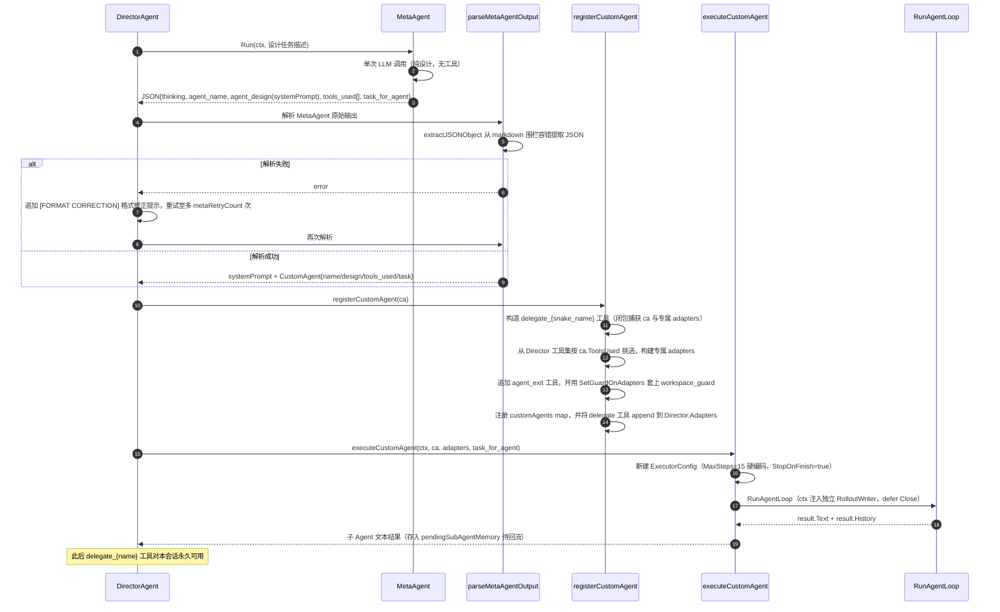

# CodeActor Agent 架构分析与优化技术方案

## 执行摘要（TL;DR）

CodeActor 当前采用「**Director 编排 + RunAgentLoop 统一执行循环 + MetaAgent 动态注册**」的多 Agent 架构：Director 负责任务编排与子 Agent 委派，`executor.RunAgentLoop` 为子 Agent 提供统一的"思考—调工具—观察"循环，MetaAgent 则支持运行时按需设计并注册专属子 Agent。本次分析识别出 **3 个高优先级问题**：① **双循环重复**——Director 内联 LLM 循环与 `RunAgentLoop` 并存，上下文压缩、指数退避重试、事件发布等关键逻辑重复实现两份，行为漂移风险高；② **director.go 过大**——单文件约 1675 行，为全仓库最大文件，编排/解析/修复/注入等多重职责耦合，维护成本高；③ **工具分发 O(n)**——每次工具调用都线性遍历 Adapters 列表查找匹配项，随 Agent 数量与工具数增长性能劣化。为此提出**三阶段优化路线图**：Phase 1 聚焦低风险速赢（魔法值收敛、局部清理），Phase 2 进行结构性重构（核心是把 Director 内联循环与 `RunAgentLoop` 统一为一套循环），Phase 3 建设并行工具执行等长期能力。

## 1. 背景与目标

本文档基于对 codeactor-agent 当前 Agent 架构与执行流程的全面分析（覆盖入口层、应用装配层、编排层、执行层、LLM 层、工具层、记忆层与支撑层的源码走读），给出分阶段、可落地的优化技术方案。方案遵循以下四条目标：

1. **消除重复逻辑**——统一 Director 内联循环与 `RunAgentLoop` 两套执行循环，消除压缩、重试、事件发布的重复实现；
2. **降低维护成本**——对超大文件（`internal/agents/director.go`，约 1675 行）进行职责化拆分；
3. **提升并发能力**——将当前单线程顺序的工具执行改造为可并行的工具调度；
4. **增强可配置性**——收敛散落在代码中的魔法值（硬编码步数、次数上限等）为具名常量或配置项。

## 2. 现状架构分析

### 2.1 技术栈

| 类别 | 技术选型 | 用途说明 |
|------|----------|----------|
| 语言/运行时 | Go 1.25 | 主架构实现语言 |
| HTTP/WebSocket | gin + melody | HTTP 服务模式与 WebSocket 实时推送 |
| 终端 UI | Bubble Tea v2 | TUI 交互模式 |
| LLM 接入 | 自研 `internal/llm` | openai-go v3、anthropic 官方 SDK；`FallbackEngine` 多 provider 兜底 |
| 浏览器自动化 | go-rod | BrowserAgent 浏览器操作能力 |
| 配置管理 | BurntSushi/toml | `config/config.toml` 加载 + hot_reload 热重载 |
| Token 计数 | tiktoken-go | 上下文压缩的 token 预算估算 |
| CLI 框架 | cobra | 命令行入口与参数解析 |
| 事件协议 | protobuf（`protocol/` 目录） | agent-events schema（`protocol/agent-events.schema.json` 等） |

> 另有内嵌子模块 **codeseek**（Rust + TypeScript），作为 MCP 代码搜索后端供 `internal/mcp` 客户端调用；它属于外部工具服务，不属于本文讨论的主架构范围。

### 2.2 分层结构与关键组件

```
┌──────────────────────────── 入口层 ────────────────────────────┐
│ main.go                                                        │
│   runTUI（Bubble Tea v2）/ runHTTP（gin+melody）/ runPrompt      │
└───────────────────────────────┬────────────────────────────────┘
                                ▼
┌──────────────────────────── 应用层 ────────────────────────────┐
│ internal/app/app.go                                            │
│   Init()：initOnce（sync.Once）保证单次初始化                    │
│   组装 GlobalCtx（FileOps/SearchOps/SysOps/CodeSeekMCP）         │
│        + 6 个子 Agent + Director + ConsolidationWorker          │
└───────────────────────────────┬────────────────────────────────┘
                                ▼
┌──────────────────────────── 编排层 ────────────────────────────┐
│ internal/agents/director.go（约 1675 行，仓库最大文件）            │
│   任务编排 / 委派强制检测 / MetaAgent 注册链 / 内联 LLM 循环        │
└───────────────────────────────┬────────────────────────────────┘
                                ▼
┌──────────────────────────── 执行层 ────────────────────────────┐
│ internal/agents/                                               │
│   executor.go（RunAgentLoop 统一循环）  types.go（Agent 接口）     │
│   meta.go（MetaAgent）                                           │
│   repo.go / coding.go / chat.go / devops.go / browser_agent.go │
│   consolidation_worker.go（异步记忆整理）                          │
│   context_compressor.go / emergency_compressor.go（两层压缩）     │
│   tool_logger.go  director_adapter.go（熔断适配器）                │
└──────────┬─────────────────────┬──────────────────┬────────────┘
           ▼                     ▼                  ▼
┌─────── LLM 层 ───────┐ ┌──── 工具层 ────┐ ┌──── 记忆层 ────────┐
│ internal/llm          │ │ internal/tools │ │ internal/memory    │
│ Engine 接口           │ │ Adapter/Regisry│ │ ConversationMemory │
│ Client 按 Agent/Tool  │ │ workspace_guard│ │ SharedMemory       │
│ 路由引擎，运行时可切换   │ │ UserConfirm    │ │ RolloutWriter      │
│ FallbackEngine 兜底    │ │ Manager        │ │                    │
└───────────────────────┘ └────────────────┘ └────────────────────┘
                                ▼
┌──────────────────────────── 支撑层 ────────────────────────────┐
│ globalctx / messaging / knowledge / mcp / config / protocol    │
└────────────────────────────────────────────────────────────────┘
```

各层要点：

- **入口层**：`main.go` 提供 `runTUI` / `runHTTP` / `runPrompt` 三种运行模式，均汇聚到应用层任务处理入口。
- **应用层**：`internal/app/app.go`（约 641 行）。`Init()` 通过 `sync.Once`（`initOnce`）保证只执行一次完整初始化：创建 `GlobalCtx`（挂载 FileOps/SearchOps/SysOps 工具组与 CodeSeekMCP 客户端）、6 个子 Agent（repo/coding/chat/meta/devops/browser）、Director 以及 ConsolidationWorker。
- **编排层**：`internal/agents/director.go`（约 1675 行，**仓库最大文件**）。承担任务编排、委派检测、自定义 Agent 注册、tool_call 修复、子 Agent 记忆回流等职责，同时内联了一套与执行层重复的 LLM 循环（详见 §2.4 与问题 P1）。
- **执行层**：`internal/agents/` 下——`executor.go`（632 行，核心函数 `RunAgentLoop`）、`types.go`（`Agent` 接口与 `BaseAgent`）、`meta.go`（MetaAgent，纯设计者角色）、五个内置子 Agent（`repo.go` / `coding.go` / `chat.go` / `devops.go` / `browser_agent.go`）、`consolidation_worker.go`（异步记忆整理 Worker）、`context_compressor.go` 与 `emergency_compressor.go`（两级上下文压缩）、`tool_logger.go`、`director_adapter.go`（熔断适配器）。各 Agent 的 system prompt 以 `*.prompt.md` 文件经 `go:embed` 打进二进制。
- **LLM 层**：`internal/llm/` 定义 `Engine` 接口 `{ GenerateContent, Model, CloseIdleConnections }`；`llm.Client` 按 Agent/Tool 名称路由引擎（如 `GetAgentEngine("director")`、`GetToolEngine("micro_agent")`），支持运行时切换；`FallbackEngine` 在主引擎失败时按配置切换到 fallback provider 兜底。
- **工具层**：`internal/tools/` 的 `Adapter{name, description, schema, fn}` 通过 `ToToolDef` 转换为 OpenAI function calling schema；`Call` 流程为：JSON 反序列化 → workspace_guard 鉴权 → 执行 → 结果序列化。`Registry` 本身是一个 map。工具有两类来源：RepoAgent 一类走 `tools.json` embed 驱动的 switch 映射（read_file、search_by_regex 等）；其余 ToolFunc 直接注入（file_edit、system_operations、search_operations、delegate、micro_agent、deepthinking）。安全层由 `WorkspaceGuard` + `UserConfirmManager` 组成，YOLO/FULL-YOLO 模式下可跳过人工确认。
- **记忆层**：`internal/memory/` 包含三类组件——`ConversationMemory`（单任务对话记忆，带 `max_size` 上限）、`SharedMemory`（跨会话持久化，位于 `~/.codeactor/data/shared_memory/{projectID}/`，约 5 秒落盘一次）、`RolloutWriter`（结构化事件流，写入 task_started / task_complete / token_count 等事件）。
- **支撑层**：`internal/globalctx`（全局上下文注入）、`internal/messaging`（Publisher → Dispatcher → consumers/tui.go + websock.go + UserConfirmManager，15+ 事件类型：ai_chunk、llm_call_start/end、thinking、tool_call_start、tool_call_result、context_compressed 等）、`internal/knowledge`（KnowledgeInjector，依赖 CodeSeekMCP）、`internal/mcp`（MCP 客户端，后台 goroutine 初始化）、`internal/config`（toml 加载 + hot_reload 热重载）。

### 2.3 核心抽象与两种 Run 签名

`internal/agents/types.go`（全文仅 27 行）定义了系统最核心的两个抽象：

```go
// AgentResult 封装 sub-agent 的完整执行结果
type AgentResult struct {
    Text   string               // 最终文本输出（给上层作为 tool_result）
    Memory []memory.ChatMessage // 完整内部对话历史
}

// Agent defines the interface for all agents in the system.
type Agent interface {
    Name() string
    Run(ctx context.Context, input string) (AgentResult, error)
}

// BaseAgent holds common dependencies for agents.
type BaseAgent struct {
    LLM       llm.Engine
    Publisher *messaging.MessagePublisher
}
```

系统中实际并存**两种 Run 签名**：

| 签名 | 使用者 | 语义 |
|------|--------|------|
| `Run(ctx, input, mem)` —— 3 参数，自持 `ConversationMemory` | `DirectorAgent.Run`（director.go） | Director 自持跨步骤会话记忆，自行管理历史拼接 |
| `Run(ctx, input)` —— 2 参数，无内部记忆 | 所有子 Agent（`Agent` 接口约定） | 无状态单轮执行，历史由调用方持有 |

两种签名语义不统一：Director 需要"带记忆的长程编排"，子 Agent 是"无状态的单轮执行器"，接口层却没有体现这一差异——这是问题 **P2-8（接口语义不一致）** 的根源，也是 Phase 2 统一抽象时要重点处理的点。

### 2.4 执行循环机制（RunAgentLoop）

`internal/agents/executor.go`（632 行）中的 `RunAgentLoop(ctx, cfg)` 是子 Agent 执行的标准循环：

```
RunAgentLoop(ctx, ExecutorConfig)
        │
        ▼
┌────────────────────────────────────────────────────┐
│ 构建初始消息：SystemPrompt + UserInput               │
└────────────────────────┬───────────────────────────┘
                         ▼
     ┌───────── for i in [0, MaxSteps) ─────────────┐
     │                                              │
     │ ① 上下文压缩                                   │
     │    TruncateToolResultsToBudget                 │
     │      （按 token 预算截断 tool 结果）              │
     │    截断后仍超限 →                               │
     │    EmergencyCompressMessages                   │
     │      （LLM 紧急摘要，保留末尾 N 条）               │
     │                                              │
     │ ② 发布事件 llm_call_start / ai_stream_start     │
     │                                              │
     │ ③ LLM.GenerateContent                          │
     │    · 带 timeout 的 context 控制单次调用超时        │
     │    · 失败按指数退避重试，等待上限 30s               │
     │                                              │
     │ ④ 发布事件 ai_stream_end / thinking /           │
     │            llm_call_end / ai_response           │
     │                                              │
     │ ⑤ 无 ToolCalls ──────────► 返回 Text，循环结束    │
     │                                              │
     │ ⑥ 有 ToolCalls ──► 遍历 Adapters 线性查找        │
     │    匹配工具并顺序执行（O(n) 分发），               │
     │    结果以 Role=Tool 消息回填历史                  │
     │                                              │
     │ ⑦ OnStepEnd hook / RolloutWriter 写入           │
     │                                              │
     └──────────────────继续下一步◄───────────────────┘
```

`ExecutorConfig` 提供四个生命周期 hook：

| Hook | 触发时机 | 说明 |
|------|----------|------|
| `OnAgentStart` | 进入循环前调用一次 | 失败则直接中止启动 |
| `OnAgentExit` | 循环结束后经 defer + recover 调用一次 | 即使捕获 panic 也保证执行，用于兜底收尾 |
| `OnToolResult` | 每个工具执行完成后回调 `(toolName, result)` | 用于日志/审计 |
| `OnStepEnd` | 每步 ToolCalls 执行完毕后触发 | 仅当该步存在 ToolCalls 时调用 |

> 典型使用方是 `GitCheckpointManager`（internal/agents/git_checkpoint.go）：CodingAgent 在构建 `ExecutorConfig` 时注入 OnAgentStart/OnAgentExit/OnStepEnd 实现 git 检查点生命周期管理。

### 2.5 Director 特有能力

Director 相比普通子 Agent 多出五项特有能力，全部实现在 `internal/agents/director.go`：

#### 2.5.1 熔断器

`DirectorAdapter`（director_adapter.go）提供 `IsCircuitBreakerOpen()`：连续 LLM 调用失败达到阈值后熔断被触发，阻断后续请求直接失败返回，避免雪崩式无效重试；配套的恢复逻辑见 `internal/agents/director/recovery.go` 的 CircuitBreaker（失败计数阈值 + 冷却时间窗口，超时 30s 量级）。

#### 2.5.2 委派强制检测

Director 收尾时若模型未通过任何 `delegate_*` 工具委派子 Agent 就想直接结束，会向消息序列注入一条模拟 user 消息强制其委派；该"强制提醒"最多触发 `maxNonDelegationPrompts`（常量 = 3，director.go）次，达到上限后放行，防止死循环（循环本身还有 MaxSteps 兜底）。

#### 2.5.3 tool_call 配对修复

`validateAndRepairToolCallPairs(messages []llm.Message)`（director.go 尾部）在送入 LLM 前校验并修复消息序列中 assistant 的 tool_calls 与 Role=Tool 结果消息的配对关系——主要修复上下文截断/紧急压缩后可能出现的配对断裂，否则部分 provider 会直接拒绝请求。

#### 2.5.4 子 Agent 记忆回流

`injectSubAgentMemory(result, toolCallID, toolName)` 将子 Agent 的执行结果写入 Director 的 `currentMemory`：写入的是结果摘要消息（`result.Text`），并打上 `IsSubAgent=true` 标记与 ParentID 关联；子 Agent 的完整内部对话历史**不会**整体回灌，也不会再发送给 LLM——避免 Director 上下文快速膨胀和 Compact Engine 频繁压缩导致信息丢失。Director 后续组装历史时会过滤 `IsSubAgent=true` 的内部消息。

#### 2.5.5 项目上下文缓存

`cachedProjectContext` 字段使项目上下文文件在同一会话内只加载一次：首次加载后将结果缓存于 Director 实例，之后直接命中缓存返回，避免每个任务重复读取项目上下文带来的延迟与 token 开销。

### 2.6 MetaAgent 动态注册链（重点）

MetaAgent 是系统的"元能力"：它本身是一个纯设计者（单次 LLM 调用、无工具），根据任务动态设计一个专属子 Agent，由 Director 完成注册与执行。完整时序如下：



关键实现细节：

1. **容错解析**：`extractJSONObject` 能从 markdown 代码围栏等包裹文本中定位最外层 JSON 对象；`parseMetaAgentOutput` 校验必需字段（缺 `agent_design` 即报错）。
2. **格式修正重试**：解析失败时，Director 会把带 `[FORMAT CORRECTION — Attempt n/N]` 的修正提示追加进消息再次请求 MetaAgent，最多重试 `metaRetryCount`（默认 3）次。
3. **专属工具集**：自定义 Agent 的 adapters 只从 Director 现有工具集中挑选（`ca.ToolsUsed` 声明），未知工具会被跳过并告警；无论声明与否都会追加 `agent_exit` 工具以便显式退出。
4. **立即执行**：注册完成后立刻用 `task_for_agent`（剥离了元设计指令的干净任务描述）驱动 `executeCustomAgent`，其中 `MaxSteps=15` 为硬编码值（魔法值，列入 Phase 1 收敛清单）。

### 2.7 端到端执行流程

从用户输入到最终输出的完整链路：

```mermaid
sequenceDiagram
    autonumber
    participant U as 用户
    participant Main as main.go（模式入口）
    participant App as app.CodeActor
    participant Dir as DirectorAgent
    participant Sub as 自定义子Agent
    participant Loop as RunAgentLoop

    U->>Main: 输入任务（runTUI / runHTTP / runPrompt）
    Main->>App: ProcessCodingTaskWithCallback(request)
    App->>App: Init()（initOnce 保证单次初始化）
    App->>Dir: Run(ctx, input, mem)
    Dir->>Dir: 组装 systemPrompt = director.prompt + 自定义Agent描述 + 项目上下文 + 知识注入
    Dir->>Dir: 追加会话历史（过滤 IsSubAgent=true 的内部消息）
    loop Director 内联 LLM 循环（三分支）
        Dir->>Dir: 压缩检查 → GenerateContent
        alt 分支一：直接文本
            Dir-->>Dir: 准备返回最终文本
        else 分支二：普通工具
            Dir->>Dir: Adapters 线性查找分发执行，Role=Tool 回填
        else 分支三：委派 delegate_*
            Dir->>Sub: executeCustomAgent(task_for_agent)
            Sub->>Loop: RunAgentLoop(maxSteps=15)
            Loop-->>Sub: result.Text
            Sub-->>Dir: 子 Agent 结果
            Dir->>Dir: injectSubAgentMemory（标记 IsSubAgent=true）
        end
    end
    Note over Dir: 未委派即想结束 → 强制提醒（上限 maxNonDelegationPrompts）
    Dir-->>U: 通过委派检测后返回最终文本
```

### 2.8 并发模型现状

当前系统的并发特征可概括为四点：

1. **工具单线程顺序执行**：无论是 `RunAgentLoop` 还是 Director 内联循环，同一轮的多个 ToolCalls 都是 for 循环逐个分发、串行执行，**没有任何并行**——这是 Phase 3「并行工具」优化的直接动因；
2. **MCP 客户端后台初始化**：`internal/mcp` 的客户端在 `Init()` 中以后台 goroutine 启动，不阻塞主流程，就绪前相关工具调用会等待/降级；
3. **流式事件逐 chunk 发布**：LLM 流式输出经 `CallOptions.StreamHandler` 回调逐 chunk 发布 `ai_chunk` 事件，经 messaging 总线推往 TUI/WebSocket 前端；
4. **ConsolidationWorker 异步整理**：记忆整理任务由独立的 goroutine + channel 异步消费，与主执行链路解耦。

---
