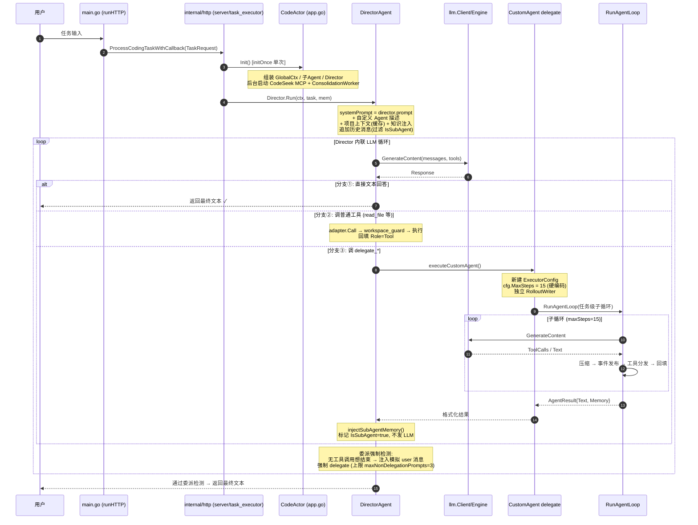

# CodeActor Agent 架构分析与优化方案

| 元数据 | 值 |
|--------|-----|
| **版本** | v1.0 |
| **日期** | 2026 年 |
| **状态** | 评审稿 |
| **作者** | Director 编排系统 |
| **适用仓库** | `codeactor-agent`（module: `codeactor`，go 1.25.8） |

---

## 执行摘要（TL;DR）

> **三个高优先级（P0）问题**：
> 1. **双循环重复** —— `internal/agents/executor.go`（632 行）的 `RunAgentLoop` 与 `internal/agents/director.go`（1675 行）中 `Run()` 的内联 LLM 循环（约 600 行）几乎完整复制了同一套「压缩 → 事件发布 → LLM 调用 → 重试退避 → 工具分发 → Rollout 写入」逻辑，任何改动都需双处同步，是当前最主要的维护负担与 bug 来源；
> 2. **`director.go` 单文件过大（1675 行）** —— 循环、Meta 解析、Agent 注册、委派执行、压缩、熔断、记忆注入、Rollout 混杂一处，严重违反单一职责；
> 3. **工具分发 O(n)** —— 每次分发均 `for` 遍历 `self.Adapters` 线性查找，而 `Registry` 本身已是 `map`，索引能力被浪费。
>
> **三阶段路线图一句话概括**：Phase 1 先以「纯拆分 + 索引化 + 配置化 + taskID 显式化」完成低风险速赢，Phase 2 通过「扩展 ExecutorConfig 三个 hook 注入点」统一双循环并收口配对规则与引擎刷新，Phase 3 演进「并行工具执行 + 统一 Run 签名 + 结构化输出」，每阶段独立上线、配合 Git Checkpoint 与事件流录制做行为等价性回归。

---

## 目录

1. [背景与目标](#1-背景与目标)
2. [现状架构分析](#2-现状架构分析)
   - 2.1 技术栈 / 2.2 分层结构与关键组件 / 2.3 核心抽象与两种 Run 签名
   - 2.4 执行循环机制 / 2.5 Director 特有能力 / 2.6 MetaAgent 动态注册链
   - 2.7 端到端执行流程 / 2.8 并发模型现状
3. [问题诊断（分级清单）](#3-问题诊断分级清单)
4. [重构方案详述](#4-重构方案详述)
   - 4.1 方案 A 统一双循环 / 4.2 方案 B 纯拆分 / 4.3 方案 C 工具分发索引化
   - 4.4 方案 D 配置化收敛 / 4.5 方案 E taskID 显式传播 / 4.6 方案 F 配对规则单一化
   - 4.7 方案 G 引擎拉取式刷新 / 4.8 方案 H 并行工具执行 / 4.9 其余小项
5. [实施路线图](#5-实施路线图)
6. [依赖关系与实施顺序](#6-依赖关系与实施顺序)
7. [附录](#7-附录)

---

## 1. 背景与目标

### 1.1 文档目的

本文档基于对 `codeactor-agent` 当前多 Agent 架构与执行流程的全面分析，给出**分阶段、可落地**的架构优化方案。文中所有技术事实（文件路径、行数、函数名、常量值）均以当前仓库源码为准，已逐项核对。

### 1.2 优化目标

| 目标 | 说明 | 对应问题 |
|------|------|----------|
| **消除重复逻辑** | 统一 `RunAgentLoop` 与 `Director.Run` 内联循环，压缩/事件/重试/Rollout 单点实现 | P0-1、P1-6 |
| **降低维护成本** | 拆分超大文件、收敛魔法值为配置、单一化配对规则 | P0-2、P1-5、P1-6 |
| **提升并发能力** | 工具分发索引化、只读工具并行执行 | P0-3、方案 H |
| **提升可配置性** | 超时/步数/阈值/熔断参数全部进入 `config.toml` 并支持热重载 | P1-5 |
| **消除全局可变状态** | taskID 从包级全局变量改为显式传播 | P1-4 |

### 1.3 非目标

- 不改变现有对外行为（TUI/WebSocket 事件语义、委派机制的用户可感知行为）；
- 不重写 `internal/llm` 的 provider 抽象（OpenAI/Anthropic/fallback 已稳定）；
- 不触碰内嵌 `codeseek/` 子模块（Rust + TS，独立演进）。

---

## 2. 现状架构分析

### 2.1 技术栈

| 类别 | 选型 | 说明 |
|------|------|------|
| **语言** | Go 1.25（`go.mod` 声明 `go 1.25.8`） | 本机工具链 go1.26.2 可编译 |
| **Web 框架** | `gin-gonic/gin` + `olasol/melody` | HTTP Server + WebSocket 推送 |
| **CLI/TUI** | Bubble Tea v2 生态（`charm.land`：bubbles/bubbletea/glamour/lipgloss） | 终端 UI |
| **CLI 解析** | `spf13/cobra` | `main.go` 提供 `runTUI` / `runHTTP` / `runPrompt` 三种模式 |
| **LLM 客户端** | `openai/openai-go/v3` + 自研 `internal/llm` 抽象层 | openai / anthropic / fallback 多 provider 兜底 |
| **浏览器自动化** | `go-rod/rod` | Chromium 驱动 |
| **配置** | `BurntSushi/toml`（`config/config.toml` + `default_config.toml`） | 支持热重载（`hot_reload.go`） |
| **Token 计数** | `pkoukk/tiktoken-go` | 上下文压缩预算估算 |
| **Protocol Buffers** | `google.golang.org/protobuf` | `protocol/` 下 agent-events schema |
| **MCP 后端** | 内嵌 `codeseek/` 子模块（Rust + TypeScript，含 `package.json`） | 作为 MCP 代码搜索后端，**不属于**主架构 |

### 2.2 分层结构与关键组件

```
┌─────────────────────────── 入口层 ───────────────────────────┐
│ main.go (404行, cobra: runTUI / runHTTP / runPrompt)          │
│   └─ internal/app/app.go (641行)                              │
│      CodeActor.Init(): initOnce 保证单次组装                  │
│      ├─ CodeSeek MCP 客户端（后台 goroutine 异步初始化）      │
│      ├─ GlobalCtx（FileOps/SearchOps/SysOps/...）             │
│      ├─ 子 Agent: repo/coding/chat/meta/devops/browser        │
│      ├─ DirectorAgent（注入全部子 Agent）                     │
│      └─ ConsolidationWorker（记忆整理异步 Worker）            │
├─────────────────────────── 编排层 ───────────────────────────┤
│ internal/agents/director.go (1675行, 仓库最大文件)            │
│   主循环 + 委派编排 + Meta 解析 + 记忆注入 + 熔断接入        │
├─────────────────────────── 执行层 ───────────────────────────┤
│ internal/agents/                                              │
│   executor.go (632行)      RunAgentLoop 统一执行循环          │
│   types.go (27行)          Agent 接口 / AgentResult / BaseAgent│
│   meta.go (175行)          MetaAgent 动态设计子 Agent          │
│   repo.go(174) coding.go(568) chat.go(97) devops.go(109)      │
│   browser_agent.go(209)   各子 Agent                          │
│   consolidation_worker.go (335行)  记忆整理 Worker             │
│   context_compressor.go(207) / emergency_compressor.go(244)   │
│                           两层上下文压缩                       │
│   tool_logger.go (163行)   工具调用日志 + delegate 日志        │
│   director_adapter.go (50行) 熔断/度量适配器                   │
├─────────────────────────── LLM 层 ────────────────────────────┤
│ internal/llm/                                                 │
│   Engine 接口: GenerateContent / Model / CloseIdleConnections │
│   实现: engine_openai / engine_anthropic / fallback(多兜底)   │
│   llm.Client: 按 Agent/Tool 路由引擎                          │
│     GetAgentEngine("director") / GetToolEngine("micro_agent") │
│     支持运行时切换模型                                         │
├─────────────────────────── 工具层 ────────────────────────────┤
│ internal/tools/                                               │
│   Adapter{name, description, schema, fn}                      │
│     ToToolDef() → OpenAI function calling schema              │
│     Call() → JSON 反序列化 → workspace_guard 鉴权 → 执行      │
│   Registry = map[string]*Adapter                              │
│   工具两类来源:                                                │
│     ① RepoAgent: tools.json embed 驱动 switch 映射            │
│     ② ToolFunc 直注: file_edit / system_operations /          │
│        search_operations / delegate / micro_agent /           │
│        deepthinking 等                                        │
│   安全层: WorkspaceGuard + UserConfirmManager                  │
│     (危险操作需用户确认; YOLO 模式跳过确认)                    │
├─────────────────────────── 记忆层 ────────────────────────────┤
│ internal/memory/                                              │
│   ConversationMemory  单任务会话, max_size 上限               │
│   SharedMemory        跨会话持久化                             │
│     ~/.codeactor/data/shared_memory/{projectID}/              │
│     5s 间隔落盘                                                │
│   RolloutWriter       结构化事件流                             │
│     (task_started / task_complete / token_count ...)          │
├─────────────────────────── 支撑层 ────────────────────────────┤
│ internal/globalctx   全局上下文, 注入所有 Agent/Tools          │
│ internal/messaging   Publisher → Dispatcher → Consumers       │
│     consumers/tui.go(629行) + websock.go + UserConfirmManager │
│     15+ 事件类型: ai_chunk / llm_call_start / llm_call_end /  │
│     ai_stream_start/end / thinking / tool_call_start /        │
│     tool_call_result / ai_response / context_compressed ...   │
│ internal/knowledge   KnowledgeInjector（依赖 CodeSeekMCP）    │
│ internal/mcp         CodeSeek MCP 客户端(后台 goroutine 初始化)│
│ internal/config      toml 加载 + hot_reload 热重载             │
└───────────────────────────────────────────────────────────────┘
```

### 2.3 核心抽象与两种 Run 签名

`internal/agents/types.go` 定义了 Agent 抽象：

```go
type Agent interface {
    Name() string
    // ... Run 等方法
}

type BaseAgent struct {
    LLM       llm.Engine                  // 每个 Agent 持有独立 LLM 引擎
    Publisher *messaging.MessagePublisher // 事件发布
}
```

**⚠️ 两种 `Run` 签名并存（语义不统一，见 P2-8）**：

| 签名 | 持有者 | 记忆模型 |
|------|--------|----------|
| `Run(ctx, input, mem)` — 3 参数 | `DirectorAgent` | 自行维护 `ConversationMemory`，跨步骤保留完整会话 |
| `Run(ctx, input)` — 2 参数 | 子 Agent（Repo/Coding/Chat/DevOps/Browser）及 MetaAgent 动态生成的 CustomAgent | 无内部会话记忆，单次任务即弃 |

这一不一致导致：委派时子 Agent 结果需要靠 Director 侧的 `injectSubAgentMemory()` 回流补记；统一签名方案（P2-8）依赖方案 A 完成后实施。

### 2.4 执行循环机制

`internal/agents/executor.go` 的 `RunAgentLoop`（632 行）是**所有子 Agent 共同调用的统一循环**。流程如下：

```text
                    ┌─────────────────────────────────┐
                    │  构建 system + user 消息         │
                    │  (system prompt + 工具 schema)   │
                    └───────────────┬─────────────────┘
                                    ▼
              ┌─────── for i in maxSteps ────────────┐
              │                                       │
              │  ① 上下文压缩（两层）                  │
              │     TruncateToolResultsToBudget       │
              │       (按 token 预算截断工具结果)      │
              │     → EmergencyCompressMessages       │
              │       (截断仍超限 → 紧急摘要)          │
              │                                       │
              │  ② 发布 llm_call_start / ai_stream_start │
              │                                       │
              │  ③ LLM.GenerateContent                │
              │     · 带 timeout context              │
              │     · 失败指数退避重试（上限 30s）      │
              │                                       │
              │  ④ 发布 ai_stream_end / thinking /    │
              │     llm_call_end / ai_response        │
              │                                       │
              │  ⑤ 无 ToolCalls ──────────► 返回 Text │
              │     （循环结束）                       │
              │                                       │
              │  ⑥ 有 ToolCalls → 遍历 adapters       │
              │     线性查找分发执行                   │
              │     → 回填 Role=Tool 消息              │
              │                                       │
              │  ⑦ OnStepEnd hook / Rollout 写入      │
              │                                       │
              └──────────────── 循环 ─────────────────┘
```

**ExecutorConfig hooks（现有 4 个注入点）**：

| Hook | 时机 | 作用 |
|------|------|------|
| `OnAgentStart` | 循环开始前 | Agent 级初始化 |
| `OnAgentExit` | defer + recover | 捕获 panic、兜底收尾 |
| `OnToolResult` | 每个工具执行后 | 结果观测/记录 |
| `OnStepEnd` | 每步结束后 | 步级收尾、Rollout 写入 |

> 这 4 个 hook 是方案 A（统一双循环）的**雏形**——证明「通过 hook 注入 Director 特有能力」在现有代码中已有先例，扩展成本低。

### 2.5 Director 特有能力

`DirectorAgent.Run()`（`director.go`，1675 行）在子 Agent 循环之外，额外维护了 5 项独有机制：

| 机制 | 实现 | 说明 |
|------|------|------|
| **熔断器** | `DirectorAdapter.IsCircuitBreakerOpen()`（director_adapter.go） | 连续 LLM 失败达到阈值则阻断请求，防止雪崩 |
| **委派强制检测** | `maxNonDelegationPrompts = 3`（director.go:32） | Director 无工具调用就想结束 → 注入模拟 user 消息强制其调用 `delegate_*`；达到上限后放行（防死循环，循环本身有 maxSteps 兜底） |
| **tool_call 配对修复** | `validateAndRepairToolCallPairs()`（director.go:1568） | 修复截断后的 tool_call → tool 响应配对 |
| **Sub-Agent Memory 注入** | `injectSubAgentMemory()`（director.go:782） | 将子 Agent 内部对话写入 memory，标记 `IsSubAgent=true`，**但不发送给 LLM**（仅用于内存记录） |
| **项目上下文缓存** | `cachedProjectContext`（director.go:82） | 会话内只加载一次项目上下文文件 |

### 2.6 MetaAgent 动态注册链（重点）

这是架构中最精巧的部分，实现「**Agent 自我生成 Agent**」：运行时无需改代码即可新增专属子 Agent。

```text
 MetaAgent.Run()                          ← Director 调用
    │  输出 JSON:
    │  {thinking, agent_name, agent_design(systemPrompt),
    │   tools_used[], task_for_agent}
    ▼
 parseMetaAgentOutput()
    │  extractJSONObject() 容错提取
    │  (LLM 输出常被 markdown 围栏 ```json 包裹)
    │  失败 → 带格式修正提示重试
    │        (metaRetryCount 次, director.go:76/270)
    ▼
 registerCustomAgent(CustomAgent)
    │  ① 构造 delegate_<snake_name> 工具
    │  ② 从 Director 工具集里挑出 ca.ToolsUsed,
    │     构建专属 adapters
    │  ③ 追加 agent_exit 工具
    │  ④ 套 workspace_guard
    │  ⑤ 注册到 a.customAgents[delegate_name]
    │     并 append 到 a.Adapters
    ▼
 Director 立即执行刚创建的 delegate 工具
    └─ executeCustomAgent()
        │  新建 ExecutorConfig
        │  cfg.MaxSteps = 15 (硬编码, director.go:753)
        │  → RunAgentLoop() (任务级子循环)
        │  创建该 delegate 的独立 RolloutWriter
        ▼
 返回格式化结果给 LLM
 此后 delegate_<name> 永久可用
```

**关键点**：
- Meta 输出解析依赖 `extractJSONObject`（director.go:610）从杂乱文本中提取最外层 JSON 对象——鲁棒性受 LLM 输出质量制约（P2-9）；
- `registerCustomAgent` 将新 Adapter **append 到 `a.Adapters` 切片**——后续分发走线性查找（P0-3 的成因之一）；
- `executeCustomAgent` 硬编码 `MaxSteps = 15`（director.go:753），未走配置（P1-5 的典型样本）。

### 2.7 端到端执行流程

以编码任务主线为例（HTTP 模式）：



### 2.8 并发模型现状

| 维度 | 现状 | 备注 |
|------|------|------|
| **工具执行** | **单线程顺序执行，无并行** | 单步多个 ToolCalls 逐个分发 |
| **MCP 客户端** | 后台 goroutine 初始化 | 与主流程解耦 |
| **流式输出** | `CallOptions.StreamHandler` 逐 chunk 发布 `ai_chunk` 事件 | TUI/WebSocket 实时渲染 |
| **记忆整理** | `ConsolidationWorker`（335 行）异步消费 `ConsolidationTask` | goroutine + channel，调 LLM 将新观察整理进长期记忆 |
| **委派执行** | 同步阻塞（普通工具超时 120s，delegate 超时 10min） | Director 等待子循环完成 |

> 并发能力是当前架构的明显短板：工具串行 + 委派同步阻塞，长任务吞吐受限。方案 H（并行工具执行）为长期能力演进目标。

---
