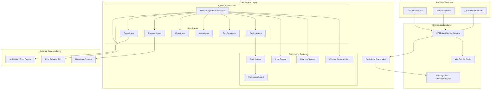
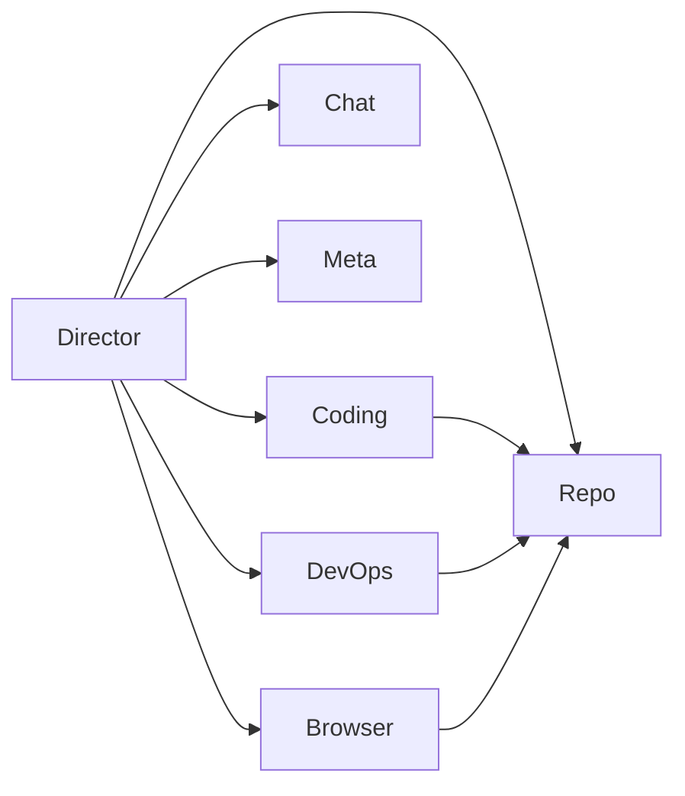
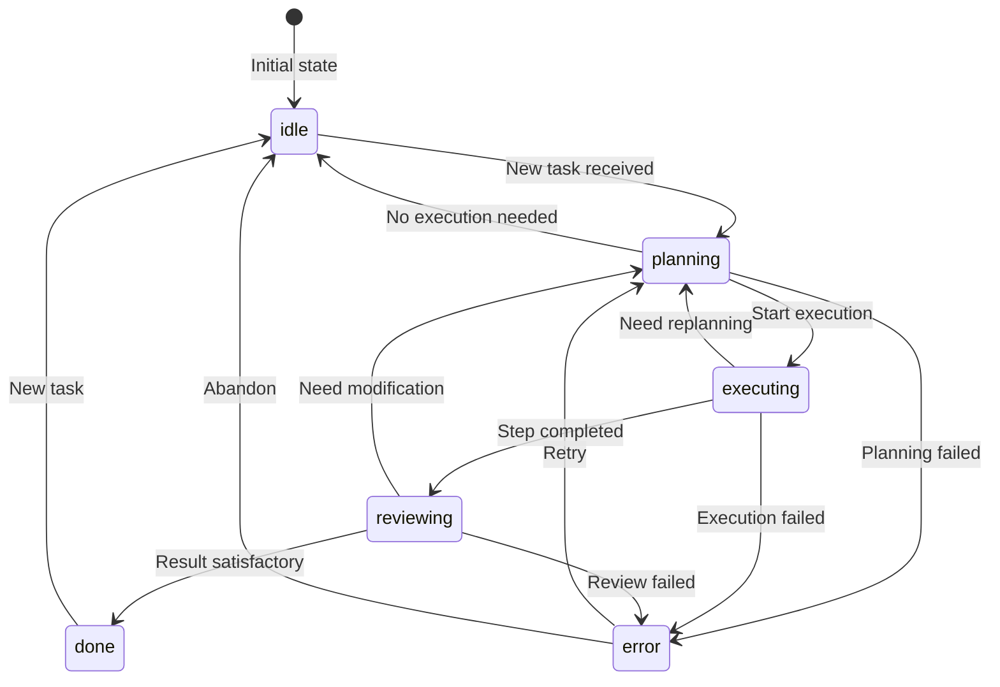
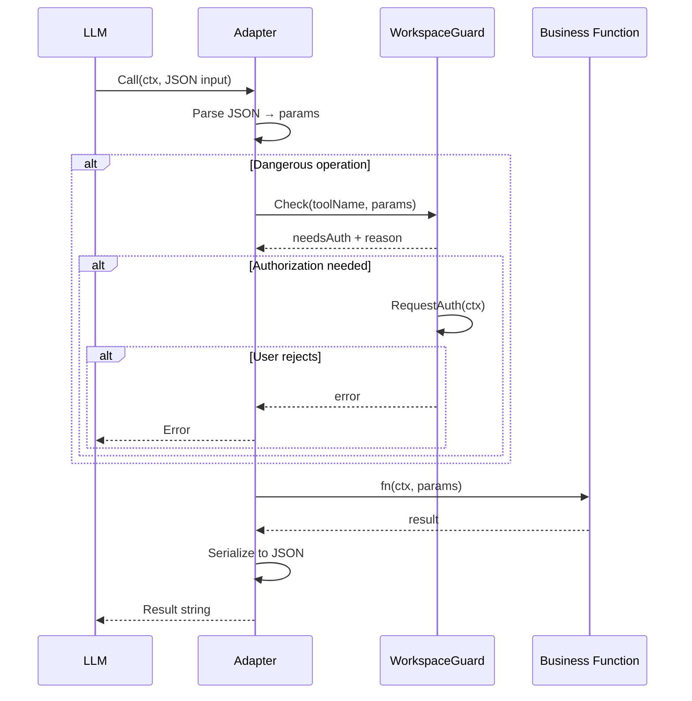
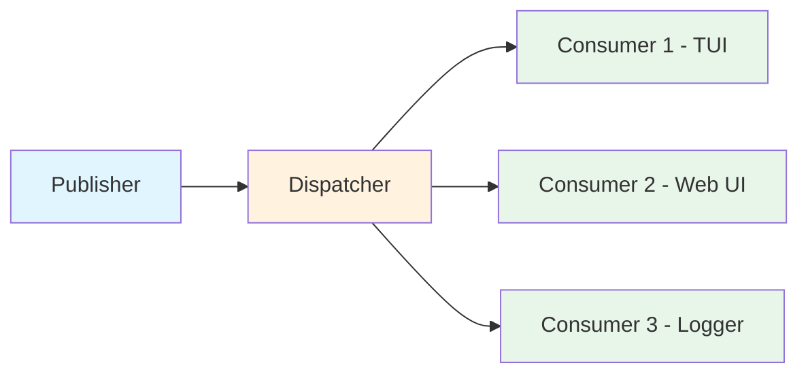
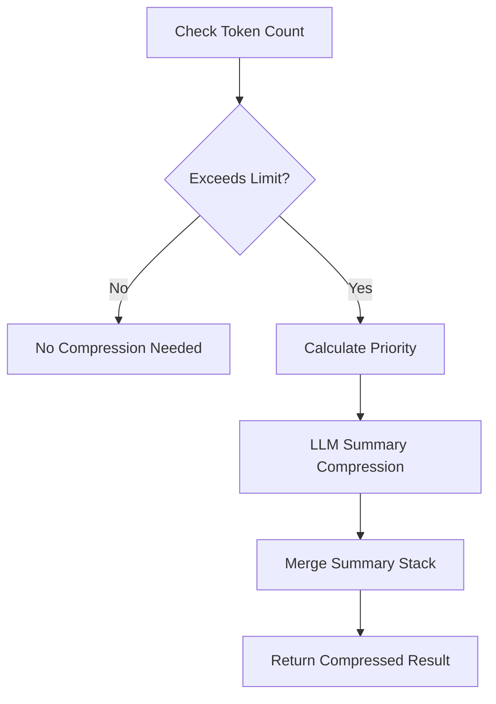
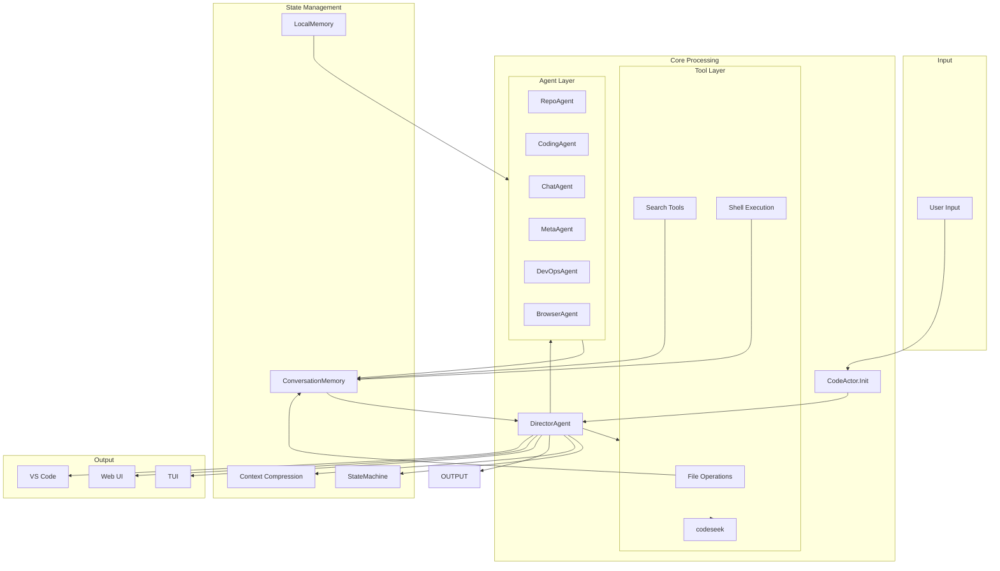
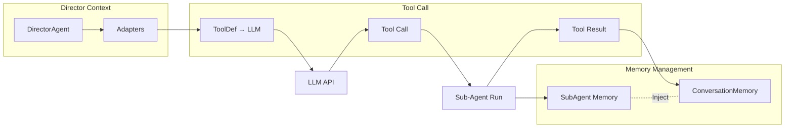

# CodeActor System Architecture Document

> Version: v1.0.0 | Last Updated: 2025

## Table of Contents

- [1. Overview](#1-overview)
- [2. Overall Architecture Layers](#2-overall-architecture-layers)
- [3. Agent System](#3-agent-system)
  - [3.1 Agent Interface and Basics](#31-agent-interface-and-basics)
  - [3.2 DirectorAgent Orchestrator](#32-directoragent-orchestrator)
  - [3.3 Sub-Agent Details](#33-sub-agent-details)
  - [3.4 Delegation Graph](#34-delegation-graph)
  - [3.5 State Machine](#35-state-machine)
- [4. Tool System](#4-tool-system)
  - [4.1 Adapter Pattern](#41-adapter-pattern)
  - [4.2 Tool Registry](#42-tool-registry)
  - [4.3 WorkspaceGuard](#43-workspaceguard)
  - [4.4 DelegateAdapter](#44-delegateadapter)
  - [4.5 Core Tool List](#45-core-tool-list)
- [5. LLM Engine](#5-llm-engine)
  - [5.1 Engine Interface](#51-engine-interface)
  - [5.2 Message and Tool Definition Format](#52-message-and-tool-definition-format)
  - [5.3 Multi-Model Support](#53-multi-model-support)
- [6. Memory System](#6-memory-system)
  - [6.1 ConversationMemory](#61-conversationmemory)
  - [6.2 LocalMemory](#62-localmemory)
- [7. Event/Message System](#7-eventmessage-system)
  - [7.1 Publish-Subscribe Architecture](#71-publish-subscribe-architecture)
  - [7.2 Event Types](#72-event-types)
  - [7.3 WAL Persistence and Dead Letter Queue](#73-wal-persistence-and-dead-letter-queue)
- [8. Context Compression Engine](#8-context-compression-engine)
  - [8.1 Core Compression Algorithm](#81-core-compression-algorithm)
  - [8.2 Async Incremental Compression](#82-async-incremental-compression)
  - [8.3 Priority Calculation](#83-priority-calculation)
- [10. External Service Integration](#10-external-service-integration)
  - [10.1 Codeseek Code Analysis Engine](#101-codeseek-code-analysis-engine)
  - [10.2 Browser Automation](#102-browser-automation)
- [11. Presentation Layer](#11-presentation-layer)
  - [11.1 TUI (Terminal UI)](#111-tui-terminal-ui)
  - [11.2 Web UI](#112-web-ui)
  - [11.3 VS Code Extension](#113-vs-code-extension)
- [12. Configuration System](#12-configuration-system)
- [13. Key Design Patterns](#13-key-design-patterns)
- [14. Data Flow Diagrams](#14-data-flow-diagrams)
  - [14.1 Complete Task Processing Data Flow](#141-complete-task-processing-data-flow)
  - [14.2 Inter-Agent Communication Data Flow](#142-inter-agent-communication-data-flow)
- [15. Glossary](#15-glossary)

---

## 1. Overview

CodeActor is an **AI-driven autonomous coding system** built in Go. It employs a multi-Agent collaborative architecture, driven by LLMs (Large Language Models), capable of autonomously completing complex tasks such as code analysis, writing, debugging, and operations.

### Core Features

- **Multi-Agent Collaboration**: 6 specialized sub-Agents + 1 orchestrator, each with distinct responsibilities
- **Rich Tooling**: 26 built-in tools covering file operations, code search, system commands, and more
- **Memory Management**: Conversation memory + local sticky notes, automatic tool_call pairing repair
- **Context Compression**: Async incremental compression, intelligent summarization, hot-reload configuration support
- **Safety Guards**: Workspace permission checks + user confirmation mechanism
- **Knowledge Management**: Pre-conversation knowledge retrieval, async memory consolidation, repo memory cache
- **Multiple Presentation Layers**: TUI, Web UI, VS Code extension, unified protocol

### Project Structure

```
codeactor-agent/
├── internal/
│   ├── agents/        # Agent system core (with director/ subpackage)
│   │   ├── director/  # Director types, metrics, recovery logic
│   │   ├── context_compressor.go  # Context compression (TruncateToolResultsToBudget)
│   │   ├── emergency_compressor.go # Emergency compression
│   │   ├── consolidation_worker.go # Async memory consolidation
│   │   ├── repo_memory.go         # Repo memory cache
│   │   ├── knowledge_hook.go      # Knowledge extraction hook
│   │   └── git_checkpoint.go      # Git checkpoint mechanism
│   ├── tools/         # Tool system (with browser/ subpackage)
│   │   └── browser/   # 11 browser tools (navigate, click, scroll, etc.)
│   ├── llm/           # LLM engine abstraction (engine_openai, engine_anthropic, fallback, messages)
│   ├── memory/        # Memory system (ConversationMemory, LocalMemory)
│   ├── messaging/     # Message system (with bus/, consumers/, peer/ subpackages)
│   │   ├── bus/       # Channel-based event distribution
│   │   ├── consumers/ # TUIConsumer, WebSocketConsumer
│   │   └── peer/      # Peer-to-peer messaging
│   ├── browser/       # Browser automation
│   ├── config/        # Configuration system (with CodeSeek, Knowledge, MemoryJSONL)
│   ├── datamanager/   # Task data persistence (DataManager, JSONL read/write/index)
│   ├── knowledge/     # Knowledge injector (KnowledgeInjector, pre-conversation retrieval)
│   ├── mcp/           # MCP client (MCPClient, stdio JSON-RPC)
│   ├── recovery/      # Circuit breaker (CircuitBreaker, closed/open/half-open)
│   ├── registry/      # Capability registry (CapabilityRegistry)
│   ├── skills/        # Skill system (SkillRegistry, loads .md skill files)
│   ├── dict/          # Dictionary/autocomplete engine (DictEngine)
│   ├── diff/          # Diff comparison utilities
│   ├── embedbin/      # Embedded binaries
│   ├── globalctx/     # Global context singleton (GlobalCtx)
│   ├── logging/       # Task-scoped log directory management
│   ├── tokenutil/     # Token counting utilities
│   ├── util/          # Common utilities (crash, error_utils, numeric)
│   ├── app/           # Application entry
│   ├── tui/           # Terminal UI
│   ├── http/          # HTTP/WebSocket service
│   └── protocol/      # Protocol definitions
├── codeseek/          # Rust code analysis engine
├── vscode/            # VS Code extension
├── webui/             # Web frontend
├── protocol/          # Protocol Schema
└── config/            # Configuration files
```

---

## 2. Overall Architecture Layers

CodeActor adopts a classic four-layer architecture design, from top to bottom:



### Layer Descriptions

| Layer | Responsibility | Key Components |
|-------|----------------|----------------|
| **Presentation Layer** | User interaction interface | TUI, Web UI, VS Code Extension |
| **Communication Layer** | Inter-process communication, event distribution | HTTP Server, WebSocket, Message Bus |
| **Core Engine Layer** | Business logic, AI reasoning | DirectorAgent, Sub-Agents, Tools, LLM, Memory |
| **External Services Layer** | External capability integration | codeseek, LLM API, Browser |

---

## 3. Agent System

### 3.1 Agent Interface and Basics

All Agents in the system implement a unified `Agent` interface:

```go
// internal/agents/types.go
type Agent interface {
    Name() string
    Run(ctx context.Context, input string) (AgentResult, error)
}

type AgentResult struct {
    Text   string
    Memory []memory.ChatMessage
}

type BaseAgent struct {
    LLM       llm.Engine
    Publisher *messaging.MessagePublisher
}
```

**Design Highlights**:
- `Name()` returns the Agent's unique identifier (snake_case format)
- `Run()` accepts a task description string and returns text results along with the complete internal conversation history
- `AgentResult.Memory` contains the full conversation records with `IsSubAgent=true`, which the Director injects into the main context

### 3.2 DirectorAgent Orchestrator

The **DirectorAgent** is the "brain" of the entire system, located at `internal/agents/director.go`, responsible for:

1. **Task Assessment**: Analyze user intent, select appropriate sub-Agent
2. **Delegation Scheduling**: Distribute tasks to sub-Agents via tool calls
3. **Result Aggregation**: Collect sub-Agent outputs, integrate into final response
4. **Flow Control**: State management, retries, circuit breaking, context compression coordination

#### 3.2.1 Director Structure

```go
type DirectorAgent struct {
    BaseAgent
    // 6 sub-Agent references
    RepoAgent      *RepoAgent
    CodingAgent    *CodingAgent
    ChatAgent      *ChatAgent
    MetaAgent      *MetaAgent
    DevOpsAgent    *DevOpsAgent
    BrowserAgent   *BrowserAgent
    
    // Tool adapter list
    Adapters       []*tools.Adapter
    
    // Context compression (inlined in Director, no standalone Engine/AsyncCompactor types)
    
    // Fault tolerance mechanisms
    stepRetries          int
    circuitBreakerThreshold    int
    circuitBreakerResetTimeout time.Duration
    consecutiveLLMFailures     int
    
    // Dynamic Agent registration
    customAgents map[string]*CustomAgent
}
```

#### 3.2.2 Delegation Toolchain

Director exposes tools to the LLM through Adapters, with the core being 6 delegation tools:

| Tool Name | Target Agent | Purpose |
|-----------|-------------|---------|
| `delegate_repo` | RepoAgent | Code analysis, semantic search |
| `delegate_coding` | CodingAgent | File read/write, code editing |
| `delegate_chat` | ChatAgent | General conversation, explanations |
| `delegate_meta` | MetaAgent | Custom Agent generation |
| `delegate_devops` | DevOpsAgent | System operations, Shell commands |
| `delegate_browser` | BrowserAgent | Browser automation |

#### 3.2.3 Director Run Flow

```mermaid
sequenceDiagram
    participant User as User
    participant CA as CodeActor
    participant COND as DirectorAgent
    participant LLM as LLM API
    participant TOOL as Tool/Sub-Agent
    participant MEM as Memory System

    User->>CA: Input task
    CA->>COND: Run(ctx, task)
    COND->>MEM: Load conversation history
    COND->>COND: Assess phase
    
    loop Up to N steps
        COND->>LLM: Send messages + tool definitions
        LLM-->>COND: Response (tool_call/text)
        
        alt tool_call
            COND->>TOOL: Execute delegation/tool
            TOOL-->>COND: Execution result
            COND->>MEM: Record tool_call/result
        else text
            COND->>MEM: Record assistant response
            COND->>COND: Check result
            alt Needs more steps
                COND->>COND: Continue loop
            else Done
                break
            end
        end
        
        alt Consecutive failures
            COND->>COND: Check circuit breaker
            alt Breaker triggered
                COND->>COND: Exponential backoff wait
            end
        end
    end
    
    COND->>COND: Compress context (if needed)
    COND->>MEM: Inject sub-Agent memory
    COND-->>CA: AgentResult
    CA-->>User: Final response
```

#### 3.2.4 Fault Tolerance Mechanisms

**Circuit Breaker**:
```go
// Trigger circuit breaker on consecutive LLM call failures
if a.consecutiveLLMFailures >= a.circuitBreakerThreshold {
    // Exponential backoff retry
    time.Sleep(backoffDuration)
}
```

**Step Retries**:
- When LLM returns an invalid response, automatically retry the current step
- Retry count read from configuration `config.LLM.StepRetries`

**tool_call Pairing Repair**:
- Memory system automatically detects and repairs mismatched tool_call / tool_response pairs
- Prevents truncation or compression from breaking atomicity

### 3.3 Sub-Agent Details

#### 3.3.1 RepoAgent (Code Analysis Agent)

**Responsibility**: Deep codebase analysis, semantic search, code structure understanding

**Core Tools**:
- `semantic_search`: Semantic code search
- `query_code_skeleton`: Get code skeleton
- `query_code_snippet`: Get code snippet
- `read_file`: File reading
- `search_by_regex`: Regex search

**External Dependency**: Calls codeseek service (Rust engine) via MCP

```go
// RepoAgent toolchain
RepoOps = NewRepoOperationsTool(codeSeekMCP, workDir, 0)
```

#### 3.3.2 CodingAgent (Coding Agent)

**Responsibility**: File editing, code generation, build execution

**Core Tools**:
- `read_file`: Read file content
- `create_file`: Create new file
- `search_replace_in_file`: Search and replace text
- `run_bash`: Execute Shell commands
- `thinking`: Thinking tool
- `micro_agent`: Micro-Agent invocation

#### 3.3.3 ChatAgent (Conversation Agent)

**Responsibility**: General conversation, Q&A, non-coding tasks

**Core Tools**:
- `thinking`: Thinking tool
- `micro_agent`: Micro-Agent invocation
- **Note**: ChatAgent has no file operation permissions, it is a pure conversation Agent

#### 3.3.4 MetaAgent (Meta-Agent / Agent Designer)

**Responsibility**: Dynamically generate custom Agent designs

**Workflow**:
1. Receive natural language description
2. Single LLM call generates JSON design output
3. Director parses JSON, registers as new Agent

**Output Format**:
```json
{
  "thinking": "...",
  "agent_name": "my_custom_agent",
  "agent_design": "System prompt...",
  "tools_used": ["read_file", "search_by_regex"],
  "task_for_agent": "Task description template..."
}
```

#### 3.3.5 DevOpsAgent (Operations Agent)

**Responsibility**: System administration, Shell commands, file checks, log analysis

**Core Tools**:
- `run_bash`: Execute arbitrary Shell commands
- `read_file` / `search_by_regex`: File checks
- `file_operations`: File management

#### 3.3.6 BrowserAgent (Browser Automation Agent)

**Responsibility**: Drive headless Chrome to complete web operations

**Tech Stack**: go-rod (Chrome DevTools Protocol client)

**Core Capabilities**:
- Page navigation
- Element operations
- Screenshot
- JavaScript execution

### 3.4 Delegation Graph

> **Note**: The delegation graph definition and execution state control are inlined in `director.go` and `executor.go`; there is no standalone `delegation.go` file.

The Delegation Graph is a **static DAG (Directed Acyclic Graph)** that defines delegation permissions between Agents, preventing circular calls.

```go
type DelegationGraph map[string][]string

// Default delegation relationships
func DefaultDelegationGraph() DelegationGraph {
    return DelegationGraph{
        "director": {"repo", "coding", "chat", "meta", "devops", "browser"},
        "coding":    {"repo"},
        "devops":    {"repo"},
        "browser":   {"repo"},
        "repo":      {},  // Leaf node
        "chat":      {},  // Leaf node
        "meta":      {},  // Leaf node
    }
}
```



**Verification Algorithm**: DFS three-color marking to detect cycles
- 0 = Unvisited (white)
- 1 = Visiting (gray)
- 2 = Completed (black)

**Topological Sort**: Kahn's algorithm, sorting from leaves to root

### 3.5 State Machine

> **Note**: The state machine is a design plan; the equivalent flow control is currently implemented via the executor loop in `executor.go`. There is no independent `StateMachine` type or `state_machine.go` file.

The State Machine manages the Director's execution phases, ensuring controlled flow.



**State Definitions**:
| State | Meaning | Allowed Transitions |
|-------|---------|---------------------|
| `idle` | Idle | → planning |
| `planning` | Planning | → executing, error, idle |
| `executing` | Executing | → reviewing, error, planning |
| `reviewing` | Reviewing | → done, planning, error, idle |
| `done` | Completed | → idle |
| `error` | Error | → planning, idle |

---

## 4. Tool System

The tool system, located at `internal/tools/`, provides a unified, secure tool invocation interface.

### 4.1 Adapter Pattern

**Adapter** is the core abstraction of the tool system, wrapping functions into LLM-consumable tool definitions:

```go
// internal/tools/adapter.go
type ToolFunc func(ctx context.Context, params map[string]interface{}) (interface{}, error)

type Adapter struct {
    name        string
    description string
    fn          ToolFunc
    schema      map[string]interface{}
    guard       *WorkspaceGuard
}
```

**Key Methods**:
- `NewAdapter(name, description, fn)`: Create adapter

- `WithSchema(schema)`: Set JSON Schema
- `Call(ctx, input)`: Execute tool call, automatically triggers guard check
- `ToToolDef()`: Convert to LLM's ToolDef format

**Workflow**:


### 4.2 Tool Registry

**Registry** is a thread-safe tool registry supporting registration/lookup/listing:

```go
type Registry struct {
    tools   map[string]*Adapter
    mu      sync.RWMutex
}
```

**Features**:
- Thread-safe (read-write lock)
- Indexed by name
- Supports batch retrieval (for LLM system prompts)

### 4.3 WorkspaceGuard

**WorkspaceGuard** checks file paths before executing dangerous operations, ensuring operations stay within the workspace:

```go
type WorkspaceGuard struct {
    workspacePath     string
    confirmMgr        *UserConfirmManager
    sessionAllowed    map[string]bool  // Session-level authorized tools
    sessionAllAllowed bool             // All tools authorized for session
    projectAuthorized bool             // Project permanent authorization
}
```

**Dangerous Tool List**:
| Tool Name | Check Type |
|-----------|------------|
| `create_file` | Path within workspace |
| `search_replace_in_file` | Path within workspace |
| `delete_file` | Path within workspace |
| `rename_file` | Path within workspace |
| `run_bash` | Command whitelist check |

**Authorization Levels**:
1. **Single Authorization** (allow/yes): Valid only for this call
2. **Session Authorization** (allow_session): That tool is authorized for the entire session
3. **Session All-Authorization** (allow_all_session): All tools are authorized for the entire session
4. **Project Permanent Authorization** (allow_all_project): Persisted to settings.json

### 4.4 DelegateAdapter

Wraps an Agent into a `delegate_<name>` tool, enabling other Agents to invoke it directly:

```go
func NewDelegateAdapter(name, description string, target AgentRunner) *Adapter {
    toolName := "delegate_" + name
    return NewAdapter(toolName, description, func(ctx, params) {
        task := params["task"].(string)
        return target.Run(ctx, task)
    }).WithSchema({...})
}
```

### 4.5 Core Tool List

Tool definitions are in `internal/agents/tools.json`, totaling 26 tools.

| Category | Tool | Description |
|----------|------|-------------|
| **File Operations** | `read_file` | Read file content |
| | `create_file` | Create new file |
| | `search_replace_in_file` | Search and replace text block |
| | `delete_file` | Delete file |
| | `rename_file` | Rename file |
| **Directory Browsing** | `list_dir` | View directory contents |
| | `print_dir_tree` | Print directory tree |
| **Search** | `search_by_regex` | Regular expression search |
| | `semantic_search` | Semantic code search (calls codeseek) |
| | `query_code_skeleton` | Get code skeleton |
| | `query_code_snippet` | Get code snippet |
| | `find_function_callee` | Find functions called by a function |
| | `find_function_caller` | Find functions that call a function |
| | `query_call_graph` | Query call graph |
| **System** | `run_bash` | Execute Shell commands |
| **Cognitive** | `thinking` | Thinking tool |
| | `micro_agent` | Create sub-task |
| | `deepthinking` | Deep analysis |
| **Interaction** | `ask_user_for_help` | Request user help |
| | `agent_exit` | Exit Agent |
| **Git** | `git_checkpoint_list` | List checkpoints |
| | `git_checkpoint_rollback` | Roll back to checkpoint |
| | `git_checkpoint_create` | Create checkpoint |
| **Knowledge** | `consolidate_knowledge` | Consolidate knowledge |
| | `prune_history` | Prune historical knowledge |
| **Delegation** | `delegate_repo` | Delegate code analysis |
| | `delegate_coding` | Delegate coding task |
| | `delegate_chat` | Delegate conversation |
| | `delegate_meta` | Delegate Agent design |
| | `delegate_devops` | Delegate operations task |
| | `delegate_browser` | Delegate browser operations |
| **Browser** (`tools/browser/`, 11 tools) | `navigate`, `click`, `scroll`, `input`, `cookies`, `evaluate`, `extract`, `history`, `pdf`, `wait_element`, `registry` | Headless browser automation |

---

## 5. LLM Engine

### 5.1 Engine Interface

LLM engine abstraction layer, supporting multiple LLM providers:

```go
// internal/llm/engine.go
type Engine interface {
    GenerateContent(ctx context.Context, messages []Message, tools []ToolDef, opts *CallOptions) (*Response, error)
    Model() string
}
```

**Implementations**:
- `EngineOpenAI` (`internal/llm/engine_openai.go`): OpenAI-compatible interface, supports Claude (via OpenAI-compatible endpoint), Gemini, etc.
- `EngineAnthropic` (`internal/llm/engine_anthropic.go`): Anthropic native interface, supports thinking blocks, cache control
- `internal/llm/fallback.go`, `internal/llm/messages.go`: Fallback and message/tool definitions

### 5.2 Message and Tool Definition Format

#### Message Format

```go
type Message struct {
    Role       Role       // system/user/assistant/tool
    Content    string     // Text content
    ToolCalls  []ToolCall // Tool calls
    ToolCallID string     // Tool call ID (for tool role responses)
    ToolName   string     // Tool name
    Reasoning  string     // Reasoning content (for DeepSeek, etc.)
}
```

#### Tool Definition

```go
type ToolDef struct {
    Type     string      // "function"
    Function FunctionDef
}

type FunctionDef struct {
    Name        string         // Tool name
    Description string         // Tool description
    Parameters  map[string]any // JSON Schema
}
```

### 5.3 Multi-Model Support

CodeActor supports configuring different LLM models for different Agents and tools:

```
Configuration Hierarchy:
  1. per-agent engine (highest priority)
  2. per-tool engine
  3. default engine
```

```go
// Engine resolution
directorEngine = client.GetAgentEngine("director")
codingEngine    = client.GetAgentEngine("coding")
microAgentEngine = client.GetToolEngine("micro_agent")
```

**Advantages**:
- Use low-cost models for simple tasks
- Use high-quality models for complex reasoning
- Micro-Agents can use independent models

---

## 6. Memory System

### 6.1 ConversationMemory

Manages complete conversation context, supporting multi-role and sub-Agent grouping:

```go
// internal/memory/memory.go
type ChatMessage struct {
    Type       MessageType     // system/human/assistant/tool
    Content    string
    ToolCalls  []ToolCallData
    ToolCallID *string
    Timestamp  time.Time
    Metadata   map[string]interface{}

    // Sub-Agent grouping metadata
    GroupID    string  // Shared by same sub-agent call
    ParentID   string  // Points to Director's tool_call_id
    IsSubAgent bool    // Quick filter flag
}

type ConversationMemory struct {
    Messages []ChatMessage
    MaxSize  int  // Default 300 messages
}
```

**Core Features**:
1. **Automatic Truncation**: When exceeding MaxSize, removes oldest non-system messages
2. **tool_call Pairing Repair**: Automatically repairs mismatched tool_calls after truncation
3. **Sub-Agent Isolation**: `ToMessages()` automatically skips IsSubAgent messages
4. **Sub-agent Injection**: After sub-Agent completes, Director injects full Memory into main context

### 6.2 LocalMemory

Agent-private sticky notes, not shared across Agents:

```go
type LocalMemory struct {
    // Independent private storage for each Agent instance
    data map[string]string
    mu   sync.RWMutex
}
```

**Usage**:
- Agent internal state tracking
- Task context caching
- Avoiding redundant LLM calls

---

## 7. Event/Message System

### 7.1 Publish-Subscribe Architecture



**Core Components**:

```go
// MessagePublisher - Publisher
type MessagePublisher struct {
    dispatcher *MessageDispatcher
}

func (p *Publisher) Publish(eventType string, content interface{}, from string) error

// MessageDispatcher - Dispatcher
type MessageDispatcher struct {
    mainCh        chan *Event
    consumers     map[EventType][]Consumer
    wal           WAL
    backlog       *Backlog
    dlq           *DeadLetterQueue
}
```

**Data Flow**:
1. Agent publishes events via Publisher
2. Dispatcher receives events, writes to WAL (if enabled)
3. Dispatcher distributes to all registered Consumers by EventType
4. If main channel is full, events overflow to Backlog
5. If Consumer processing fails, events go to Dead Letter Queue

### 7.2 Event Types

Protocols are defined in `internal/protocol/agent_events.go`:

| Event Type | Description | Use Case |
|------------|-------------|----------|
| `model_info` | Model information | Broadcast current model at startup |
| `llm_call_start` | LLM call start | Monitoring/timing |
| `llm_call_end` | LLM call end | Monitoring/statistics |
| `ai_response` | AI response | Display to user |
| `tool_call_start` | Tool call start | Progress display |
| `tool_call_result` | Tool call result | Progress display |
| `tool_call_error` | Tool call error | Error handling |
| `context_loaded` | Context loaded | Progress display |
| `ai_stream_start` | Streaming response start | Streaming UI |
| `ai_chunk` | Streaming data chunk | Streaming UI |
| `ai_stream_end` | Streaming response end | Streaming UI |
| `user_help_needed` | User help needed | Permission request |
| `user_help_response` | User response | Permission decision |
| `conversation_error` | Conversation error | Error handling |
| `conversation_result` | Conversation completed | Task completion |
| `thinking` | Thinking content | Thinking display |

### 7.3 WAL Persistence and Dead Letter Queue

**WAL (Write-Ahead Log)**:
- Async disk writing to ensure events are not lost
- Supports replaying unconfirmed events after restart
- Configured via `DispatcherOptions.WALPath`

**Backlog**:
- When the main channel is full, events overflow to Backlog
- Background goroutine periodically drains Backlog
- Configurable maximum capacity (default 10000)

**Dead Letter Queue (DLQ)**:
- Events that fail Consumer processing go to DLQ
- Configurable retry count (default 3 times)
- Supports exponential backoff retry

### 7.4 Subpackage Structure

The messaging system includes the following subpackages:

| Subpackage | Contents | Description |
|------------|----------|-------------|
| `internal/messaging/bus/` | `bus.go` | Channel-based event distribution core |
| `internal/messaging/consumers/` | `tui.go`, `websock.go` | TUI consumer, WebSocket consumer |
| `internal/messaging/peer/` | `peer.go`, `topics.go`, `options.go` | Peer-to-peer messaging |

---

## 8. Context Compression Engine

### 8.1 Core Compression Algorithm

Context compression logic is located at `internal/agents/context_compressor.go`, triggered when conversation token count exceeds limits:

```go
// TruncateToolResultsToBudget truncates tool results to fit token budget
func TruncateToolResultsToBudget(messages []Message, budget int) []Message
```

**Compression Flow**:


**Key Parameters**:
- `MaxContextTokens`: Context token upper limit
- `KeepRecentRounds`: Keep last N rounds of complete conversation
- `MinSummaryTokens`: Minimum summary token count

### 8.2 Priority Calculation

**PriorityCalculator** calculates message priority based on multiple factors:

```go
type PriorityWeights struct {
    SystemMessageWeight    float64  // System message weight
    RecentMessageWeight    float64  // Recent message weight
    ToolCallWeight         float64  // Tool call weight
    UserMessageWeight      float64  // User message weight
    CriticalMessageWeight  float64  // Critical message weight
}
```

Messages with **higher priority** are more likely to be retained during compression.

**Emergency Compression** (`internal/agents/emergency_compressor.go`):
When tokens severely exceed limits, `EmergencyCompressMessages()` performs forced compression, called by Director in the main loop.

---

## 9. Knowledge Management System

### 9.1 KnowledgeInjector

**Responsibility**: Retrieve relevant knowledge from the codebase before Agent conversation execution and inject it into the context.

**Location**: `internal/knowledge/injector.go`

**Workflow**:
1. Receive current conversation context
2. Retrieve relevant code snippets and knowledge entries via codeseek MCP
3. Inject retrieval results into the system prompt
4. Control injected token count (`InjectionMaxTokens`) and entry count (`InjectionMaxEntries`)

### 9.2 ConsolidationWorker

**Responsibility**: Asynchronously consolidate conversation memory generated during Agent execution, extracting reusable knowledge.

**Location**: `internal/agents/consolidation_worker.go`

**Workflow**:
1. Listen for Agent execution completion signals
2. Summarize and extract knowledge from conversation history
3. Write extracted knowledge to long-term storage
4. Supports hot-reload configuration

### 9.3 RepoMemoryStore

**Responsibility**: Cache repository-level structured memory to avoid re-analyzing the same code areas.

**Location**: `internal/agents/repo_memory.go`

**Workflow**:
1. Cache code analysis results (structure, dependencies, key functions)
2. Quickly retrieve existing memory during Agent execution
3. Works with KnowledgeHook to extract new knowledge points during conversation

---

## 10. External Service Integration

### 10.1 Codeseek Code Analysis Engine

Codeseek is a code analysis engine written in Rust, providing semantic code search capabilities via MCP (stdio JSON-RPC):

```
┌──────────────┐         HTTP/gRPC         ┌──────────────┐
│  CodeActor   │ ──────────────────────▶  │  Codeseek    │
│  (Go)        │ ◀──────────────────────  │  (Rust)      │
└──────────────┘                          └──────────────┘
```

**Integration Method**:
- RepoAgent calls codeseek service via MCP
- Port dynamically allocated by main function

**Capabilities Provided**:
- Semantic code search
- Code skeleton query
- Code snippet extraction
- Code structure analysis

### 10.2 Browser Automation

BrowserAgent uses go-rod to drive headless Chrome:

```go
import "github.com/go-rod/rod"
```

**Capabilities**:
- Page navigation
- Element search and operations
- Screenshot
- JavaScript execution
- Cookie management

---

## 11. Presentation Layer

### 11.1 TUI (Terminal UI)

Terminal interface based on Bubble Tea framework:

```go
import "github.com/charmbracelet/bubbletea"
```

**Components**:
- `tui_model.go`: Bubble Tea Model implementation
- `tui_render.go`: Rendering logic
- `tui_tasks.go`: Task management
- `tui_completion.go`: Auto-completion
- `components/`: Reusable UI components

### 11.2 Web UI

Web interface built with React + TypeScript:

```
webui/
├── src/          # React components
├── public/       # Static assets
└── package.json  # Dependencies
```

**Communication Protocol**: WebSocket, using unified Agent Events protocol.

### 11.3 VS Code Extension

VS Code extension communicates with CodeActor via WebSocket:

```
┌──────────────┐  WebSocket   ┌──────────────┐
│ VS Code      │ ◀─────────▶ │ CodeActor    │
│ Extension    │              │ HTTP Server  │
└──────────────┘              └──────────────┘
```

**Features**:
- Sidebar integration
- Code operations
- Real-time status display

---

## 12. Configuration System

The configuration system supports hot-reload, located at `internal/config/config.go`:

```go
type Config struct {
    Global      TopLevelConfig              // [global.llm] - Global LLM config
    Agents      AgentsConfig                // [agents.llm] - Per-agent LLM overrides
    Tools       ToolsConfig                 // [tools.llm] - Per-tool LLM overrides
    App         AppConfig                   // [app] - App-level config
    Agent       AgentConfig                 // [agent] - Agent behavior config
    LLM         LLMConfig                   // [llm] - LLM inference fallback (timeout, retries, circuit breaker)
    Browser     BrowserConfig               // [browser] - Browser config
    Keywords    KeywordsConfig              // [keywords] - Keyword dictionary config
    TaskTimeout time.Duration               // Global task timeout
    GitCheckpoint GitCheckpointConfig       // [git_checkpoint] - Git checkpoint mechanism
    CodeSeek    CodeSeekConfig              // [codeseek] - MCP code analysis engine config
    EnhancedCommander EnhancedCommanderConfig // [enhanced_commander] - Enhanced Commander
    TUI         TUIConfig                   // [tui] - TUI interface config (keybindings, etc.)
    MemoryJSONL MemoryJSONLConfig           // [memory_jsonl] - JSONL real-time write config
}
```

**Features**:
- TOML format configuration file
- Runtime hot-reload
- Default configuration + user configuration override
- Three-tier LLM overrides: per-tool > per-agent > global
- Supports Bedrock, Anthropic native API, OpenAI-compatible API

---

## 13. Key Design Patterns

| Pattern | Location | Description |
|---------|----------|-------------|
| **Orchestrator** | DirectorAgent | Orchestrate sub-Agent collaboration |
| **Adapter** | tools.Adapter | Unified tool interface |
| **Strategy** | Compression strategy, LLM engine selection | Swappable algorithms |
| **State Machine** | executor loop (design plan) | State flow control |
| **Circuit Breaker** | DirectorAgent / recovery/ | Circuit breaking on consecutive failures |
| **Repository** | RepoMemoryStore | Repo memory cache |
| **Hook** | knowledge_hook.go | Knowledge extraction hook |
| **Retry** | Exponential backoff retry | Fault tolerance mechanism |
| **Publish-Subscribe** | MessageDispatcher | Event distribution |
| **Factory** | NewDirectorAgent, NewAgent | Agent creation |
| **Decorator** | Adapter.WithSchema | Enhanced tool definition |
| **Singleton** | GlobalCtx | Global context |

---

## 14. Data Flow Diagrams

### 14.1 Complete Task Processing Data Flow



### 14.2 Inter-Agent Communication Data Flow



---

## 15. Glossary

| Term | English | Description |
|------|---------|-------------|
| Agent | Agent | AI component with specific capabilities |
| Director | DirectorAgent | The orchestrator/brain of the system |
| Sub-Agent | Sub-Agent | Dedicated Agent delegated a task |
| Tool | Tool | Operational capability available to Agents |
| Adapter | Adapter | Tool adapter that wraps functions into LLM-consumable format |
| Delegate | Delegate | Delegation, assigning a task to another Agent |
| LLM | Large Language Model | Large Language Model |
| Tool Call | Tool Call | Request from LLM to invoke a tool |
| WAL | Write-Ahead Log | Write-ahead log for persistence |
| DLQ | Dead Letter Queue | Dead letter queue for messages that failed processing |
| TUI | Text User Interface | Terminal user interface |
| Codeseek | Codeseek | Rust-written code analysis engine |
| Context Compression | Context Compression | Context compression to reduce token usage |
| Circuit Breaker | Circuit Breaker | Circuit breaker, pauses on consecutive failures |
| State Machine | State Machine | State machine (design plan), currently implemented by executor loop |
| DAG | Directed Acyclic Graph | Directed Acyclic Graph |
| Knowledge Injection | Knowledge Injection | Pre-conversation knowledge retrieval from codebase into context |
| MCP | Model Context Protocol | stdio JSON-RPC protocol for integrating external services |

---

## Appendix

### A. Key File Index

| File Path | Description |
|-----------|-------------|
| `internal/agents/types.go` | Agent interface definition |
| `internal/agents/director.go` | DirectorAgent implementation (includes delegation graph) |
| `internal/agents/director/types.go` | Director-specific types |
| `internal/agents/director/metrics.go` | Director metrics collection |
| `internal/agents/director/recovery.go` | Director recovery/retry logic |
| `internal/agents/context_compressor.go` | Context compression (TruncateToolResultsToBudget) |
| `internal/agents/emergency_compressor.go` | Emergency compression (EmergencyCompressMessages) |
| `internal/agents/consolidation_worker.go` | Async memory consolidation |
| `internal/agents/repo_memory.go` | Repo memory cache |
| `internal/agents/knowledge_hook.go` | Knowledge extraction hook |
| `internal/agents/git_checkpoint.go` | Git checkpoint mechanism |
| `internal/agents/tools.json` | 26 tool definitions |
| `internal/tools/adapter.go` | Tool adapter |
| `internal/tools/registry.go` | Tool registry |
| `internal/tools/workspace_guard.go` | Workspace guard |
| `internal/tools/delegate.go` | Delegate adapter |
| `internal/tools/browser/` | 11 browser tools |
| `internal/llm/engine.go` | LLM engine interface |
| `internal/llm/engine_openai.go` | OpenAI-compatible implementation |
| `internal/llm/engine_anthropic.go` | Anthropic native implementation |
| `internal/llm/fallback.go` | Fallback logic |
| `internal/llm/messages.go` | Message and tool definitions |
| `internal/memory/memory.go` | Conversation memory |
| `internal/memory/local.go` | Local sticky note memory |
| `internal/messaging/message_publisher.go` | Message publisher |
| `internal/messaging/message_dispatcher.go` | Message dispatcher |
| `internal/messaging/bus/bus.go` | Channel-based event distribution |
| `internal/messaging/consumers/tui.go` | TUI consumer |
| `internal/messaging/consumers/websock.go` | WebSocket consumer |
| `internal/messaging/peer/peer.go` | Peer-to-peer messaging |
| `internal/messaging/wal.go` | WAL persistence |
| `internal/knowledge/injector.go` | Knowledge injector |
| `internal/mcp/client.go` | MCP client |
| `internal/recovery/circuit_breaker.go` | Circuit breaker |
| `internal/registry/capability_registry.go` | Capability registry |
| `internal/skills/skills.go` | Skill system |
| `internal/datamanager/data_manager.go` | Task data persistence |
| `internal/config/config.go` | Configuration system |
| `internal/protocol/agent_events.go` | Event type definitions |
| `internal/app/app.go` | CodeActor application entry |

### B. Configuration Example

```toml
# config/config.toml

[global.llm]
use_provider = "deepseek"

[global.llm.providers.deepseek]
model = "deepseek-chat"
api_base_url = "https://api.deepseek.com"
api_key = "sk-..."

[agents.llm]
use_provider = "deepseek"

[agent]
yolo_mode = false
director_max_steps = 30
coding_max_steps = 20
chat_max_steps = 10
repo_max_steps = 15
devops_max_steps = 15
browser_max_steps = 10
meta_max_steps = 5
meta_retry_count = 3

[llm]
timeout = "30s"
max_retries = 5
step_retries = 3
circuit_breaker_threshold = 5
circuit_breaker_reset_timeout = "60s"
enable_fallback = true

[browser]
headless = true
viewport_width = 1280
viewport_height = 720
timeout_seconds = 30
enable_browser_agent = true

[codeseek]
binary_path = ""
request_timeout = 30

[codeseek.knowledge]
enabled = true
injection_max_tokens = 2000
injection_max_entries = 10
injection_min_score = 0.5

[git_checkpoint]
enabled = true
max_checkpoints = 10
squash_on_exit = true
auto_merge_on_exit = false

[enhanced_commander]
enable = false
max_delegation_depth = 3
enable_context_compression = true
context_compression_threshold = 120000
tool_result_keep_tokens = 200

[memory_jsonl]
enable = false
output_dir = "~/.codeactor/tasks"

[tui.keybindings.edit]
submit_task = "alt+s"
command_mode = "ctrl+e"
```
