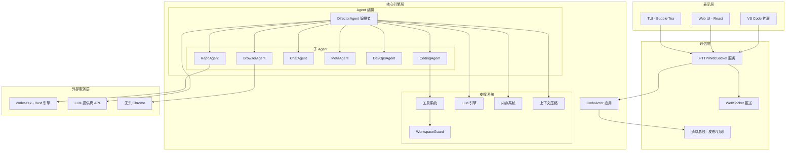
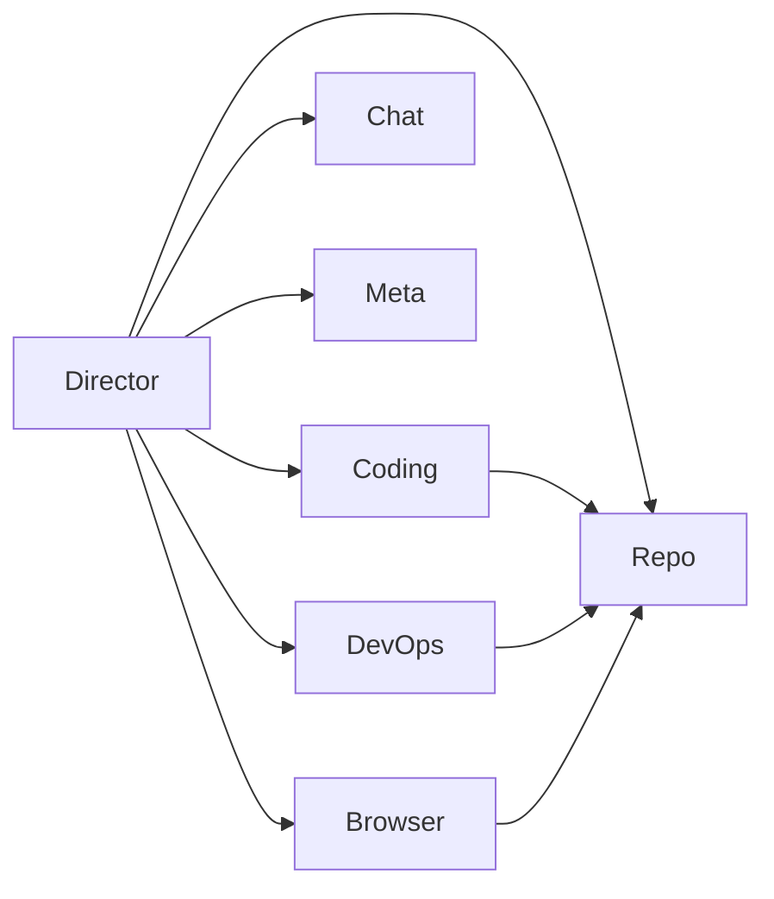
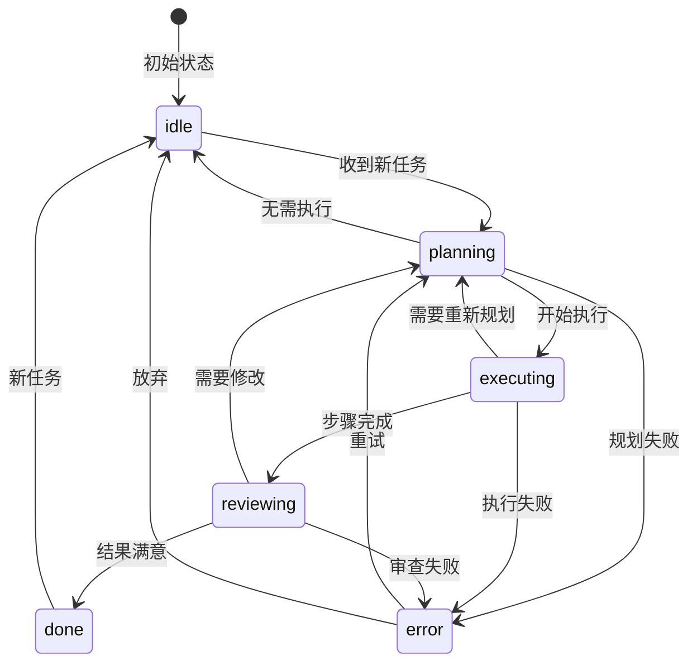
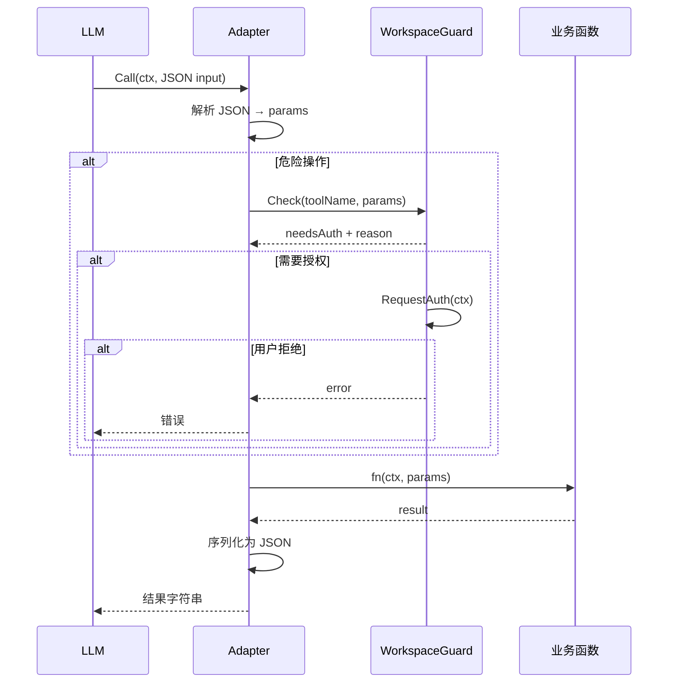
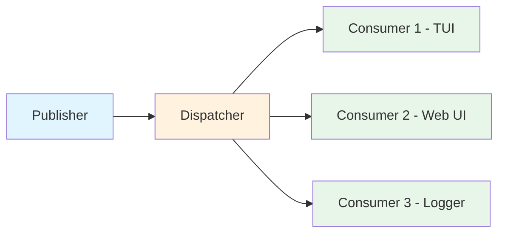
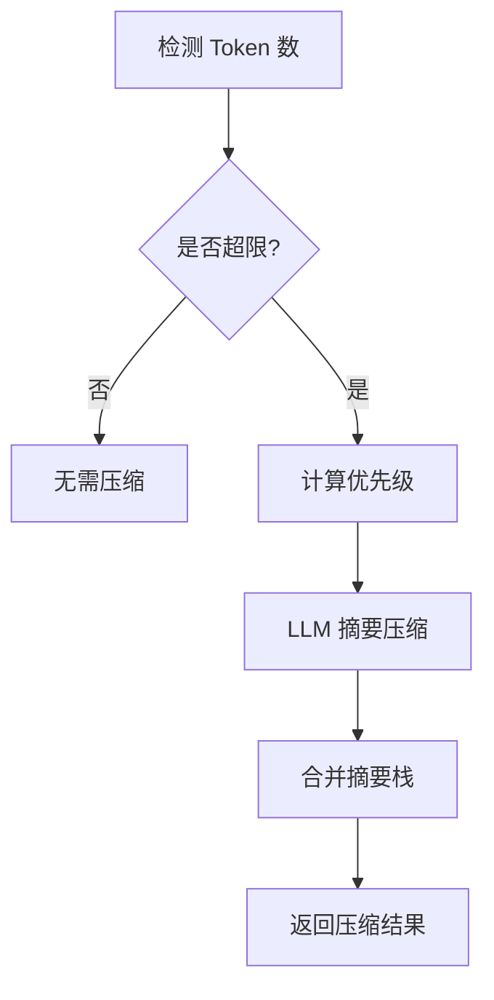
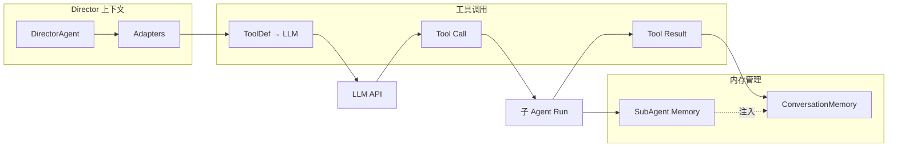

# CodeActor 系统架构文档

> 版本：v1.0.0 | 最后更新：2025年

## 目录

- [1. 概述](#1-概述)
- [2. 整体架构分层](#2-整体架构分层)
- [3. Agent 系统](#3-agent-系统)
  - [3.1 Agent 接口与基础](#31-agent-接口与基础)
  - [3.2 DirectorAgent 编排器](#32-directoragent-编排器)
  - [3.3 子 Agent 详解](#33-子-agent-详解)
  - [3.4 委派图（DelegationGraph）](#34-委派图delegationgraph)
  - [3.5 状态机（StateMachine）](#35-状态机statemachine)
- [4. 工具系统](#4-工具系统)
  - [4.1 Adapter 模式](#41-adapter-模式)
  - [4.2 工具注册表（Registry）](#42-工具注册表registry)
  - [4.3 WorkspaceGuard 安全守卫](#43-workspaceguard-安全守卫)
  - [4.4 委派适配器（DelegateAdapter）](#44-委派适配器的legateadapter)
  - [4.5 核心工具列表](#45-核心工具列表)
- [5. LLM 引擎](#5-llm-引擎)
  - [5.1 Engine 接口](#51-engine-接口)
  - [5.2 消息与工具定义格式](#52-消息与工具定义格式)
  - [5.3 多模型支持](#53-多模型支持)
- [6. 内存系统](#6-内存系统)
  - [6.1 ConversationMemory（对话内存）](#61-conversationmemory对话内存)
  - [6.2 LocalMemory（本地便签内存）](#62-localmemory本地便签内存)
- [7. 事件/消息系统](#7-事件消息系统)
  - [7.1 发布-订阅架构](#71-发布-订阅架构)
  - [7.2 事件类型](#72-事件类型)
  - [7.3 WAL 持久化与死信队列](#73-wal-持久化与死信队列)
  - [7.4 子包结构](#74-子包结构)
- [8. 上下文压缩引擎](#8-上下文压缩引擎)
  - [8.1 核心压缩算法](#81-核心压缩算法)
  - [8.2 优先级计算](#82-优先级计算)
- [9. 知识管理系统](#9-知识管理系统)
  - [9.1 KnowledgeInjector（知识注入）](#91-knowledgeinjector知识注入)
  - [9.2 ConsolidationWorker（记忆整理）](#92-consolidationworker记忆整理)
  - [9.3 RepoMemoryStore（仓库记忆）](#93-repomemorystore仓库记忆)
- [10. 外部服务集成](#10-外部服务集成)
  - [10.1 Codeseek 代码分析引擎](#101-codeseek-代码分析引擎)
  - [10.2 浏览器自动化](#102-浏览器自动化)
- [11. 表示层](#11-表示层)
  - [11.1 TUI（终端 UI）](#111-tui终端-ui)
  - [11.2 Web UI](#112-web-ui)
  - [11.3 VS Code 扩展](#113-vs-code-扩展)
- [12. 配置系统](#12-配置系统)
- [13. 关键设计模式](#13-关键设计模式)
- [14. 数据流图](#14-数据流图)
  - [14.1 任务处理完整数据流](#141-任务处理完整数据流)
  - [14.2 Agent 间通信数据流](#142-agent-间通信数据流)
- [15. 术语表](#15-术语表)

---

## 1. 概述

CodeActor 是一个用 Go 语言构建的 **AI 驱动自主编码系统**。它采用多 Agent 协作架构，通过 LLM（大语言模型）驱动，能够自主完成代码分析、编写、调试和运维等复杂任务。

### 核心特性

- **多 Agent 协作**：6 个专业子 Agent + 1 个编排者，各司其职
- **工具丰富**：26 种内置工具，覆盖文件操作、代码搜索、系统命令等
- **内存管理**：对话记忆 + 本地便签，自动修复 tool_call 配对
- **上下文压缩**：异步增量压缩，智能摘要，支持热重载配置
- **安全守卫**：工作区权限检查 + 用户确认机制
- **知识管理**：对话前知识检索注入、异步记忆整理、仓库记忆缓存
- **多表示层**：TUI、Web UI、VS Code 扩展，统一协议

### 项目结构

```
codeactor-agent/
├── internal/
│   ├── agents/        # Agent 系统核心（含 director/ 子包）
│   │   ├── director/  # Director 专用类型、指标、恢复逻辑
│   │   ├── context_compressor.go  # 上下文压缩（TruncateToolResultsToBudget）
│   │   ├── emergency_compressor.go # 紧急压缩
│   │   ├── consolidation_worker.go # 异步记忆整理
│   │   ├── repo_memory.go         # 仓库记忆缓存
│   │   ├── knowledge_hook.go      # 知识提取 hook
│   │   └── git_checkpoint.go      # Git checkpoint 机制
│   ├── tools/         # 工具系统（含 browser/ 子包）
│   │   └── browser/   # 11 个浏览器工具（navigate、click、scroll 等）
│   ├── llm/           # LLM 引擎抽象（engine_openai、engine_anthropic、fallback、messages）
│   ├── memory/        # 内存系统（ConversationMemory、LocalMemory）
│   ├── messaging/     # 消息系统（含 bus/、consumers/、peer/ 子包）
│   │   ├── bus/       # 基于 channel 的事件分发
│   │   ├── consumers/ # TUIConsumer、WebSocketConsumer
│   │   └── peer/      # 点对点消息通信
│   ├── browser/       # 浏览器自动化
│   ├── config/        # 配置系统（含 CodeSeek、Knowledge、MemoryJSONL 等）
│   ├── datamanager/   # 任务数据持久化（DataManager，JSONL 读/写/索引）
│   ├── knowledge/     # 知识注入器（KnowledgeInjector，对话前知识检索）
│   ├── mcp/           # MCP 客户端（MCPClient，stdio JSON-RPC）
│   ├── recovery/      # 熔断器（CircuitBreaker，closed/open/half-open）
│   ├── registry/      # 能力注册表（CapabilityRegistry）
│   ├── skills/        # 技能系统（SkillRegistry，加载 .md 技能文件）
│   ├── dict/          # 字典/补全引擎（DictEngine，关键词补全）
│   ├── diff/          # 差异比较工具
│   ├── embedbin/      # 嵌入二进制
│   ├── globalctx/     # 全局上下文单例（GlobalCtx）
│   ├── logging/       # 任务级日志目录管理
│   ├── tokenutil/     # Token 计数工具
│   ├── util/          # 通用工具（crash、error_utils、numeric）
│   ├── app/           # 应用入口
│   ├── tui/           # 终端 UI
│   ├── http/          # HTTP/WebSocket 服务
│   └── protocol/      # 协议定义
├── codeseek/          # Rust 代码分析引擎
├── vscode/            # VS Code 扩展
├── webui/             # Web 前端
├── protocol/          # 协议 Schema
└── config/            # 配置文件
```

---

## 2. 整体架构分层

CodeActor 采用经典的四层架构设计，从上到下依次为：



### 分层说明

| 层级 | 职责 | 关键组件 |
|------|------|----------|
| **表示层** | 用户交互界面 | TUI、Web UI、VS Code 扩展 |
| **通信层** | 进程间通信、事件分发 | HTTP Server、WebSocket、消息总线 |
| **核心引擎层** | 业务逻辑、AI 推理 | DirectorAgent、子 Agent、工具、LLM、内存 |
| **外部服务层** | 外部能力集成 | codeseek、LLM API、浏览器 |

---

## 3. Agent 系统

### 3.1 Agent 接口与基础

系统中所有 Agent 都实现统一的 `Agent` 接口：

```go
// internal/agents/types.go
type Agent interface {
    Name() string
    Run(ctx context.Context, input string) (AgentResult, error)
}

type AgentResult struct {
    Text   string
    Memory []memory.ChatMessage
}

type BaseAgent struct {
    LLM       llm.Engine
    Publisher *messaging.MessagePublisher
}
```

**设计要点**：
- `Name()` 返回 Agent 的唯一标识（snake_case 格式）
- `Run()` 接收任务描述字符串，返回文本结果和完整的内部对话历史
- `AgentResult.Memory` 包含 `IsSubAgent=true` 的完整对话记录，供 Director 注入主上下文

### 3.2 DirectorAgent 编排器

**DirectorAgent** 是整个系统的"大脑"，位于 `internal/agents/director.go`，负责：

1. **任务评估**：分析用户意图，选择合适的子 Agent
2. **委派调度**：通过工具调用将任务分发给子 Agent
3. **结果聚合**：收集子 Agent 输出，整合为最终回复
4. **流程控制**：状态管理、重试、熔断、上下文压缩协调

#### 3.2.1 Director 结构

```go
type DirectorAgent struct {
    BaseAgent
    // 6 个子 Agent 引用
    RepoAgent      *RepoAgent
    CodingAgent    *CodingAgent
    ChatAgent      *ChatAgent
    MetaAgent      *MetaAgent
    DevOpsAgent    *DevOpsAgent
    BrowserAgent   *BrowserAgent
    
    // 工具适配器列表
    Adapters       []*tools.Adapter
    
    // 上下文压缩（内联到 Director，无独立 Engine/AsyncCompactor 类型）
    
    // 容错机制
    stepRetries          int
    circuitBreakerThreshold    int
    circuitBreakerResetTimeout time.Duration
    consecutiveLLMFailures     int
    
    // 动态 Agent 注册
    customAgents map[string]*CustomAgent
}
```

#### 3.2.2 委派工具链

Director 通过 Adapters 向 LLM 暴露工具，核心是 6 个委派工具：

| 工具名 | 目标 Agent | 用途 |
|--------|-----------|------|
| `delegate_repo` | RepoAgent | 代码分析、语义搜索 |
| `delegate_coding` | CodingAgent | 文件读写、代码编辑 |
| `delegate_chat` | ChatAgent | 一般对话、解释 |
| `delegate_meta` | MetaAgent | 自定义 Agent 生成 |
| `delegate_devops` | DevOpsAgent | 系统运维、Shell 命令 |
| `delegate_browser` | BrowserAgent | 浏览器自动化 |

#### 3.2.3 Director Run 流程

```mermaid
sequenceDiagram
    participant User as 用户
    participant CA as CodeActor
    participant COND as DirectorAgent
    participant LLM as LLM API
    participant TOOL as 工具/子Agent
    participant MEM as 内存系统

    User->>CA: 输入任务
    CA->>COND: Run(ctx, task)
    COND->>MEM: 加载对话历史
    COND->>COND: Assess 阶段
    
    loop 最多 N 步
        COND->>LLM: 发送消息+工具定义
        LLM-->>COND: 响应(tool_call/text)
        
        alt tool_call
            COND->>TOOL: 执行委派/工具
            TOOL-->>COND: 执行结果
            COND->>MEM: 记录 tool_call/result
        else text
            COND->>MEM: 记录助手回复
            COND->>COND: 检查结果
            alt 需要更多步骤
                COND->>COND: 继续循环
            else 完成
                break
            end
        end
        
        alt 连续失败
            COND->>COND: 检查熔断器
            alt 触发熔断
                COND->>COND: 指数退避等待
            end
        end
    end
    
    COND->>COND: 压缩上下文(如需)
    COND->>MEM: 注入子 Agent 内存
    COND-->>CA: AgentResult
    CA-->>User: 最终回复
```

#### 3.2.4 容错机制

**熔断器（Circuit Breaker）**：
```go
// 连续 LLM 调用失败时触发熔断
if a.consecutiveLLMFailures >= a.circuitBreakerThreshold {
    // 指数退避重试
    time.Sleep(backoffDuration)
}
```

**步骤重试（Step Retries）**：
- 当 LLM 返回无效响应时，自动重试当前步骤
- 重试次数从配置 `config.LLM.StepRetries` 读取

**tool_call 配对修复**：
- 内存系统自动检测并修复 tool_call / tool_response 不匹配
- 防止截断或压缩破坏原子性

### 3.3 子 Agent 详解

#### 3.3.1 RepoAgent（代码分析 Agent）

**职责**：代码库深度分析、语义搜索、代码结构理解

**核心工具**：
- `semantic_search`：语义代码搜索
- `query_code_skeleton`：获取代码骨架
- `query_code_snippet`：获取代码片段
- `read_file`：文件读取
- `search_by_regex`：正则搜索

**外部依赖**：通过 MCP 调用 codeseek 服务（Rust 引擎）

```go
// RepoAgent 工具链
RepoOps = NewRepoOperationsTool(codeSeekMCP, workDir, 0)
```

#### 3.3.2 CodingAgent（编码 Agent）

**职责**：文件编辑、代码生成、构建执行

**核心工具**：
- `read_file`：读取文件内容
- `create_file`：创建新文件
- `search_replace_in_file`：搜索替换文本
- `run_bash`：执行 Shell 命令
- `thinking`：思考工具
- `micro_agent`：微 Agent 调用

#### 3.3.3 ChatAgent（对话 Agent）

**职责**：一般对话、问题解答、非编码任务

**核心工具**：
- `thinking`：思考工具
- `micro_agent`：微 Agent 调用
- **注意**：ChatAgent 无文件操作权限，纯对话 Agent

#### 3.3.4 MetaAgent（元 Agent / Agent 设计师）

**职责**：动态生成自定义 Agent 设计

**工作方式**：
1. 接收自然语言描述
2. 单次 LLM 调用生成 JSON 设计输出
3. Director 解析 JSON，注册为新 Agent

**输出格式**：
```json
{
  "thinking": "...",
  "agent_name": "my_custom_agent",
  "agent_design": "系统提示词...",
  "tools_used": ["read_file", "search_by_regex"],
  "task_for_agent": "任务描述模板..."
}
```

#### 3.3.5 DevOpsAgent（运维 Agent）

**职责**：系统管理、Shell 命令、文件检查、日志分析

**核心工具**：
- `run_bash`：执行任意 Shell 命令
- `read_file` / `search_by_regex`：文件检查
- `file_operations`：文件管理

#### 3.3.6 BrowserAgent（浏览器自动化 Agent）

**职责**：驱动无头 Chrome 完成 Web 操作

**技术栈**：go-rod（Chrome DevTools Protocol 客户端）

**核心能力**：
- 页面导航
- 元素操作
- 截图
- JavaScript 执行

### 3.4 委派图（DelegationGraph）

> **注**：委派图定义与执行状态控制内联于 `director.go` 和 `executor.go`，无独立 `delegation.go` 文件。

委派图是一个 **静态 DAG（有向无环图）**，定义 Agent 间的委派权限，防止循环调用。

```go
type DelegationGraph map[string][]string

// 默认委派关系
func DefaultDelegationGraph() DelegationGraph {
    return DelegationGraph{
        "director": {"repo", "coding", "chat", "meta", "devops", "browser"},
        "coding":    {"repo"},
        "devops":    {"repo"},
        "browser":   {"repo"},
        "repo":      {},  // 叶子节点
        "chat":      {},  // 叶子节点
        "meta":      {},  // 叶子节点
    }
}
```



**验证算法**：DFS 三色标记法检测环
- 0 = 未访问（白色）
- 1 = 正在访问（灰色）
- 2 = 已完成（黑色）

**拓扑排序**：Kahn 算法，从叶子到根排序

### 3.5 状态机（StateMachine）

> **注**：状态机为设计规划，当前通过 `executor.go` 中的循环实现等效流程控制，无独立的 `StateMachine` 类型或 `state_machine.go` 文件。

状态机管理 Director 的运行阶段，确保流程可控。



**状态定义**：
| 状态 | 含义 | 允许转换 |
|------|------|----------|
| `idle` | 空闲 | → planning |
| `planning` | 规划中 | → executing, error, idle |
| `executing` | 执行中 | → reviewing, error, planning |
| `reviewing` | 审查中 | → done, planning, error, idle |
| `done` | 完成 | → idle |
| `error` | 错误 | → planning, idle |

---

## 4. 工具系统

工具系统位于 `internal/tools/`，提供统一、安全的工具调用接口。

### 4.1 Adapter 模式

**Adapter** 是工具系统的核心抽象，将函数包装为 LLM 可用的工具定义：

```go
// internal/tools/adapter.go
type ToolFunc func(ctx context.Context, params map[string]interface{}) (interface{}, error)

type Adapter struct {
    name        string
    description string
    fn          ToolFunc
    schema      map[string]interface{}
    guard       *WorkspaceGuard
}
```

**关键方法**：
- `NewAdapter(name, description, fn)`：创建适配器
- `WithSchema(schema)`：设置 JSON Schema
- `Call(ctx, input)`：执行工具调用，自动触发 guard 检查
- `ToToolDef()`：转换为 LLM 的 ToolDef 格式

**工作流程**：


### 4.2 工具注册表（Registry）

**Registry** 是线程安全的工具注册表，支持注册/查找/列表：

```go
type Registry struct {
    tools   map[string]*Adapter
    mu      sync.RWMutex
}
```

**特性**：
- 线程安全（读写锁）
- 按名称索引
- 支持批量获取（用于 LLM 系统提示）

### 4.3 WorkspaceGuard 安全守卫

**WorkspaceGuard** 在执行危险操作前检查文件路径，确保操作在工作区内：

```go
type WorkspaceGuard struct {
    workspacePath     string
    confirmMgr        *UserConfirmManager
    sessionAllowed    map[string]bool  // 会话级授权工具
    sessionAllAllowed bool             // 会话内全部授权
    projectAuthorized bool             // 项目永久授权
}
```

**危险工具列表**：
| 工具名 | 检查类型 |
|--------|----------|
| `create_file` | 路径在工作区内 |
| `search_replace_in_file` | 路径在工作区内 |
| `delete_file` | 路径在工作区内 |
| `rename_file` | 路径在工作区内 |
| `run_bash` | 命令白名单检查 |

**授权级别**：
1. **单次授权**（allow/yes）：仅本次生效
2. **会话授权**（allow_session）：本次会话内该工具免审
3. **会话全部授权**（allow_all_session）：本次会话内所有工具免审
4. **项目永久授权**（allow_all_project）：持久化到 settings.json

### 4.4 委派适配器（DelegateAdapter）

将 Agent 包装为 `delegate_<name>` 工具，使其他 Agent 可直接调用：

```go
func NewDelegateAdapter(name, description string, target AgentRunner) *Adapter {
    toolName := "delegate_" + name
    return NewAdapter(toolName, description, func(ctx, params) {
        task := params["task"].(string)
        return target.Run(ctx, task)
    }).WithSchema({...})
}
```

### 4.5 核心工具列表

工具定义位于 `internal/agents/tools.json`，共 26 个工具。

| 类别 | 工具 | 说明 |
|------|------|------|
| **文件操作** | `read_file` | 读取文件内容 |
| | `create_file` | 创建新文件 |
| | `search_replace_in_file` | 搜索并替换文本块 |
| | `delete_file` | 删除文件 |
| | `rename_file` | 重命名文件 |
| **目录浏览** | `list_dir` | 查看目录内容 |
| | `print_dir_tree` | 打印目录树 |
| **搜索** | `search_by_regex` | 正则表达式搜索 |
| | `semantic_search` | 语义代码搜索（调用 codeseek） |
| | `query_code_skeleton` | 获取代码骨架 |
| | `query_code_snippet` | 获取代码片段 |
| | `find_function_callee` | 查找函数调用方 |
| | `find_function_caller` | 查找被调用函数 |
| | `query_call_graph` | 查询调用图 |
| **系统** | `run_bash` | 执行 Shell 命令 |
| **认知** | `thinking` | 思考工具 |
| | `micro_agent` | 创建子任务 |
| | `deepthinking` | 深度分析 |
| **交互** | `ask_user_for_help` | 请求用户帮助 |
| | `agent_exit` | 退出 Agent |
| **Git** | `git_checkpoint_list` | 列出 checkpoint |
| | `git_checkpoint_rollback` | 回滚到 checkpoint |
| | `git_checkpoint_create` | 创建 checkpoint |
| **知识** | `consolidate_knowledge` | 整理知识 |
| | `prune_history` | 清理历史知识 |
| **委派** | `delegate_repo` | 委派代码分析 |
| | `delegate_coding` | 委派编码任务 |
| | `delegate_chat` | 委派对话 |
| | `delegate_meta` | 委派 Agent 设计 |
| | `delegate_devops` | 委派运维任务 |
| | `delegate_browser` | 委派浏览器操作 |
| **浏览器**（`tools/browser/`，11 个） | `navigate`、`click`、`scroll`、`input`、`cookies`、`evaluate`、`extract`、`history`、`pdf`、`wait_element`、`registry` | 无头浏览器自动化 |

---

## 5. LLM 引擎

### 5.1 Engine 接口

LLM 引擎抽象层，支持多种 LLM 提供商：

```go
// internal/llm/engine.go
type Engine interface {
    GenerateContent(ctx context.Context, messages []Message, tools []ToolDef, opts *CallOptions) (*Response, error)
    Model() string
}
```

**实现**：
- `EngineOpenAI`（`internal/llm/engine_openai.go`）：OpenAI 兼容接口，支持 Claude（通过 OpenAI 兼容端点）、Gemini 等
- `EngineAnthropic`（`internal/llm/engine_anthropic.go`）：Anthropic 原生接口，支持 thinking blocks、cache control
- `internal/llm/fallback.go`、`internal/llm/messages.go`：故障转移与消息工具定义

### 5.2 消息与工具定义格式

#### 消息格式

```go
type Message struct {
    Role       Role       // system/user/assistant/tool
    Content    string     // 文本内容
    ToolCalls  []ToolCall // 工具调用
    ToolCallID string     // 工具调用 ID（tool 角色回复用）
    ToolName   string     // 工具名称
    Reasoning  string     // 推理内容（DeepSeek 等）
}
```

#### 工具定义

```go
type ToolDef struct {
    Type     string      // "function"
    Function FunctionDef
}

type FunctionDef struct {
    Name        string         // 工具名称
    Description string         // 工具描述
    Parameters  map[string]any // JSON Schema
}
```

### 5.3 多模型支持

CodeActor 支持为不同 Agent 和工具配置不同的 LLM 模型：

```
配置层级：
  1. per-agent 引擎（优先级最高）
  2. per-tool 引擎
  3. 默认引擎
```

```go
// 引擎解析
directorEngine = client.GetAgentEngine("director")
codingEngine    = client.GetAgentEngine("coding")
microAgentEngine = client.GetToolEngine("micro_agent")
```

**优势**：
- 简单任务使用低成本模型
- 复杂推理使用高质量模型
- 微 Agent 可以使用独立模型

---

## 6. 内存系统

### 6.1 ConversationMemory（对话内存）

管理完整的对话上下文，支持多角色和子 Agent 分组：

```go
// internal/memory/memory.go
type ChatMessage struct {
    Type       MessageType     // system/human/assistant/tool
    Content    string
    ToolCalls  []ToolCallData
    ToolCallID *string
    Timestamp  time.Time
    Metadata   map[string]interface{}

    // 子 Agent 分组元数据
    GroupID    string  // 同一 sub-agent 调用共享
    ParentID   string  // 指向 Director 的 tool_call_id
    IsSubAgent bool    // 快速过滤标记
}

type ConversationMemory struct {
    Messages []ChatMessage
    MaxSize  int  // 默认 300 条
}
```

**核心功能**：
1. **自动截断**：超过 MaxSize 时移除最旧的非系统消息
2. **tool_call 配对修复**：截断后自动修复不匹配的 tool_call
3. **子 Agent 隔离**：`ToMessages()` 自动跳过 IsSubAgent 消息
4. **Sub-agent 注入**：子 Agent 完成后，Director 将完整 Memory 注入主上下文

### 6.2 LocalMemory（本地便签内存）

Agent 私有便签，不跨 Agent 共享：

```go
type LocalMemory struct {
    // 每个 Agent 实例独立的私有存储
    data map[string]string
    mu   sync.RWMutex
}
```

**用途**：
- Agent 内部状态追踪
- 任务上下文缓存
- 避免重复 LLM 调用

---

## 7. 事件/消息系统

### 7.1 发布-订阅架构



**核心组件**：

```go
// MessagePublisher - 发布者
type MessagePublisher struct {
    dispatcher *MessageDispatcher
}

func (p *Publisher) Publish(eventType string, content interface{}, from string) error

// MessageDispatcher - 调度器
type MessageDispatcher struct {
    mainCh        chan *Event
    consumers     map[EventType][]Consumer
    wal           WAL
    backlog       *Backlog
    dlq           *DeadLetterQueue
}
```

**数据流**：
1. Agent 通过 Publisher 发布事件
2. Dispatcher 接收事件，写入 WAL（如启用）
3. Dispatcher 按 EventType 分发给所有注册 Consumer
4. 如果主 channel 满，事件进入 Backlog
5. 如果 Consumer 处理失败，事件进入死信队列

### 7.2 事件类型

协议定义在 `internal/protocol/agent_events.go`：

| 事件类型 | 说明 | 使用场景 |
|---------|------|----------|
| `model_info` | 模型信息 | 启动时广播当前模型 |
| `llm_call_start` | LLM 调用开始 | 监控/计时 |
| `llm_call_end` | LLM 调用结束 | 监控/统计 |
| `ai_response` | AI 响应 | 显示给用户 |
| `tool_call_start` | 工具调用开始 | 进度展示 |
| `tool_call_result` | 工具调用结果 | 进度展示 |
| `tool_call_error` | 工具调用错误 | 错误处理 |
| `context_loaded` | 上下文加载 | 进度展示 |
| `ai_stream_start` | 流式响应开始 | 流式 UI |
| `ai_chunk` | 流式数据块 | 流式 UI |
| `ai_stream_end` | 流式响应结束 | 流式 UI |
| `user_help_needed` | 需要用户帮助 | 权限请求 |
| `user_help_response` | 用户回复 | 权限决策 |
| `conversation_error` | 对话错误 | 错误处理 |
| `conversation_result` | 对话完成 | 任务完成 |
| `thinking` | 思考内容 | 思考展示 |

### 7.3 WAL 持久化与死信队列

**WAL（Write-Ahead Log）**：
- 异步写入磁盘，确保事件不丢失
- 支持重启后回放未确认事件
- 通过 `DispatcherOptions.WALPath` 配置

**Backlog（积压队列）**：
- 主 channel 满时，事件溢出到 Backlog
- 后台协程定期排空 Backlog
- 可配置最大容量（默认 10000）

**DeadLetterQueue（死信队列）**：
- Consumer 处理失败的事件进入 DLQ
- 可配置重试次数（默认 3 次）
- 支持指数退避重试

### 7.4 子包结构

消息系统包含以下子包：

| 子包 | 内容 | 说明 |
|------|------|------|
| `internal/messaging/bus/` | `bus.go` | 基于 channel 的事件分发核心 |
| `internal/messaging/consumers/` | `tui.go`、`websock.go` | TUI 消费者、WebSocket 消费者 |
| `internal/messaging/peer/` | `peer.go`、`topics.go`、`options.go` | 点对点消息通信 |

---

## 8. 上下文压缩引擎

### 8.1 核心压缩算法

上下文压缩逻辑位于 `internal/agents/context_compressor.go`，当对话 token 数超过限制时触发：

```go
// TruncateToolResultsToBudget 截断工具结果以适配 token 预算
func TruncateToolResultsToBudget(messages []Message, budget int) []Message
```

**压缩流程**：


**关键参数**：
- `MaxContextTokens`：上下文 token 上限
- `KeepRecentRounds`：保留最近 N 轮完整对话
- `MinSummaryTokens`：摘要最小 token 数

### 8.2 优先级计算

**PriorityCalculator** 根据多种因素计算消息优先级：

```go
type PriorityWeights struct {
    SystemMessageWeight    float64  // 系统消息权重
    RecentMessageWeight    float64  // 近期消息权重
    ToolCallWeight         float64  // 工具调用权重
    UserMessageWeight      float64  // 用户消息权重
    CriticalMessageWeight  float64  // 关键消息权重
}
```

**优先级越高**的消息越可能在压缩时被保留。

**紧急压缩**（`internal/agents/emergency_compressor.go`）：
当 token 严重超限时，`EmergencyCompressMessages()` 执行强制压缩，Director 在主循环中调用。

---

## 9. 知识管理系统

### 9.1 KnowledgeInjector（知识注入）

**职责**：在 Agent 执行对话前，从代码库中检索相关知识并注入到上下文中。

**位置**：`internal/knowledge/injector.go`

**工作方式**：
1. 接收当前对话上下文
2. 通过 codeseek MCP 检索相关代码片段和知识条目
3. 将检索结果注入到系统提示中
4. 控制注入 token 数量（`InjectionMaxTokens`）和条目数（`InjectionMaxEntries`）

### 9.2 ConsolidationWorker（记忆整理）

**职责**：异步整理 Agent 执行过程中产生的对话记忆，提取可复用知识。

**位置**：`internal/agents/consolidation_worker.go`

**工作方式**：
1. 监听 Agent 执行完成的信号
2. 对对话历史进行摘要和知识提取
3. 将提取的知识写入长期存储
4. 支持热重载配置

### 9.3 RepoMemoryStore（仓库记忆）

**职责**：缓存仓库级别的结构化记忆，避免重复分析相同代码区域。

**位置**：`internal/agents/repo_memory.go`

**工作方式**：
1. 缓存代码分析结果（结构、依赖、关键函数）
2. 在 Agent 执行期间快速检索已有记忆
3. 配合 KnowledgeHook 在对话中提取新知识点

---

## 10. 外部服务集成

### 10.1 Codeseek 代码分析引擎

Codeseek 是一个用 Rust 编写的代码分析引擎，通过 MCP（stdio JSON-RPC）提供语义代码搜索能力：

```
┌──────────────┐         HTTP/gRPC         ┌──────────────┐
│  CodeActor   │ ──────────────────────▶  │  Codeseek    │
│  (Go)        │ ◀──────────────────────  │  (Rust)      │
└──────────────┘                          └──────────────┘
```

**集成方式**：
- RepoAgent 通过 MCP 调用 codeseek 服务
- 端口由 main 函数动态分配

**提供的能力**：
- 语义代码搜索
- 代码骨架查询
- 代码片段提取
- 代码结构分析

### 10.2 浏览器自动化

BrowserAgent 使用 go-rod 驱动无头 Chrome：

```go
import "github.com/go-rod/rod"
```

**能力**：
- 页面导航
- 元素查找和操作
- 截图
- JavaScript 执行
- Cookie 管理

---

## 11. 表示层

### 11.1 TUI（终端 UI）

基于 Bubble Tea 框架的终端界面：

```go
import "github.com/charmbracelet/bubbletea"
```

**组件**：
- `tui_model.go`：Bubble Tea Model 实现
- `tui_render.go`：渲染逻辑
- `tui_tasks.go`：任务管理
- `tui_completion.go`：自动补全
- `components/`：可复用 UI 组件

### 11.2 Web UI

React + TypeScript 构建的 Web 界面：

```
webui/
├── src/          # React 组件
├── public/       # 静态资源
└── package.json  # 依赖
```

**通信协议**：WebSocket，使用统一的 Agent Events 协议。

### 11.3 VS Code 扩展

VS Code 扩展通过 WebSocket 与 CodeActor 通信：

```
┌──────────────┐  WebSocket   ┌──────────────┐
│ VS Code      │ ◀─────────▶ │ CodeActor    │
│ Extension    │              │ HTTP Server  │
└──────────────┘              └──────────────┘
```

**功能**：
- 侧边栏集成
- 代码操作
- 实时状态展示

---

## 12. 配置系统

配置系统支持热重载，位于 `internal/config/config.go`：

```go
type Config struct {
    Global      TopLevelConfig       // [global.llm] - 全局 LLM 配置
    Agents      AgentsConfig         // [agents.llm] - 按 Agent 的 LLM 覆盖
    Tools       ToolsConfig          // [tools.llm] - 按工具的 LLM 覆盖
    App         AppConfig            // [app] - 应用级配置
    Agent       AgentConfig          // [agent] - Agent 行为配置
    LLM         LLMConfig            // [llm] - LLM 推理兜底配置（超时、重试、熔断）
    Browser     BrowserConfig        // [browser] - 浏览器配置
    Keywords    KeywordsConfig       // [keywords] - 关键词词典配置
    TaskTimeout time.Duration        // 全局任务超时
    GitCheckpoint GitCheckpointConfig // [git_checkpoint] - Git checkpoint 机制
    CodeSeek    CodeSeekConfig       // [codeseek] - MCP 代码分析引擎配置
    EnhancedCommander EnhancedCommanderConfig // [enhanced_commander] - 增强型 Commander
    TUI         TUIConfig            // [tui] - TUI 界面配置（快捷键等）
    MemoryJSONL MemoryJSONLConfig    // [memory_jsonl] - JSONL 实时写入配置
}
```

**特性**：
- TOML 格式配置文件
- 运行时热重载
- 默认配置 + 用户配置覆盖
- 三层 LLM 覆盖：per-tool > per-agent > global
- 支持 Bedrock、Anthropic 原生 API、OpenAI 兼容 API

---

## 13. 关键设计模式

| 模式 | 应用位置 | 说明 |
|------|---------|------|
| **Orchestrator** | DirectorAgent | 编排子 Agent 协作 |
| **Adapter** | tools.Adapter | 统一工具接口 |
| **Strategy** | 压缩策略、LLM 引擎选择 | 可切换算法 |
| **State Machine** | executor 循环（设计规划） | 状态流转控制 |
| **Circuit Breaker** | DirectorAgent / recovery/ | 连续失败时熔断 |
| **Retry** | 指数退避重试 | 容错机制 |
| **Publish-Subscribe** | MessageDispatcher | 事件分发 |
| **Factory** | NewDirectorAgent, NewAgent | Agent 创建 |
| **Decorator** | Adapter.WithSchema | 增强工具定义 |
| **Singleton** | GlobalCtx | 全局上下文 |
| **Repository** | RepoMemoryStore | 仓库记忆缓存 |
| **Hook** | knowledge_hook.go | 知识提取钩子 |

---

## 14. 数据流图

### 14.1 任务处理完整数据流

```mermaid
flowchart TB
    subgraph Input ["输入"]
        USER[用户输入]
    end

    subgraph Core ["核心处理"]
        APP[CodeActor.Init]
        COND[DirectorAgent]
        
        subgraph Agents ["Agent 层"]
            REPO[RepoAgent]
            CODE[CodingAgent]
            CHAT[ChatAgent]
            META[MetaAgent]
            DEVOPS[DevOpsAgent]
            BR[BrowserAgent]
        end
        
        subgraph Tools ["工具层"]
            FILEOPS[文件操作]
            SEARCH[搜索工具]
            BASH[Shell 执行]
            CODESEEK[codeseek]
        end
    end

    subgraph State ["状态管理"]
        MEM[ConversationMemory]
        LOCALM[LocalMemory]
        SM[Executor Loop
(设计: StateMachine)]
        COMPACT[Context Compression]
    end

    subgraph Output ["输出"]
        TUI[TUI]
        WEB[Web UI]
        VSIX[VS Code]
    end

    USER --> APP
    APP --> COND
    COND --> Agents
    COND --> Tools
    Agents --> MEM
    COND --> SM
    COND --> COMPACT
    COND --> OUTPUT
    MEM --> COND
    LOCALM --> Agents
    
    Tools --> CODESEEK
    FILEOPS --> MEM
    SEARCH --> MEM
    BASH --> MEM
    
    COND --> TUI
    COND --> WEB
    COND --> VSIX
```

### 14.2 Agent 间通信数据流



---

## 15. 术语表

| 术语 | 英文 | 说明 |
|------|------|------|
| Agent | Agent | 具有特定能力的 AI 组件 |
| Director | DirectorAgent | 系统的编排者/大脑 |
| Sub-Agent | Sub-Agent | 被委派任务的专用 Agent |
| Tool | Tool | Agent 可使用的操作能力 |
| Adapter | Adapter | 工具适配器，包装函数为 LLM 可用格式 |
| Delegate | Delegate | 委派，将一个任务交给另一个 Agent |
| LLM | Large Language Model | 大语言模型 |
| Tool Call | Tool Call | LLM 请求调用工具的请求 |
| WAL | Write-Ahead Log | 预写日志，用于持久化 |
| DLQ | Dead Letter Queue | 死信队列，存放处理失败的消息 |
| TUI | Text User Interface | 终端用户界面 |
| Codeseek | Codeseek | Rust 编写的代码分析引擎 |
| Context Compression | Context Compression | 上下文压缩，减少 token 占用 |
| Circuit Breaker | Circuit Breaker | 熔断器，连续失败时暂停 |
| State Machine | State Machine | 状态机（设计规划），当前由 executor 循环实现 |
| DAG | Directed Acyclic Graph | 有向无环图 |
| Knowledge Injection | Knowledge Injection | 对话前从代码库检索相关知识注入上下文 |
| MCP | Model Context Protocol | stdio JSON-RPC 协议，用于集成外部服务 |

---

## 附录

### A. 关键文件索引

| 文件路径 | 说明 |
|---------|------|
| `internal/agents/types.go` | Agent 接口定义 |
| `internal/agents/director.go` | DirectorAgent 实现（含委派图定义） |
| `internal/agents/director/types.go` | Director 专用类型 |
| `internal/agents/director/metrics.go` | Director 指标采集 |
| `internal/agents/director/recovery.go` | Director 恢复/重试逻辑 |
| `internal/agents/context_compressor.go` | 上下文压缩（TruncateToolResultsToBudget） |
| `internal/agents/emergency_compressor.go` | 紧急压缩（EmergencyCompressMessages） |
| `internal/agents/consolidation_worker.go` | 异步记忆整理 |
| `internal/agents/repo_memory.go` | 仓库记忆缓存 |
| `internal/agents/knowledge_hook.go` | 知识提取 hook |
| `internal/agents/git_checkpoint.go` | Git checkpoint 机制 |
| `internal/agents/tools.json` | 26 个工具定义 |
| `internal/tools/adapter.go` | 工具适配器 |
| `internal/tools/registry.go` | 工具注册表 |
| `internal/tools/workspace_guard.go` | 工作区守卫 |
| `internal/tools/delegate.go` | 委派适配器 |
| `internal/tools/browser/` | 11 个浏览器工具 |
| `internal/llm/engine.go` | LLM 引擎接口 |
| `internal/llm/engine_openai.go` | OpenAI 兼容实现 |
| `internal/llm/engine_anthropic.go` | Anthropic 原生实现 |
| `internal/llm/fallback.go` | 故障转移 |
| `internal/llm/messages.go` | 消息与工具定义 |
| `internal/memory/memory.go` | 对话内存 |
| `internal/memory/local.go` | 本地便签内存 |
| `internal/messaging/message_publisher.go` | 消息发布者 |
| `internal/messaging/message_dispatcher.go` | 消息调度器 |
| `internal/messaging/bus/bus.go` | 基于 channel 的事件分发 |
| `internal/messaging/consumers/tui.go` | TUI 消费者 |
| `internal/messaging/consumers/websock.go` | WebSocket 消费者 |
| `internal/messaging/peer/peer.go` | 点对点消息通信 |
| `internal/messaging/wal.go` | WAL 持久化 |
| `internal/knowledge/injector.go` | 知识注入器 |
| `internal/mcp/client.go` | MCP 客户端 |
| `internal/recovery/circuit_breaker.go` | 熔断器 |
| `internal/registry/capability_registry.go` | 能力注册表 |
| `internal/skills/skills.go` | 技能系统 |
| `internal/datamanager/data_manager.go` | 任务数据持久化 |
| `internal/config/config.go` | 配置系统 |
| `internal/protocol/agent_events.go` | 事件类型定义 |
| `internal/app/app.go` | CodeActor 应用入口 |

### B. 配置示例

```toml
# config/config.toml

[global.llm]
use_provider = "deepseek"

[global.llm.providers.deepseek]
model = "deepseek-chat"
api_base_url = "https://api.deepseek.com"
api_key = "sk-..."

[agents.llm]
use_provider = "deepseek"

[agent]
yolo_mode = false
director_max_steps = 30
coding_max_steps = 20
chat_max_steps = 10
repo_max_steps = 15
devops_max_steps = 15
browser_max_steps = 10
meta_max_steps = 5
meta_retry_count = 3

[llm]
timeout = "30s"
max_retries = 5
step_retries = 3
circuit_breaker_threshold = 5
circuit_breaker_reset_timeout = "60s"
enable_fallback = true

[browser]
headless = true
viewport_width = 1280
viewport_height = 720
timeout_seconds = 30
enable_browser_agent = true

[codeseek]
binary_path = ""
request_timeout = 30

[codeseek.knowledge]
enabled = true
injection_max_tokens = 2000
injection_max_entries = 10
injection_min_score = 0.5

[git_checkpoint]
enabled = true
max_checkpoints = 10
squash_on_exit = true
auto_merge_on_exit = false

[enhanced_commander]
enable = false
max_delegation_depth = 3
enable_context_compression = true
context_compression_threshold = 120000
tool_result_keep_tokens = 200

[memory_jsonl]
enable = false
output_dir = "~/.codeactor/tasks"

[tui.keybindings.edit]
submit_task = "alt+s"
command_mode = "ctrl+e"
```
