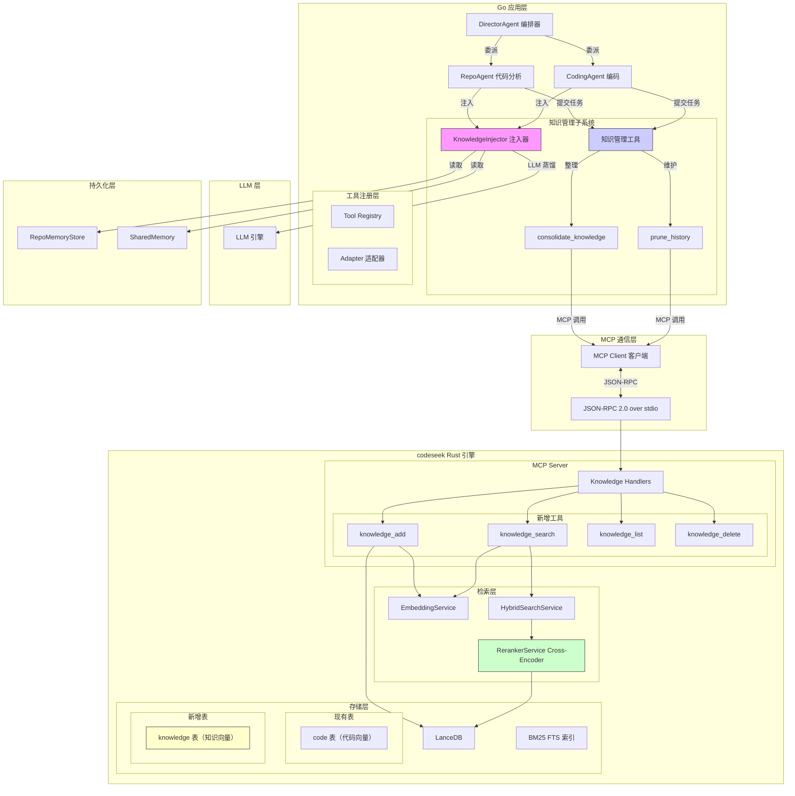

# 知识管理系统设计方案

> **文档信息**

| 属性 | 值 |
|------|------|
| **标题** | 知识管理系统设计方案 |
| **版本** | v0.1（草案） |
| **日期** | 2025-07-15 |
| **状态** | 待评审 |
| **适用范围** | CodeActor Agent 系统 — 知识检索、注入、整理子系统 |
| **作者** | codeactor-agent 技术团队 |
| **相关文档** | [ARCHITECTURE.md](./ARCHITECTURE.md)、[context-compression-config.md](./context-compression-config.md) |

---

## 目录

- [1. 背景与问题](#1-背景与问题)
- [2. 现状基础盘点](#2-现状基础盘点)
- [3. 总体架构与数据流](#3-总体架构与数据流)
- [4. 存储方案选型](#4-存储方案选型)
- [5. 详细设计](#5-详细设计)
- [6. 配置项](#6-配置项)
- [7. 分阶段实施计划](#7-分阶段实施计划)
- [8. 测试与验证策略](#8-测试与验证策略)
- [9. 风险点与缓解](#9-风险点与缓解)
- [10. 回滚计划](#10-回滚计划)
- [11. 关键假设](#11-关键假设)

---

## 1. 背景与问题

### 1.1 目标

为 CodeActor Agent 系统提供一套**专门的知识管理工具链**，解决当前上下文中知识碎片化、重复检索、知识丢失等问题。核心目标：

1. **知识持久化**：将 Agent 在 Repo-Agent 检索任务和 Coding-Agent 编码/修改文件任务中积累的知识，通过向量索引持久化到 codeseek 向量数据库。
2. **语义检索注入**：每次对话启动前，使用 Cross-Encoder 从知识库中检索与当前任务最相关的历史记忆，注入到系统提示词中。
3. **知识整理工具**：提供 `consolidate_knowledge()` 和 `prune_history()` 两个 LLM 可调用的工具，允许 Agent 主动管理和优化知识库。
4. **知识精简原则**：知识条目必须**核心、简练**，一题一条，只记录关键发现和坐标，避免冗余。

### 1.2 现状问题三层缺陷

| 层级 | 问题描述 | 根本原因 | 影响 |
|------|----------|----------|------|
| **存储层** | codeseek 只能索引代码文件，无独立的知识表 | 现有 LanceDB 表仅存储代码文件的向量表示 | 知识无法被向量语义检索，只能依赖代码语义搜索 |
| **整理层** | ConsolidationWorker 合并结果只停留在 Go 进程内；`SharedMemory.Compact()` 为空实现 | 记忆整理后未写入持久化存储；Compact() 仅为占位符 | 进程重启后知识丢失；长期积累的知识无法压缩整理 |
| **注入层** | `RenderMemoryForInjection()` 是静态全量注入，无相关性筛选 | 每次注入完整记忆文本，不考虑与当前任务的相关性 | 无关知识占用 token，相关知识可能被遗漏，导致重复检索/重复犯错 |

### 1.3 因果链描述

```
┌─────────────────────────────────────────────────────────────────────────┐
│                         问题因果链                                       │
├─────────────────────────────────────────────────────────────────────────┤
│                                                                         │
│  codeseek 无知识表                                                        │
│      ↓                                                                  │
│  知识只能存内存（RepoMemoryStore）或文件（.md）                            │
│      ↓                                                                  │
│  无法进行向量语义检索（只有代码文件向量）                                  │
│      ↓                                                                  │
│  知识注入只能静态全量（RenderMemoryForInjection 每次注入全部记忆）          │
│      ↓                                                                  │
│  无关知识占用大量 token + 相关知识可能缺失                                 │
│      ↓                                                                  │
│  Agent 重复检索相同问题 + 重复犯相同错误                                   │
│                                                                         │
└─────────────────────────────────────────────────────────────────────────┘
```

### 1.4 优先级排序

| 优先级 | 任务 | 说明 |
|--------|------|------|
| **P0** | codeseek 知识表 + MCP 工具 | 基础支撑，无此则后续无法实现 |
| **P1** | `consolidate_knowledge()` 工具 | 主动知识整理入口 |
| **P1** | `prune_history()` 工具 | 主动知识维护入口 |
| **P1** | 对话前检索注入 | 核心价值点，动态知识注入 |
| **P2** | ConsolidationWorker 自动提取 | 自动化触发，减少人工调用 |

---

## 2. 现状基础盘点

### 2.1 已有能力

| 能力 | 关键文件/函数 | 说明 |
|------|---------------|------|
| **ConversationMemory 截断** | `internal/memory/memory.go` L180-200 | 超过 `MaxSize` 时自动截断最旧的非系统消息 |
| **tool_call 配对修复** | `internal/memory/memory.go` L220-280 | `repairToolCallPairsAfterTruncation()` |
| **ConsolidationWorker 异步整理** | `internal/agents/consolidation_worker.go` | 单 goroutine + channel 串行处理，LLM 蒸馏 + 格式校验 |
| **RepoMemoryStore 静态注入** | `internal/agents/repo_memory.go` L152-162 | `RenderMemoryForInjection()` 将记忆注入 system prompt |
| **codeseek LanceDB 向量索引** | `codeseek/rust-core/src/services/embedding_service.rs` | Qwen3-Embedding-4B，2560 维，LanceDB 存储 |
| **Hybrid Search（RRF 融合）** | `codeseek/rust-core/src/services/hybrid_search.rs` | Dense(vector) + Sparse(BM25) 双路召回 |
| **Cross-Encoder Reranker** | `codeseek/rust-core/src/services/reranker_service.rs` | BAAI/bge-reranker-v2-m3，可选启用 |
| **MCP 集成（stdio JSON-RPC 2.0）** | `internal/mcp/client.go` | `MCPClient.CallTool()` 封装 JSON-RPC 调用 |
| **工具注册机制** | `internal/tools/registry.go` + `tools.json` | Registry 线程安全注册表，Adapter 模式 |
| **ResultCompressor 大结果压缩** | `internal/agents/result_compressor.go` | 阈值 4096 字节，摘要 2048 字符，存入 SharedMemory |
| **IsAnchored 锚定标记** | `internal/memory/memory.go` L45-50 | 锚定消息不参与压缩/截断 |

### 2.2 缺失能力

| 缺失能力 | 影响 | 解决方向 |
|----------|------|----------|
| **Go 层向量检索工具** | Agent 无法主动触发知识检索 | 新增 `knowledge_search` MCP 工具 + Go 封装 |
| **动态知识检索注入** | 每次对话只能注入静态记忆 | 新增 `KnowledgeInjector`，对话前检索注入 |
| **知识写入通道** | 整理后的知识无处写入 | codeseek 新增 knowledge 表 + `knowledge_add` 工具 |
| **知识图谱（可选）** | 缺乏知识间关系表示 | 暂不实现，知识表通过 tags/related_files 关联 |
| **SharedMemory.Compact() 实现** | 共享内存无法压缩 | 作为 P2 任务，与知识整理协同实现 |

### 2.3 关键代码位置索引

| 组件 | 文件路径 | 关键函数/行号 |
|------|----------|---------------|
| RepoAgent.Run | `internal/agents/repo.go` | L98-141，记忆注入点 L108-111 |
| ConsolidationWorker | `internal/agents/consolidation_worker.go` | L50-100（Start/Stop），L102-150（process） |
| RepoMemoryStore | `internal/agents/repo_memory.go` | L60-100（Load/Save），L152-162（RenderMemoryForInjection） |
| SharedMemory.Compact | `internal/memory/shared.go` | L141（空实现） |
| MCP Client | `internal/mcp/client.go` | L100-200（CallTool），L200-300（JSON-RPC 处理） |
| Tool Registry | `internal/tools/registry.go` | L30-60（Register/MustRegister），L80-100（Execute） |
| EmbeddingService | `codeseek/rust-core/src/services/embedding_service.rs` | L50-100（vectorize_directory），L120-180（search） |
| HybridSearchService | `codeseek/rust-core/src/services/hybrid_search.rs` | L30-80（search） |
| RerankerService | `codeseek/rust-core/src/services/reranker_service.rs` | L40-90（rerank） |
| app.go 初始化 | `internal/app/app.go` | L111-169（MCP 启动），L535-537（worker.Stop） |
| CodeSeekConfig | `internal/config/config.go` | L661-668 |

---

## 3. 总体架构与数据流

### 3.1 架构图



### 3.2 完整数据流

```
┌──────────────────────────────────────────────────────────────────────────────┐
│                            知识全生命周期数据流                                │
├──────────────────────────────────────────────────────────────────────────────┤
│                                                                              │
│  【产生】                                                                    │
│  Agent 任务执行（RepoAgent 检索 / CodingAgent 编码）                            │
│      ↓                                                                     │
│  AgentResult.Text（任务输出文本）                                             │
│      ↓                                                                     │
│  ConsolidationWorker.Submit(task)                                            │
│      ↓                                                                     │
│                                                                              │
│  【整理】consolidate_knowledge() 工具执行                                     │
│  ┌──────────────────────────────────────────────────────────────────┐       │
│  │  ① 格式校验：type/title/content 必填，tags 非空                   │       │
│  │  ② 超长 LLM 蒸馏：>500 字内容通过 LLM 压缩至核心要点               │       │
│  │  ③ 去重检测：以 title 为 query 搜 top_k=5，rerank_score>0.85 判重复 │       │
│  │  ④ 高相似 → LLM 合并 → delete 旧 + add 新（记录 parent_ids）       │       │
│  │  ⑤ 无重复 → 直接 knowledge_add                                   │       │
│  └──────────────────────────────────────────────────────────────────┘       │
│      ↓                                                                     │
│                                                                              │
│  【写入】knowledge_add MCP 调用                                              │
│  codeseek Rust:                                                              │
│    embed(title + content) → 2560 维向量                                      │
│    生成 id: "kn_{timestamp}_{seq}"                                           │
│    写入 LanceDB knowledge 表 + BM25 FTS 索引                                 │
│      ↓                                                                     │
│                                                                              │
│  【检索】对话前 knowledge_search MCP 调用                                     │
│  codeseek Rust:                                                              │
│    embed(query) → 2560 维向量                                                │
│    Dense(vector) 召回 + Sparse(BM25) 召回 → RRF 融合                        │
│    Cross-Encoder 精排（可选，enabled=true 时）                                │
│    返回 top-k 结果，更新 access_count / last_accessed                        │
│      ↓                                                                     │
│                                                                              │
│  【注入】KnowledgeInjector 格式化                                            │
│    过滤 minScore ≥ 0.3                                                       │
│    格式化 <knowledge_context> 块                                             │
│    Token 预算截断：≤1000 tokens（留 50 token 余量）                            │
│    注入到 system prompt 的 <repository_knowledge> 之后                        │
│      ↓                                                                     │
│                                                                              │
│  【维护】prune_history() 工具执行                                            │
│    list：按条件（type/age/confidence/tags）筛选知识条目清单                    │
│    merge：候选两两比较 → 相似度>阈值 → LLM 合并 → add 新 + delete 旧          │
│    delete：按 ids 删除知识条目                                               │
│      ↓                                                                     │
│                                                                              │
│  【周期触发】ConsolidationWorker 每 10 次 consolidation 触发一次 prune(merge)  │
│                                                                              │
└──────────────────────────────────────────────────────────────────────────────┘
```

---

## 4. 存储方案选型

### 4.1 方案对比

#### 方案 A：扩展 codeseek Rust 新增 knowledge 表（推荐）

| 维度 | 评估 |
|------|------|
| **工作量** | 中（Rust ~400 行 + Go ~800 行） |
| **风险** | 中（需直接修改 Rust 子模块源码） |
| **检索质量** | ★★★★★（复用 embedding+hybrid+reranker 全链路） |
| **架构清晰度** | ★★★★☆（与现有 MCP 模式一致，知识表独立） |
| **Rust 改动** | 直接修改 codeseek/rust-core 源码 |
| **Go 改动** | 新增 MCP 方法 + tools/knowledge.go + injector |
| **可维护性** | ★★★★☆（Rust 集中存储逻辑，Go 仅封装调用） |
| **Metadata 支持** | ★★★★★（完整 metadata：type/tags/source_agent/task_id 等） |
| **复用基础设施** | ★★★★★（LanceDB + BM25 + Cross-Encoder 全复用） |

**优点**：
- 检索质量最高：复用现有 Dense(BM25) + Sparse(vector) + Cross-Encoder 全链路
- Metadata 完整：支持 type、tags、related_files、source_agent、task_id、confidence 等
- 与现有 MCP 模式一致：新增工具无需 Go 层额外适配
- LanceDB 多表支持：可在同一 LanceDB 实例中创建 knowledge 表

**缺点**：
- 需直接修改 codeseek 子模块源码（非 patch 方式）
- 升级 codeseek 时需重新合入改动（源码随子模块演进，合并冲突需手动解决）
- 知识条目与代码条目共享 LanceDB 实例，需注意隔离

#### 方案 B：Go 层自建 SQLite + 调 codeseek embedding

| 维度 | 评估 |
|------|------|
| **工作量** | 中（Go 层实现检索逻辑） |
| **风险** | 中高（自实现检索质量难保证） |
| **检索质量** | ★★☆☆☆（需自实现 BM25/RRF，质量难保证） |
| **架构清晰度** | ★★☆☆☆（违背 embedding 在 Rust 层的架构边界） |
| **Rust 改动** | 无 |
| **Go 改动** | 大（需实现检索引擎） |
| **可维护性** | ★★☆☆☆（Go 层维护检索逻辑，与 Rust 不同步） |
| **Metadata 支持** | ★★★☆☆（SQLite 支持，但检索逻辑需自建） |
| **复用基础设施** | ★★☆☆☆（embedding 调用可复用，但检索/融合需自建） |

**优点**：
- Rust 无改动
- Go 层完全控制，灵活性高

**缺点**：
- 需自实现 BM25 检索、RRF 融合，质量难保证
- 违背"embedding 在 Rust 层"的架构边界
- Go 层需要引入 SQLite 依赖，增加复杂度
- 与 codeseek 的 HybridSearch 逻辑不同步，难以保持一致

#### 方案 C：知识写成 .md 文件 + vectorize_directory

| 维度 | 评估 |
|------|------|
| **工作量** | 低（零 Rust 改动，利用现有 vectorize_directory） |
| **风险** | 低（无代码改动） |
| **检索质量** | ★★☆☆☆（知识与代码混检，无 metadata 区分） |
| **架构清晰度** | ★☆☆☆☆（hacky 方案，知识混入代码索引） |
| **Rust 改动** | 无 |
| **Go 改动** | 小（仅需文件读写） |
| **可维护性** | ★★☆☆☆（文件管理复杂，prune 需删文件重索引） |
| **Metadata 支持** | ★☆☆☆☆（无法区分知识类型、来源等） |
| **复用基础设施** | ★★★☆☆（复用现有向量索引，但检索精度差） |

**优点**：
- 零 Rust 改动
- 快速实现

**缺点**：
- 知识与代码混检，检索精度差
- 无 metadata 支持，无法区分知识类型/来源
- 重索引慢：每次更新需重新向量化整个目录
- prune 需删除文件并重新索引
- 知识条目与代码文件边界模糊

### 4.2 三维对比表

| 评估维度 | 方案 A（Rust 扩展） | 方案 B（Go 自建） | 方案 C（.md hack） |
|----------|---------------------|-------------------|---------------------|
| **检索质量** | ★★★★★ | ★★☆☆☆ | ★★☆☆☆ |
| **架构清晰度** | ★★★★☆ | ★★☆☆☆ | ★☆☆☆☆ |
| **Rust 改动** | 中 | 无 | 无 |
| **Go 改动** | 中 | 大 | 小 |
| **可维护性** | ★★★★☆ | ★★☆☆☆ | ★★☆☆☆ |
| **Metadata 支持** | ★★★★★ | ★★★☆☆ | ★☆☆☆☆ |
| **复用基础设施** | ★★★★★ | ★★☆☆☆ | ★★★☆☆ |
| **综合评分** | **4.5/5** | **2.5/5** | **2.0/5** |

### 4.3 结论

**推荐方案 A：扩展 codeseek Rust 新增 knowledge 表。**

**理由**：
1. **检索质量是核心指标**：知识管理的核心价值在于"语义检索"，方案 A 复用全链路检索能力，质量最高。
2. **架构一致性**：与现有 codeseek MCP 模式一致，Go 层仅需封装调用，无需重复实现检索逻辑。
3. **Metadata 完整性**：知识条目需要 type、tags、source_agent 等元数据，方案 A 支持完整 metadata。
4. **长期可维护性**：Rust 层集中管理存储和检索，Go 层保持简洁。

**代价**：需直接修改 codeseek 子模块源码，改动随子模块一并提交；升级 codeseek 时需注意改动与新版本的兼容性。建议改动保持最小化、模块化，便于后续合入 codeseek 上游。

---

## 5. 详细设计

### 5.1 LanceDB knowledge 表 Schema

#### 5.1.1 KnowledgeRecord 字段定义

```rust
// codeseek/rust-core/src/db/knowledge_table.rs（新增文件）

use lance::dataset::WriteParams;
use serde::{Deserialize, Serialize};
use std::collections::HashMap;
use std::sync::Arc;
use chrono::{DateTime, Utc};

/// KnowledgeRecord 知识条目，存储于 LanceDB knowledge 表
#[derive(Debug, Clone, Serialize, Deserialize)]
pub struct KnowledgeRecord {
    /// 唯一标识：kn_{timestamp}_{seq}
    pub id: String,
    
    /// 向量：2560 维（Qwen3-Embedding-4B）
    pub vector: Vec<f32>,
    
    /// 知识类型：repo_retrieval | coding_modification
    pub type_: String,
    
    /// 标题：≤30 字
    pub title: String,
    
    /// 内容：≤500 字，核心要点
    pub content: String,
    
    /// 标签：检索用关键词
    pub tags: Vec<String>,
    
    /// 相关文件路径
    pub related_files: Vec<String>,
    
    /// 来源 Agent：repo_agent | coding_agent
    pub source_agent: String,
    
    /// 任务 ID：关联到具体任务
    pub task_id: String,
    
    /// 置信度：0.0-1.0
    pub confidence: f32,
    
    /// 创建时间
    pub created_at: DateTime<Utc>,
    
    /// 最后更新时间
    pub updated_at: DateTime<Utc>,
    
    /// 被检索次数
    pub access_count: u32,
    
    /// 最后访问时间
    pub last_accessed: DateTime<Utc>,
    
    /// 合并来源 ID（合并操作时记录）
    pub parent_ids: Vec<String>,
}

impl KnowledgeRecord {
    pub fn new(
        id: String,
        vector: Vec<f32>,
        type_: String,
        title: String,
        content: String,
        tags: Vec<String>,
        related_files: Vec<String>,
        source_agent: String,
        task_id: String,
        confidence: f32,
    ) -> Self {
        let now = Utc::now();
        Self {
            id,
            vector,
            type_,
            title,
            content,
            tags,
            related_files,
            source_agent,
            task_id,
            confidence,
            created_at: now,
            updated_at: now,
            access_count: 0,
            last_accessed: now,
            parent_ids: vec![],
        }
    }
}
```

#### 5.1.2 LanceDB 表创建

```rust
// codeseek/rust-core/src/db/mod.rs（新增初始化逻辑）

use lance::dataset::WriteParams;

pub async fn create_knowledge_table(connection: &Connection, db_path: &str) -> Result<(), Error> {
    // 使用 LanceDB 多表支持，创建 knowledge 表
    let schema = Arc::new(Schema::new(vec![
        Field::new("id", DataType::String),
        Field::new("vector", DataType::FixedSizeList(Arc::new(Field::new("item", DataType::Float32)), 2560)),
        Field::new("type_", DataType::String),
        Field::new("title", DataType::String),
        Field::new("content", DataType::String),
        Field::new("tags", DataType::List(Arc::new(Field::new("item", DataType::String)))),
        Field::new("related_files", DataType::List(Arc::new(Field::new("item", DataType::String)))),
        Field::new("source_agent", DataType::String),
        Field::new("task_id", DataType::String),
        Field::new("confidence", DataType::Float32),
        Field::new("created_at", DataType::Timestamp(TimeUnit::Millisecond, None)),
        Field::new("updated_at", DataType::Timestamp(TimeUnit::Millisecond, None)),
        Field::new("access_count", DataType::UInt32),
        Field::new("last_accessed", DataType::Timestamp(TimeUnit::Millisecond, None)),
        Field::new("parent_ids", DataType::List(Arc::new(Field::new("item", DataType::String)))),
    ]));
    
    let table = Table::create(
        connection,
        "knowledge",
        schema,
        WriteParams::default(),
    ).await?;
    
    // 创建 BM25 FTS 索引（用于全文检索）
    table.create_fts_index(&["title", "content", "tags"]).await?;
    
    Ok(())
}
```

#### 5.1.3 索引策略

| 索引类型 | 字段 | 用途 |
|----------|------|------|
| **Vector Index** | `vector`（2560 维） | Dense 语义检索 |
| **BM25 FTS** | `title`, `content`, `tags` | Sparse 关键词检索 |
| **Scalar Index** | `type_`, `source_agent` | 类型过滤 |
| **Scalar Index** | `created_at`, `last_accessed` | 时间范围过滤（prune 用） |

---

### 5.2 知识条目整理规范

#### 5.2.1 核心原则

1. **一题一条**：每条知识只记录一个独立发现或经验。
2. **只记核心**：不记录过程，只记录结论和坐标。
3. **可操作**：知识应能帮助 Agent 避免重复错误、加速类似任务。
4. **带坐标**：必须包含文件路径、函数名或调用链，便于定位。

#### 5.2.2 repo_retrieval 模板

```markdown
### 检索目标
（一句话描述本次检索要解决的问题）

### 关键发现
1. 【文件:行号】发现：核心结论
2. 【函数名】作用：关键行为
3. 【调用链】A → B → C：调用关系

### 检索范围
- 工具：semantic_search / find_function_caller 等
- 目录：src/xxx/
```

**完整示例**：

```markdown
### 检索目标
查找 HTTP 服务器启动入口及中间件注册流程

### 关键发现
1. 【internal/http/server.go:45】`NewServer()` 是 HTTP 服务器构造函数，创建 router 和 middleware 链
2. 【`ApplyMiddleware()`】注册 CORS、日志、认证中间件，顺序：CORS → Logger → Auth
3. 【调用链】`app.go:120` → `NewServer()` → `ApplyMiddleware()` → `router.Use()`

### 检索范围
- 工具：semantic_search、find_function_caller
- 目录：internal/http/、internal/app/
```

#### 5.2.3 coding_modification 模板

```markdown
### 修改任务
（一句话描述本次修改的目标）

### 修改文件
- 【路径】函数/模块：改动摘要

### 修改原因
（为什么需要这个修改）

### 实现要点
（1-2 句核心实现逻辑）

### 注意事项
- 副作用：...
- 依赖：...
```

**完整示例**：

```markdown
### 修改任务
为 RepoAgent 添加知识注入支持

### 修改文件
- 【internal/agents/repo.go】`Run()` 方法：在 systemPrompt 构建后注入知识块
- 【internal/tools/knowledge.go】新增 `consolidate_knowledge()` 工具实现

### 修改原因
解决静态记忆全量注入导致的 token 浪费问题

### 实现要点
通过 KnowledgeInjector 在 Run() 入口检索 top-k 相关知识，格式化后注入 system prompt

### 注意事项
- 副作用：首次检索有额外延迟（~200ms）
- 依赖：需要 codeseek knowledge 表已初始化
```

#### 5.2.4 质量规则表

| 规则 | 限制 | 说明 |
|------|------|------|
| **标题长度** | ≤30 字 | 简洁可检索 |
| **内容长度** | ≤500 字 | 核心要点，不冗余 |
| **原子性** | 一题一条 | 避免合并多个独立发现 |
| **具体性** | 必含文件路径或函数名 | 便于定位 |
| **去冗余** | 不复述代码本身 | 只记结论和坐标 |
| **可检索性** | tags ≥ 1 个 | 至少一个检索标签 |
| **related_files** | 完整路径列表 | 所有相关文件 |
| **置信度** | 0.0-1.0 | LLM 蒸馏后赋值 |

---

### 5.3 codeseek Rust 层扩展（直接修改源码）

#### 5.3.1 改动清单

| 文件 | 改动类型 | 说明 |
|------|----------|------|
| `codeseek/rust-core/src/db/mod.rs` | 修改 | 新增 `create_knowledge_table()` 初始化函数 |
| `codeseek/rust-core/src/db/knowledge_table.rs` | 新建 | KnowledgeRecord 结构体 + CRUD 方法 |
| `codeseek/rust-core/src/mcp/server.rs` | 修改 | 注册 4 个新知识工具 |
| `codeseek/rust-core/src/mcp/handlers/knowledge.rs` | 新建 | 4 个 handler 实现 |
| `codeseek/rust-core/src/search/hybrid.rs` | 修改 | 新增 `search_knowledge()` 方法 |
| `codeseek/rust-core/Cargo.toml` | 无改动 | 无新依赖 |

#### 5.3.2 4 个 MCP 工具的 JSON Schema 定义

**knowledge_add**：

```json
{
  "name": "knowledge_add",
  "description": "向知识库添加一条新记录",
  "parameters": {
    "type": "object",
    "required": ["type", "title", "content"],
    "properties": {
      "type": {
        "type": "string",
        "enum": ["repo_retrieval", "coding_modification"],
        "description": "知识类型"
      },
      "title": {
        "type": "string",
        "maxLength": 30,
        "description": "知识标题（≤30 字）"
      },
      "content": {
        "type": "string",
        "maxLength": 500,
        "description": "知识内容（≤500 字）"
      },
      "tags": {
        "type": "array",
        "items": {"type": "string"},
        "description": "检索标签，至少 1 个"
      },
      "related_files": {
        "type": "array",
        "items": {"type": "string"},
        "description": "相关文件路径列表"
      },
      "source_agent": {
        "type": "string",
        "enum": ["repo_agent", "coding_agent"],
        "description": "来源 Agent"
      },
      "task_id": {
        "type": "string",
        "description": "关联任务 ID"
      },
      "confidence": {
        "type": "number",
        "minimum": 0.0,
        "maximum": 1.0,
        "description": "置信度"
      }
    }
  }
}
```

**knowledge_search**：

```json
{
  "name": "knowledge_search",
  "description": "从知识库语义检索最相关的历史记忆",
  "parameters": {
    "type": "object",
    "required": ["query"],
    "properties": {
      "query": {
        "type": "string",
        "description": "检索查询语句"
      },
      "type": {
        "type": "string",
        "enum": ["repo_retrieval", "coding_modification", ""],
        "description": "按类型过滤，空=全部"
      },
      "top_k": {
        "type": "integer",
        "default": 10,
        "description": "返回数量"
      },
      "rerank": {
        "type": "boolean",
        "default": true,
        "description": "是否启用 Cross-Encoder 精排"
      },
      "tags_filter": {
        "type": "array",
        "items": {"type": "string"},
        "description": "标签过滤，匹配任一即返回"
      }
    }
  }
}
```

**knowledge_list**：

```json
{
  "name": "knowledge_list",
  "description": "列出知识库中的知识条目",
  "parameters": {
    "type": "object",
    "properties": {
      "type": {
        "type": "string",
        "enum": ["repo_retrieval", "coding_modification", ""],
        "description": "按类型过滤"
      },
      "limit": {
        "type": "integer",
        "default": 50,
        "description": "返回数量上限"
      },
      "offset": {
        "type": "integer",
        "default": 0,
        "description": "偏移量"
      },
      "order_by": {
        "type": "string",
        "enum": ["created_at", "updated_at", "access_count", "confidence"],
        "default": "created_at",
        "description": "排序字段"
      },
      "max_age_days": {
        "type": "integer",
        "description": "最大年龄（天），用于 prune"
      },
      "min_confidence": {
        "type": "number",
        "minimum": 0.0,
        "maximum": 1.0,
        "description": "最低置信度"
      }
    }
  }
}
```

**knowledge_delete**：

```json
{
  "name": "knowledge_delete",
  "description": "从知识库删除指定条目",
  "parameters": {
    "type": "object",
    "required": ["ids"],
    "properties": {
      "ids": {
        "type": "array",
        "items": {"type": "string"},
        "description": "要删除的条目 ID 列表"
      }
    }
  }
}
```

#### 5.3.3 Rust handler 关键逻辑

**knowledge_add handler**：

```rust
// codeseek/rust-core/src/mcp/handlers/knowledge.rs

pub async fn handle_knowledge_add(
    params: &serde_json::Value,
    db: &Database,
) -> Result<serde_json::Value, McpError> {
    // 1. 提取参数
    let type_ = params["type"].as_str().unwrap_or("");
    let title = params["title"].as_str().unwrap_or("");
    let content = params["content"].as_str().unwrap_or("");
    let tags: Vec<String> = serde_json::from_value(params["tags"].clone())?;
    let related_files: Vec<String> = serde_json::from_value(params["related_files"].clone())?;
    let source_agent = params["source_agent"].as_str().unwrap_or("");
    let task_id = params["task_id"].as_str().unwrap_or("");
    let confidence = params["confidence"].as_float().unwrap_or(1.0);
    
    // 2. 生成 ID：kn_{timestamp}_{seq}
    let timestamp = Utc::now().timestamp_millis();
    let seq = generate_sequence(db).await?;
    let id = format!("kn_{}_{}", timestamp, seq);
    
    // 3. Embed：title + content
    let text_to_embed = format!("{}: {}", title, content);
    let vector = db.embedding_service.vectorize(&text_to_embed).await?;
    
    // 4. 创建 KnowledgeRecord
    let record = KnowledgeRecord::new(
        id.clone(),
        vector,
        type_.to_string(),
        title.to_string(),
        content.to_string(),
        tags,
        related_files,
        source_agent.to_string(),
        task_id.to_string(),
        confidence as f32,
    );
    
    // 5. 写入 LanceDB
    db.knowledge_table.insert(record).await?;
    
    Ok(json!({"id": id, "status": "added"}))
}
```

**knowledge_search handler**：

```rust
pub async fn handle_knowledge_search(
    params: &serde_json::Value,
    db: &Database,
) -> Result<serde_json::Value, McpError> {
    let query = params["query"].as_str().unwrap_or("");
    let type_filter = params["type"].as_str().unwrap_or("");
    let top_k = params["top_k"].as_u64().unwrap_or(10) as usize;
    let rerank = params["rerank"].as_bool().unwrap_or(true);
    let tags_filter: Vec<String> = serde_json::from_value(params["tags_filter"].clone())?;
    
    // 1. Embed query
    let query_vector = db.embedding_service.vectorize(query).await?;
    
    // 2. Dense + BM25 RRF 融合
    let mut candidates = db.hybrid_search.search_knowledge(
        &query_vector,
        query,
        top_k * 2,  // 召回更多候选
        type_filter,
        &tags_filter,
    ).await?;
    
    // 3. Cross-Encoder 精排（可选）
    if rerank && db.reranker.is_some() {
        candidates = db.reranker.as_ref().unwrap().rerank(
            query,
            &candidates,
        ).await?;
        candidates.truncate(top_k);
    }
    
    // 4. 更新 access_count / last_accessed
    for candidate in &candidates {
        db.knowledge_table.increment_access(&candidate.id).await?;
    }
    
    // 5. 返回结果
    Ok(json!({
        "results": candidates,
        "total": candidates.len(),
        "query": query
    }))
}
```

#### 5.3.4 代码改动示意

直接修改 codeseek 子模块源码，改动点如下（diff 示意，实际以子模块内提交为准）：

```diff
diff --git a/codeseek/rust-core/src/db/mod.rs b/codeseek/rust-core/src/db/mod.rs
index abc123..def456 100644
--- a/codeseek/rust-core/src/db/mod.rs
+++ b/codeseek/rust-core/src/db/mod.rs
@@ -10,6 +10,7 @@
 pub mod code_table;
+pub mod knowledge_table;
 
 use crate::services::{EmbeddingService, HybridSearchService};
 
@@ -45,6 +46,12 @@ impl Database {
     pub async fn initialize(&self) -> Result<(), Error> {
         code_table::init(&self.connection).await?;
+        knowledge_table::create_knowledge_table(&self.connection, &self.db_path).await?;
         Ok(())
     }
 }

diff --git a/codeseek/rust-core/src/mcp/server.rs b/codeseek/rust-core/src/mcp/server.rs
index ghi789..jkl012 100644
--- a/codeseek/rust-core/src/mcp/server.rs
+++ b/codeseek/rust-core/src/mcp/server.rs
@@ -20,6 +20,10 @@ use handlers::{
     handle_search,
     handle_skeleton,
+    knowledge::handle_knowledge_add,
+    knowledge::handle_knowledge_search,
+    knowledge::handle_knowledge_list,
+    knowledge::handle_knowledge_delete,
 };
 
@@ -60,6 +64,16 @@ impl MCPServer {
             "codeseek_snippet" => handle_snippet(params).await,
+            "knowledge_add" => handle_knowledge_add(&params, &self.db).await,
+            "knowledge_search" => handle_knowledge_search(&params, &self.db).await,
+            "knowledge_list" => handle_knowledge_list(&params, &self.db).await,
+            "knowledge_delete" => handle_knowledge_delete(&params, &self.db).await,
             _ => Err(McpError::ToolNotFound(tool_name.to_string())),
         }
     }
 }
```

---

### 5.4 Go 层 MCP Client 扩展

#### 5.4.1 新增方法签名

```go
// internal/mcp/client.go（新增方法）

// KnowledgeAddRequest 知识添加请求
type KnowledgeAddRequest struct {
    Type         string   `json:"type"`          // repo_retrieval | coding_modification
    Title        string   `json:"title"`
    Content      string   `json:"content"`
    Tags         []string `json:"tags,omitempty"`
    RelatedFiles []string `json:"related_files,omitempty"`
    SourceAgent  string   `json:"source_agent,omitempty"`
    TaskID       string   `json:"task_id,omitempty"`
    Confidence   float64  `json:"confidence,omitempty"`
}

// KnowledgeSearchRequest 知识检索请求
type KnowledgeSearchRequest struct {
    Query      string   `json:"query"`
    Type       string   `json:"type,omitempty"`
    TopK       int      `json:"top_k,omitempty"`
    Rerank     bool     `json:"rerank,omitempty"`
    TagsFilter []string `json:"tags_filter,omitempty"`
}

// KnowledgeListRequest 知识列表请求
type KnowledgeListRequest struct {
    Type         string `json:"type,omitempty"`
    Limit        int    `json:"limit,omitempty"`
    Offset       int    `json:"offset,omitempty"`
    OrderBy      string `json:"order_by,omitempty"`
    MaxAgeDays   int    `json:"max_age_days,omitempty"`
    MinConfidence float64 `json:"min_confidence,omitempty"`
}

// KnowledgeDeleteRequest 知识删除请求
type KnowledgeDeleteRequest struct {
    IDs []string `json:"ids"`
}

// KnowledgeSearchResult 知识检索结果
type KnowledgeSearchResult struct {
    ID           string  `json:"id"`
    Type         string  `json:"type"`
    Title        string  `json:"title"`
    Content      string  `json:"content"`
    Tags         []string `json:"tags"`
    Score        float64 `json:"score"`
    Confidence   float64 `json:"confidence"`
    RelatedFiles []string `json:"related_files"`
}

// KnowledgeAdd 添加知识条目
func (c *MCPClient) KnowledgeAdd(ctx context.Context, req KnowledgeAddRequest) (string, error) {
    result, err := c.CallTool(ctx, "knowledge_add", map[string]interface{}{
        "type":         req.Type,
        "title":        req.Title,
        "content":      req.Content,
        "tags":         req.Tags,
        "related_files": req.RelatedFiles,
        "source_agent": req.SourceAgent,
        "task_id":      req.TaskID,
        "confidence":   req.Confidence,
    })
    if err != nil {
        return "", err
    }
    // 解析结果，返回 ID
    var resp map[string]interface{}
    json.Unmarshal([]byte(result), &resp)
    if id, ok := resp["id"].(string); ok {
        return id, nil
    }
    return result, nil
}

// KnowledgeSearch 检索知识条目
func (c *MCPClient) KnowledgeSearch(ctx context.Context, req KnowledgeSearchRequest) ([]KnowledgeSearchResult, error) {
    result, err := c.CallTool(ctx, "knowledge_search", map[string]interface{}{
        "query":        req.Query,
        "type":         req.Type,
        "top_k":        req.TopK,
        "rerank":       req.Rerank,
        "tags_filter":  req.TagsFilter,
    })
    if err != nil {
        return nil, err
    }
    var resp map[string]interface{}
    json.Unmarshal([]byte(result), &resp)
    resultsJSON, _ := json.Marshal(resp["results"])
    var results []KnowledgeSearchResult
    json.Unmarshal(resultsJSON, &results)
    return results, nil
}

// KnowledgeList 列出知识条目
func (c *MCPClient) KnowledgeList(ctx context.Context, req KnowledgeListRequest) ([]KnowledgeSearchResult, error) {
    result, err := c.CallTool(ctx, "knowledge_list", map[string]interface{}{
        "type":          req.Type,
        "limit":         req.Limit,
        "offset":        req.Offset,
        "order_by":      req.OrderBy,
        "max_age_days":  req.MaxAgeDays,
        "min_confidence": req.MinConfidence,
    })
    if err != nil {
        return nil, err
    }
    var resp map[string]interface{}
    json.Unmarshal([]byte(result), &resp)
    resultsJSON, _ := json.Marshal(resp["results"])
    var results []KnowledgeSearchResult
    json.Unmarshal(resultsJSON, &results)
    return results, nil
}

// KnowledgeDelete 删除知识条目
func (c *MCPClient) KnowledgeDelete(ctx context.Context, req KnowledgeDeleteRequest) error {
    _, err := c.CallTool(ctx, "knowledge_delete", map[string]interface{}{
        "ids": req.IDs,
    })
    return err
}
```

---

### 5.5 consolidate_knowledge 工具

#### 5.5.1 tools.json 定义

```json
{
  "name": "consolidate_knowledge",
  "description": "将当前任务的关键知识整理并写入知识库。适用于完成一个重要检索或编码任务后，将经验沉淀为可检索的知识条目。",
  "parameters": {
    "type": "object",
    "required": ["type", "title", "content"],
    "properties": {
      "type": {
        "type": "string",
        "enum": ["repo_retrieval", "coding_modification"],
        "description": "知识类型：repo_retrieval（检索发现）或 coding_modification（编码修改）"
      },
      "title": {
        "type": "string",
        "maxLength": 30,
        "description": "知识标题，≤30 字，简洁概括核心内容"
      },
      "content": {
        "type": "string",
        "maxLength": 500,
        "description": "知识内容，≤500 字，核心要点，带文件路径或函数名坐标"
      },
      "tags": {
        "type": "array",
        "items": {"type": "string"},
        "minItems": 1,
        "description": "检索标签，至少 1 个，用于语义检索匹配"
      },
      "related_files": {
        "type": "array",
        "items": {"type": "string"},
        "description": "相关文件路径列表"
      },
      "source_agent": {
        "type": "string",
        "enum": ["repo_agent", "coding_agent"],
        "description": "来源 Agent"
      },
      "task_id": {
        "type": "string",
        "description": "关联任务 ID（可选）"
      },
      "confidence": {
        "type": "number",
        "minimum": 0.0,
        "maximum": 1.0,
        "default": 1.0,
        "description": "置信度，0.0-1.0"
      }
    }
  }
}
```

#### 5.5.2 Go 执行逻辑

```go
// internal/tools/knowledge.go

package tools

import (
    "context"
    "fmt"
    "log/slog"
    
    "codeactor/internal/globalctx"
    "codeactor/internal/mcp"
    "codeactor/internal/llm"
)

// ConsolidateKnowledge 执行知识整理逻辑
func ConsolidateKnowledge(ctx context.Context, globalCtx *globalctx.GlobalCtx, llmEngine llm.Engine, params map[string]interface{}) (interface{}, error) {
    // ① 格式校验
    typ, _ := params["type"].(string)
    title, _ := params["title"].(string)
    content, _ := params["content"].(string)
    tags, _ := params["tags"].([]interface{})
    
    if typ == "" || title == "" || content == "" {
        return nil, fmt.Errorf("type, title, content are required")
    }
    
    // 转换 tags
    tagList := make([]string, len(tags))
    for i, t := range tags {
        tagList[i] = fmt.Sprintf("%v", t)
    }
    
    // ② 超长 LLM 蒸馏
    if len(content) > 500 {
        distilled, err := distillContent(ctx, llmEngine, title, content)
        if err != nil {
            slog.Warn("LLM distillation failed, using original content", "error", err)
            // 降级：硬截断
            if len(content) > 500 {
                content = content[:500] + "..."
            }
        } else {
            content = distilled
        }
    }
    
    // ③ 去重检测：以 title 为 query 搜 top_k=5
    var results []mcp.KnowledgeSearchResult
    if globalCtx.CodeSeekMCP != nil {
        searchResults, err := globalCtx.CodeSeekMCP.KnowledgeSearch(ctx, mcp.KnowledgeSearchRequest{
            Query: title,
            TopK:  5,
            Rerank: true,
        })
        if err == nil {
            results = searchResults
        }
    }
    
    // ④ 高相似 → LLM 合并
    for _, existing := range results {
        if existing.Score > 0.85 {
            merged, err := mergeWithExisting(ctx, llmEngine, existing, title, content, typ)
            if err != nil {
                slog.Warn("Knowledge merge failed", "error", err)
                continue
            }
            // delete 旧 + add 新
            if globalCtx.CodeSeekMCP != nil {
                globalCtx.CodeSeekMCP.KnowledgeDelete(ctx, mcp.KnowledgeDeleteRequest{
                    IDs: []string{existing.ID},
                })
            }
            return addKnowledge(ctx, globalCtx, merged, typ, tags)
        }
    }
    
    // ⑤ 无重复 → 直接 add
    return addKnowledge(ctx, globalCtx, content, typ, tags)
}

// addKnowledge 调用 MCP 添加知识
func addKnowledge(ctx context.Context, globalCtx *globalctx.GlobalCtx, content, typ string, tags []string) (interface{}, error) {
    if globalCtx.CodeSeekMCP == nil {
        return map[string]string{"status": "skipped", "reason": "codeseek not available"}, nil
    }
    
    id, err := globalCtx.CodeSeekMCP.KnowledgeAdd(ctx, mcp.KnowledgeAddRequest{
        Type:      typ,
        Title:     getTitleFromContent(content),
        Content:   content,
        Tags:      tags,
        SourceAgent: getSourceAgent(typ),
    })
    
    if err != nil {
        return nil, fmt.Errorf("failed to add knowledge: %w", err)
    }
    
    return map[string]string{
        "status": "added",
        "id":     id,
    }, nil
}

// distillContent 使用 LLM 蒸馏长内容
func distillContent(ctx context.Context, llmEngine llm.Engine, title, content string) (string, error) {
    prompt := fmt.Sprintf(`将以下内容压缩为 ≤500 字的核心要点，保留关键发现和坐标（文件路径/函数名）。

标题：%s
原文：%s

输出格式（只输出核心要点，不要其他内容）：
### 核心发现
1. ...
2. ...

### 坐标
- 文件:行号 / 函数名 / 调用链`, title, content)
    
    // 调用 LLM
    // ...
    return distilled, nil
}
```

#### 5.5.3 返回消息示例

```json
{
  "status": "added",
  "id": "kn_1721000000000_001"
}
```

或去重合并时：

```json
{
  "status": "merged",
  "id": "kn_1721000000000_002",
  "parent_ids": ["kn_1720999000000_001"]
}
```

---

### 5.6 prune_history 工具

#### 5.6.1 tools.json 定义

```json
{
  "name": "prune_history",
  "description": "维护知识库健康：列出/合并/删除知识条目。可用于定期清理过期知识、合并相似条目。",
  "parameters": {
    "type": "object",
    "required": ["action"],
    "properties": {
      "action": {
        "type": "string",
        "enum": ["list", "merge", "delete"],
        "description": "操作类型"
      },
      "type": {
        "type": "string",
        "enum": ["repo_retrieval", "coding_modification", ""],
        "description": "按类型过滤（list/merge 用）"
      },
      "query": {
        "type": "string",
        "description": "检索查询（merge 用，用于查找相似条目）"
      },
      "ids": {
        "type": "array",
        "items": {"type": "string"},
        "description": "条目 ID 列表（delete 用）"
      },
      "max_age_days": {
        "type": "integer",
        "default": 30,
        "description": "最大年龄（天），用于 list/delete 过滤"
      },
      "min_confidence": {
        "type": "number",
        "minimum": 0.0,
        "maximum": 1.0,
        "default": 0.5,
        "description": "最低置信度"
      },
      "similarity_threshold": {
        "type": "number",
        "minimum": 0.0,
        "maximum": 1.0,
        "default": 0.80,
        "description": "相似度阈值（merge 用，超过此值的条目将被合并）"
      }
    }
  }
}
```

#### 5.6.2 Go 执行逻辑

```go
// internal/tools/knowledge.go（续）

// PruneHistory 执行知识维护逻辑
func PruneHistory(ctx context.Context, globalCtx *globalctx.GlobalCtx, llmEngine llm.Engine, params map[string]interface{}) (interface{}, error) {
    action, _ := params["action"].(string)
    
    switch action {
    case "list":
        return listKnowledge(ctx, globalCtx, params)
    case "merge":
        return mergeKnowledge(ctx, globalCtx, llmEngine, params)
    case "delete":
        return deleteKnowledge(ctx, globalCtx, params)
    default:
        return nil, fmt.Errorf("unknown action: %s", action)
    }
}

// listKnowledge 列出知识条目
func listKnowledge(ctx context.Context, globalCtx *globalctx.GlobalCtx, params map[string]interface{}) (interface{}, error) {
    if globalCtx.CodeSeekMCP == nil {
        return map[string]string{"status": "skipped", "reason": "codeseek not available"}, nil
    }
    
    req := mcp.KnowledgeListRequest{
        Limit:         50,
        Offset:        0,
        OrderBy:       "created_at",
        MaxAgeDays:    getIntParam(params, "max_age_days", 30),
        MinConfidence: getFloatParam(params, "min_confidence", 0.5),
    }
    
    results, err := globalCtx.CodeSeekMCP.KnowledgeList(ctx, req)
    if err != nil {
        return nil, fmt.Errorf("failed to list knowledge: %w", err)
    }
    
    return map[string]interface{}{
        "total": len(results),
        "items": results,
    }, nil
}

// mergeKnowledge 合并相似知识条目
func mergeKnowledge(ctx context.Context, globalCtx *globalctx.GlobalCtx, llmEngine llm.Engine, params map[string]interface{}) (interface{}, error) {
    if globalCtx.CodeSeekMCP == nil {
        return map[string]string{"status": "skipped", "reason": "codeseek not available"}, nil
    }
    
    query, _ := params["query"].(string)
    threshold := getFloatParam(params, "similarity_threshold", 0.80)
    
    // 1. 检索候选条目
    candidates, err := globalCtx.CodeSeekMCP.KnowledgeSearch(ctx, mcp.KnowledgeSearchRequest{
        Query: query,
        TopK:  20,
        Rerank: true,
    })
    if err != nil {
        return nil, fmt.Errorf("failed to search candidates: %w", err)
    }
    
    // 2. 两两比较，找出相似条目
    var toMerge []mcp.KnowledgeSearchResult
    for i, c1 := range candidates {
        for j, c2 := range candidates {
            if i >= j {
                continue
            }
            if c1.Score > threshold && c2.Score > threshold {
                toMerge = append(toMerge, c1, c2)
            }
        }
    }
    
    if len(toMerge) == 0 {
        return map[string]string{"status": "no_merge_needed", "query": query}, nil
    }
    
    // 3. LLM 合并
    mergedContent, err := llmEngine.Summarize(ctx, buildMergePrompt(toMerge))
    if err != nil {
        return nil, fmt.Errorf("failed to merge: %w", err)
    }
    
    // 4. add 合并条目 + delete 旧条目
    newID, err := globalCtx.CodeSeekMCP.KnowledgeAdd(ctx, mcp.KnowledgeAddRequest{
        Type:      toMerge[0].Type,
        Title:     toMerge[0].Title,
        Content:   mergedContent,
        SourceAgent: toMerge[0].Type,
    })
    if err != nil {
        return nil, fmt.Errorf("failed to add merged knowledge: %w", err)
    }
    
    var oldIDs []string
    for _, c := range toMerge {
        oldIDs = append(oldIDs, c.ID)
    }
    globalCtx.CodeSeekMCP.KnowledgeDelete(ctx, mcp.KnowledgeDeleteRequest{IDs: oldIDs})
    
    return map[string]string{
        "status":      "merged",
        "new_id":      newID,
        "merged_from": oldIDs,
    }, nil
}

// deleteKnowledge 删除知识条目
func deleteKnowledge(ctx context.Context, globalCtx *globalctx.GlobalCtx, params map[string]interface{}) (interface{}, error) {
    if globalCtx.CodeSeekMCP == nil {
        return map[string]string{"status": "skipped", "reason": "codeseek not available"}, nil
    }
    
    idsJSON, _ := params["ids"].([]interface{})
    var ids []string
    for _, id := range idsJSON {
        ids = append(ids, fmt.Sprintf("%v", id))
    }
    
    err := globalCtx.CodeSeekMCP.KnowledgeDelete(ctx, mcp.KnowledgeDeleteRequest{IDs: ids})
    if err != nil {
        return nil, fmt.Errorf("failed to delete knowledge: %w", err)
    }
    
    return map[string]string{
        "status": "deleted",
        "count":  len(ids),
    }, nil
}
```

---

### 5.7 与现有 ConsolidationWorker 协同

#### 5.7.1 现有流程不变

`ConsolidationWorker` 的核心流程保持不变：
1. 读取当前 RepoMemoryStore
2. LLM 蒸馏新观察
3. 格式化为结构化记忆
4. 写入 SharedMemory

#### 5.7.2 新增：知识提取阶段

在 ConsolidationWorker.process() 末尾，追加知识提取逻辑：

```go
// internal/agents/consolidation_worker.go（新增逻辑）

func (w *ConsolidationWorker) process(task *ConsolidationTask) {
    // ... 现有流程（蒸馏、格式化、写入 SharedMemory）...
    
    // [NEW] 知识提取阶段：从整理结果中提取可存入知识表的条目
    knowledgeEntries := w.extractKnowledge(task.NewObservations)
    for _, entry := range knowledgeEntries {
        w.submitKnowledgeEntry(entry)
    }
}

// extractKnowledge 使用 LLM 从整理结果中提取知识条目
func (w *ConsolidationWorker) extractKnowledge(observations string) []KnowledgeEntry {
    prompt := `请从以下整理结果中提取可存入知识表的条目。
每条知识应遵循以下格式：

{
  "type": "repo_retrieval" 或 "coding_modification",
  "title": "标题（≤30字）",
  "content": "内容（≤500字，核心要点+坐标）",
  "tags": ["标签1", "标签2"],
  "related_files": ["path/to/file"],
  "confidence": 0.9
}

整理结果：
{{.observations}}

输出 JSON 数组，如果没有可提取的知识则输出 []。`

    // 调用 LLM 提取
    // ...
}

// submitKnowledgeEntry 提交知识条目到 ConsolidationWorker 外部处理
func (w *ConsolidationWorker) submitKnowledgeEntry(entry KnowledgeEntry) {
    // 通过 channel 或回调提交给 KnowledgeInjector 处理
    if w.knowledgeCallback != nil {
        w.knowledgeCallback(entry)
    }
}
```

#### 5.7.3 周期 prune 触发

每 10 次 consolidation 触发一次 `prune(merge)`：

```go
// internal/agents/consolidation_worker.go

const (
    pruneTriggerInterval = 10  // 每 10 次 consolidation 触发一次 prune
)

var consolidationCount int

func (w *ConsolidationWorker) process(task *ConsolidationTask) {
    consolidationCount++
    
    // ... 现有流程 ...
    
    // [NEW] 周期触发 merge
    if consolidationCount%pruneTriggerInterval == 0 {
        w.triggerPruneMerge()
    }
}

func (w *ConsolidationWorker) triggerPruneMerge() {
    // 对每种类型执行 merge
    for _, typ := range []string{"repo_retrieval", "coding_modification"} {
        // 调用 prune_history action=merge
        // ...
    }
}
```

#### 5.7.4 LLM 知识提取 Prompt

```
请从以下整理结果中提取可存入知识表的条目。

要求：
1. 每条知识只记录一个独立发现或经验
2. 内容必须包含文件路径、函数名或调用链坐标
3. 语言简洁，只记核心，不记过程
4. tags 至少 1 个，用于语义检索

输出 JSON 数组格式：
[
  {
    "type": "repo_retrieval",
    "title": "标题（≤30字）",
    "content": "内容（≤500字）",
    "tags": ["标签1", "标签2"],
    "related_files": ["path/to/file"],
    "confidence": 0.9
  }
]

如果没有可提取的知识，输出 []。

整理结果：
{{.observations}}
```

---

### 5.8 对话前 Cross-Encoder 检索注入（KnowledgeInjector）

#### 5.8.1 触发点

| Agent | 文件 | 行号 | 注入时机 |
|-------|------|------|----------|
| **RepoAgent** | `internal/agents/repo.go` | L108-111 | `Run()` 入口，systemPrompt 构建后 |
| **CodingAgent** | `internal/agents/coding.go` | L90-100 | `Run()` 入口，systemPrompt 构建后 |
| **DirectorAgent** | `internal/agents/director.go` | L100-150 | `delegate()` 委派前，构建子 Agent prompt 时 |

#### 5.8.2 查询构造

```go
// internal/agents/knowledge_injector.go

// InjectionContext 注入上下文
type InjectionContext struct {
    UserMessage  string   // 当前用户输入
    TaskDesc     string   // 任务描述（从 system prompt 或 input 提取）
    TargetFiles  []string // 目标文件路径列表
}

// KnowledgeInjector 知识注入器
type KnowledgeInjector struct {
    mcpClient     *mcp.MCPClient
    llmEngine     llm.Engine
    maxTokens     int      // 默认 1000
    maxEntries    int      // 默认 8
    minScore      float64  // 默认 0.3
}

// BuildQuery 构造检索查询
func (k *KnowledgeInjector) BuildQuery(ctx InjectionContext) string {
    // 限制查询长度 ≤500 字符
    query := ctx.UserMessage
    if len(ctx.TaskDesc) > 0 {
        query += " " + ctx.TaskDesc
    }
    for _, f := range ctx.TargetFiles {
        query += " file:" + filepath.Base(f)
    }
    
    // 截断到 500 字符
    if len(query) > 500 {
        query = query[:500]
    }
    return query
}
```

#### 5.8.3 注入流程

```go
// internal/agents/knowledge_injector.go

// Inject 执行知识检索和注入
func (k *KnowledgeInjector) Inject(ctx context.Context, injectionCtx InjectionContext) (string, error) {
    // 1. 构造 query
    query := k.BuildQuery(injectionCtx)
    
    // 2. knowledge_search
    results, err := k.mcpClient.KnowledgeSearch(ctx, mcp.KnowledgeSearchRequest{
        Query:  query,
        TopK:   k.maxEntries,
        Rerank: true,
    })
    if err != nil {
        slog.Warn("Knowledge search failed", "error", err)
        return "", nil  // 降级：不注入
    }
    
    // 3. 过滤 minScore
    var filtered []mcp.KnowledgeSearchResult
    for _, r := range results {
        if r.Score >= k.minScore {
            filtered = append(filtered, r)
        }
    }
    
    if len(filtered) == 0 {
        return "", nil
    }
    
    // 4. 格式化
    block := k.FormatKnowledgeBlock(filtered)
    
    // 5. Token 预算截断
    block = k.TruncateToTokenBudget(block, k.maxTokens-50)
    
    return block, nil
}

// FormatKnowledgeBlock 格式化知识块
func (k *KnowledgeInjector) FormatKnowledgeBlock(results []mcp.KnowledgeSearchResult) string {
    var sb strings.Builder
    sb.WriteString("\n\n<knowledge_context>\n")
    sb.WriteString("The following is semantically retrieved knowledge from previous sessions.\n")
    sb.WriteString("Use this as additional context. Trust new findings over old knowledge.\n\n")
    
    for _, r := range results {
        // 类型标签
        tag := "[检索]"
        if r.Type == "coding_modification" {
            tag = "[编码]"
        }
        
        sb.WriteString(fmt.Sprintf("### %s %s\n", tag, r.Title))
        sb.WriteString(r.Content)
        if len(r.RelatedFiles) > 0 {
            sb.WriteString(fmt.Sprintf("\n\n**相关文件**: %s\n", strings.Join(r.RelatedFiles, ", ")))
        }
        sb.WriteString(fmt.Sprintf("\n**置信度**: %.2f | **得分**: %.3f\n\n", r.Confidence, r.Score))
    }
    
    sb.WriteString("</knowledge_context>\n")
    return sb.String()
}

// TruncateToTokenBudget 截断到 token 预算
func (k *KnowledgeInjector) TruncateToTokenBudget(text string, maxTokens int) string {
    // 估算 token 数（中文约 2 字符/token，英文约 4 字符/token）
    // 简化实现：按字符数估算
    estimatedTokens := len(text) / 2
    if estimatedTokens <= maxTokens {
        return text
    }
    
    // 按条目截断
    parts := strings.Split(text, "### ")
    var result []string
    var currentTokens int
    
    for i, part := range parts {
        if i == 0 {
            result = append(result, part)
            continue
        }
        partTokens := len(part) / 2
        if currentTokens + partTokens > maxTokens {
            break
        }
        result = append(result, "### "+part)
        currentTokens += partTokens
    }
    
    return strings.Join(result, "")
}
```

#### 5.8.4 注入格式示例

```
<knowledge_context>
The following is semantically retrieved knowledge from previous sessions.
Use this as additional context. Trust new findings over old knowledge.

### [检索] HTTP 服务器启动入口及中间件注册流程
1. 【internal/http/server.go:45】NewServer() 是 HTTP 服务器构造函数，创建 router 和 middleware 链
2. 【ApplyMiddleware()】注册 CORS、日志、认证中间件，顺序：CORS → Logger → Auth
3. 【调用链】app.go:120 → NewServer() → ApplyMiddleware() → router.Use()

**相关文件**: internal/http/server.go, internal/app/app.go
**置信度**: 0.95 | **得分**: 0.87

### [编码] 为 RepoAgent 添加知识注入支持
- 【internal/agents/repo.go】Run() 方法：在 systemPrompt 构建后注入知识块
- 【internal/tools/knowledge.go】新增 consolidate_knowledge() 工具实现

**相关文件**: internal/agents/repo.go, internal/tools/knowledge.go
**置信度**: 0.90 | **得分**: 0.82

</knowledge_context>
```

#### 5.8.5 与静态记忆对比

| 维度 | `<repository_knowledge>`（静态） | `<knowledge_context>`（动态） |
|------|----------------------------------|--------------------------------|
| **来源** | RepoMemoryStore（进程内缓存） | LanceDB knowledge 表（持久化向量库） |
| **触发时机** | RepoAgent.Run() 每次调用 | 对话前自动检索注入 |
| **筛选方式** | 全量注入（无筛选） | 语义检索 top-k + 阈值过滤 |
| **作用范围** | 项目级（整个仓库记忆） | 任务级（与当前任务最相关的知识） |
| **Token 占用** | 固定（取决于记忆量） | 动态（受 token 预算控制） |
| **互补关系** | 提供项目整体上下文 | 提供任务相关精确知识 |

**结论**：两者互补共存。静态记忆提供项目级背景，动态知识提供任务级精确上下文。

#### 5.8.6 触发点集成代码

**RepoAgent 集成**：

```go
// internal/agents/repo.go（修改）

func (a *RepoAgent) Run(ctx context.Context, input string) (AgentResult, error) {
    systemPrompt := repoPrompt
    systemPrompt = a.GlobalCtx.FormatPrompt(systemPrompt)
    
    // [EXISTING] 静态记忆注入
    if a.memStore != nil {
        memContent := a.memStore.Get()
        if injection := RenderMemoryForInjection(memContent); injection != "" {
            systemPrompt += injection
        }
    }
    
    // [NEW] 动态知识检索注入
    if a.GlobalCtx.KnowledgeInjector != nil {
        injCtx := InjectionContext{
            UserMessage: input,
            TargetFiles: extractTargetFiles(input),
        }
        if knowledgeBlock, err := a.GlobalCtx.KnowledgeInjector.Inject(ctx, injCtx); err == nil && knowledgeBlock != "" {
            systemPrompt += knowledgeBlock
        }
    }
    
    // ... 后续流程不变 ...
}
```

**CodingAgent 集成**：

```go
// internal/agents/coding.go（修改）

func (a *CodingAgent) Run(ctx context.Context, input string) (AgentResult, error) {
    systemPrompt := codingPrompt
    
    // [NEW] 动态知识检索注入
    if a.GlobalCtx.KnowledgeInjector != nil {
        injCtx := InjectionContext{
            UserMessage: input,
            TargetFiles: extractTargetFiles(input),
        }
        if knowledgeBlock, err := a.GlobalCtx.KnowledgeInjector.Inject(ctx, injCtx); err == nil && knowledgeBlock != "" {
            systemPrompt += knowledgeBlock
        }
    }
    
    // ... 后续流程不变 ...
}
```

**DirectorAgent 委派前集成**：

```go
// internal/agents/director.go（修改）

func (a *DirectorAgent) delegate(ctx context.Context, agentName string, task string) (AgentResult, error) {
    // [NEW] 委派前知识检索注入（针对子 Agent 类型）
    if a.GlobalCtx.KnowledgeInjector != nil {
        var targetAgent string
        switch agentName {
        case "repo":
            targetAgent = "repo_agent"
        case "coding":
            targetAgent = "coding_agent"
        }
        
        injCtx := InjectionContext{
            UserMessage: task,
            TargetFiles: extractTargetFiles(task),
        }
        if knowledgeBlock, err := a.GlobalCtx.KnowledgeInjector.Inject(ctx, injCtx); err == nil && knowledgeBlock != "" {
            task += "\n\n" + knowledgeBlock
        }
    }
    
    // ... 后续委派流程不变 ...
}
```

---

## 6. 配置项

### 6.1 config/config.toml 追加配置

```toml
# ── CodeSeek 知识管理配置 ──
[codeseek]
# codeseek 二进制文件路径（空=不启用 MCP，使用 HTTP codexray 作为后备）
binary_path = ""
# MCP 启动参数
mcp_args = ["serve", "--mcp"]
# MCP 请求超时
request_timeout = "30s"

# [NEW] 知识管理配置
[codeseek.knowledge]
# 是否启用知识管理功能
enabled = true
# 知识注入最大 token 数
injection_max_tokens = 1000
# 知识注入最大条目数
injection_max_entries = 8
# 知识检索最低得分阈值
injection_min_score = 0.3
# 知识检索是否启用 Cross-Encoder 精排
injection_rerank = true

# [EXISTING] 检索管线配置
[codexray.retrieval_pipeline]
enabled = true

[codexray.retrieval_pipeline.reranker]
enabled = true
api_token = "your-key"
model = "BAAI/bge-reranker-v2-m3"
api_base_url = "https://api.siliconflow.cn"
batch_size = 32
max_length = 512
```

### 6.2 internal/config/default_config.toml 追加

```toml
# ── CodeSeek 知识管理配置（默认值）──
[codeseek.knowledge]
enabled = true
injection_max_tokens = 1000
injection_max_entries = 8
injection_min_score = 0.3
injection_rerank = true

[codexray.retrieval_pipeline.reranker]
enabled = false
api_token = "your-key"
model = "BAAI/bge-reranker-v2-m3"
api_base_url = "https://api.siliconflow.cn"
batch_size = 32
max_length = 512
```

### 6.3 internal/config/config.go 新增结构体

```go
// internal/config/config.go（新增）

// KnowledgeConfig 知识管理配置
type KnowledgeConfig struct {
    Enabled          bool    `toml:"enabled"`
    InjectionMaxTokens int   `toml:"injection_max_tokens"`
    InjectionMaxEntries int   `toml:"injection_max_entries"`
    InjectionMinScore float64 `toml:"injection_min_score"`
    InjectionRerank  bool    `toml:"injection_rerank"`
}

// CodeSeekConfig 扩展
type CodeSeekConfig struct {
    BinaryPath     string        `toml:"binary_path"`
    MCPArgs        []string      `toml:"mcp_args"`
    RequestTimeout time.Duration `toml:"request_timeout"`
    Knowledge      KnowledgeConfig `toml:"knowledge"`
}
```

---

## 7. 分阶段实施计划

### Phase 1: codeseek Rust 扩展

**目标**：在 codeseek Rust 引擎中新增 knowledge 表和 4 个 MCP 工具。

**改动清单**：
- [ ] `codeseek/rust-core/src/db/mod.rs`：新增 `create_knowledge_table()`
- [ ] `codeseek/rust-core/src/db/knowledge_table.rs`：新建，KnowledgeRecord + CRUD
- [ ] `codeseek/rust-core/src/mcp/server.rs`：注册 4 个新知识工具
- [ ] `codeseek/rust-core/src/mcp/handlers/knowledge.rs`：新建，4 个 handler
- [ ] `codeseek/rust-core/src/search/hybrid.rs`：新增 `search_knowledge()`

**验证命令**：
```bash
# 编译 codeseek
cd codeseek/rust-core
cargo build --release

# MCP 手工 JSON-RPC 测试
echo '{"jsonrpc":"2.0","id":1,"method":"tools/call","params":{"name":"knowledge_add","arguments":{"type":"repo_retrieval","title":"测试","content":"测试内容","tags":["test"]}}}' | nc -U /tmp/codeseek-mcp.sock
```

**交付物**：
- `codeseek/rust-core` 源码改动（直接合入子模块并随子模块提交）
- 编译后的 codeseek binary（含 knowledge 支持）

---

### Phase 2: Go 层 MCP Client 扩展

**目标**：在 Go 层新增 MCP 客户端方法，封装知识管理工具调用。

**改动清单**：
- [ ] `internal/mcp/client.go`：新增 `KnowledgeAdd/Search/List/Delete` 方法
- [ ] `internal/config/config.go`：新增 `KnowledgeConfig` 结构体
- [ ] `config/config.toml`：追加知识管理配置
- [ ] `internal/config/default_config.toml`：追加默认配置

**验证命令**：
```bash
go build ./...
go test ./internal/mcp/...
```

**交付物**：
- 扩展后的 MCP Client
- 更新后的配置文件

---

### Phase 3: 工具注册

**目标**：注册 `consolidate_knowledge` 和 `prune_history` 工具。

**改动清单**：
- [ ] `internal/agents/tools.json`：追加两个工具定义
- [ ] `internal/tools/registry.go`：确认注册机制支持
- [ ] `internal/tools/knowledge.go`：新建，实现两个工具的执行逻辑
- [ ] `internal/app/app.go`：注册新工具到 Registry

**验证命令**：
```bash
go build ./...
go test ./internal/tools/...
# 单测：TestConsolidateKnowledge、TestPruneHistory
```

**交付物**：
- `internal/tools/knowledge.go`
- 更新的 `tools.json`
- 单测覆盖

---

### Phase 4: 对话前知识注入

**目标**：实现 KnowledgeInjector 并在 3 个触发点集成。

**改动清单**：
- [ ] `internal/agents/knowledge_injector.go`：新建，KnowledgeInjector 实现
- [ ] `internal/globalctx/globalctx.go`：注入 KnowledgeInjector 依赖
- [ ] `internal/agents/repo.go`：L108-111 后集成注入
- [ ] `internal/agents/coding.go`：L90-100 后集成注入
- [ ] `internal/agents/director.go`：L100-150 委派前集成注入
- [ ] `internal/app/app.go`：初始化 KnowledgeInjector

**验证命令**：
```bash
go build ./...
go test ./internal/agents/...
# 端到端验证：写入→检索→注入
```

**交付物**：
- `internal/agents/knowledge_injector.go`
- 3 个触发点集成代码
- 端到端验证通过

---

### Phase 5: ConsolidationWorker 自动提取

**目标**：在 ConsolidationWorker 中追加知识提取和周期 prune 逻辑。

**改动清单**：
- [ ] `internal/agents/consolidation_worker.go`：新增知识提取逻辑
- [ ] `internal/agents/consolidation_worker.go`：新增周期 prune 触发
- [ ] 端到端验证

**验证命令**：
```bash
go build ./...
go test ./internal/agents/...
# 端到端验证：ConsolidationWorker 自动提取 + prune
```

**交付物**：
- 更新的 `consolidation_worker.go`
- 端到端验证报告

---

## 8. 测试与验证策略

### 8.1 单元测试表

| 组件 | 测试文件 | 测试范围 | 关键 Case |
|------|----------|----------|-----------|
| MCP Client | `internal/mcp/client_test.go` | KnowledgeAdd/Search/List/Delete | 正常调用、超时、连接失败 |
| Knowledge 工具 | `internal/tools/knowledge_test.go` | consolidate_knowledge/prune_history | 格式校验、去重、合并、删除 |
| KnowledgeInjector | `internal/agents/knowledge_injector_test.go` | Inject/BuildQuery/FormatKnowledgeBlock | 查询构造、token 截断、格式输出 |
| ConsolidationWorker | `internal/agents/consolidation_worker_test.go` | extractKnowledge/triggerPruneMerge | 提取逻辑、周期触发 |

### 8.2 集成测试示例

```go
// internal/agents/knowledge_injector_test.go

func TestKnowledgeEndToEnd(t *testing.T) {
    // 1. 启动 codeseek MCP（mock）
    mcpClient := startMockMCPServer(t)
    
    // 2. 写入知识
    id, err := mcpClient.KnowledgeAdd(context.Background(), mcp.KnowledgeAddRequest{
        Type:    "repo_retrieval",
        Title:   "HTTP 服务器启动入口",
        Content: "NewServer() 在 internal/http/server.go:45",
        Tags:    []string{"http", "server", "startup"},
    })
    assert.NoError(t, err)
    assert.Contains(t, id, "kn_")
    
    // 3. 检索知识
    results, err := mcpClient.KnowledgeSearch(context.Background(), mcp.KnowledgeSearchRequest{
        Query:  "HTTP server startup",
        TopK:   5,
        Rerank: true,
    })
    assert.NoError(t, err)
    assert.Greater(t, len(results), 0)
    
    // 4. 注入
    injector := &KnowledgeInjector{
        MCPClient:    mcpClient,
        MaxTokens:    1000,
        MaxEntries:   8,
        MinScore:     0.3,
    }
    injCtx := InjectionContext{
        UserMessage: "How to start HTTP server?",
    }
    block, err := injector.Inject(context.Background(), injCtx)
    assert.NoError(t, err)
    assert.Contains(t, block, "<knowledge_context>")
    assert.Contains(t, block, "HTTP 服务器启动入口")
    
    // 5. Token 预算验证
    tokenCount := estimateTokens(block)
    assert.Less(t, tokenCount, 1050)  // ≤1000 + 50 余量
}
```

### 8.3 端到端验证场景表

| 场景 | 步骤 | 预期结果 |
|------|------|----------|
| **知识写入→检索→注入** | 1. 调用 consolidate_knowledge 写入条目<br>2. 启动新对话<br>3. 检查 system prompt | system prompt 包含 `<knowledge_context>` 块，内容相关 |
| **去重合并** | 1. 写入相似知识 A 和 B<br>2. 调用 consolidate_knowledge 写入 C（与 A/B 相似） | A 和 B 被合并为 C，parent_ids 记录来源 |
| **Token 预算控制** | 1. 写入大量知识条目<br>2. 注入时检查 token 数 | 注入内容 ≤1000 tokens |
| **prune merge** | 1. 写入多条相似知识<br>2. 触发周期 prune | 相似条目被合并，old_ids 记录删除 |
| **codeseek 不可用降级** | 1. 禁用 codeseek<br>2. 调用 consolidate_knowledge | 返回 `{"status": "skipped"}`，不影响主流程 |
| **reranker 禁用降级** | 1. 设置 reranker.enabled=false<br>2. 执行知识检索 | 仅使用 RRF 融合，无 Cross-Encoder 精排 |
| **ConsolidationWorker 自动提取** | 1. 执行 RepoAgent 任务<br>2. 检查知识表 | 知识条目自动写入 |

---

## 9. 风险点与缓解

| 风险 | 概率 | 影响 | 缓解措施 |
|------|------|------|----------|
| **codeseek 升级冲突** | 中 | 中 | 直接修改源码、改动保持最小化；升级时 git 合并冲突需手动解决；优先将改动合入 codeseek 上游 |
| **Reranker 延迟 >500ms** | 中 | 中 | 异步调用 reranker；设置超时 500ms；降级为纯 RRF 融合 |
| **知识条目膨胀** | 低 | 低 | 周期 prune；设置最大条目数限制；低置信度条目自动过期 |
| **MCP stdio 阻塞** | 低 | 高 | 设置请求超时；异步调用；失败时降级（不注入知识） |
| **LLM 蒸馏质量不稳定** | 中 | 中 | 失败时降级硬截断；提供人工修正工具；监控蒸馏质量 |
| **知识注入与静态知识冲突** | 低 | 低 | 在注入格式中注明"信任新发现"；静态知识在前，动态知识在后 |

---

## 10. 回滚计划

| Phase | 回滚方式 | 影响评估 |
|-------|----------|----------|
| **Phase 1** | git revert 恢复 codeseek 子模块源码改动，使用原始 codeseek binary | 知识表不存在，后续 Phase 降级处理 |
| **Phase 2** | 回退 MCP Client 代码 | Knowledge 方法不存在，调用时 panic（需捕获） |
| **Phase 3** | 从 tools.json 移除工具定义 | 工具不可用，Agent 不调用 |
| **Phase 4** | 移除 KnowledgeInjector 调用 | 不注入动态知识，仅保留静态记忆 |
| **Phase 5** | 移除 ConsolidationWorker 知识提取逻辑 | 不自动提取，需手动调用工具 |

**核心原则**：知识系统是**增强层**，移除后 Agent 核心功能不受影响。所有知识相关调用都有降级处理（返回 nil 或空字符串）。

---

## 11. 关键假设

1. **LanceDB 多表支持**：codeseek 使用的 LanceDB 版本支持在同一实例中创建多个表（code 表和 knowledge 表）。
2. **Qwen3-Embedding 对知识文本效果**：Qwen3-Embedding-4B 对中文知识文本的嵌入效果良好，能支持有效的语义检索。
3. **bge-reranker-v2-m3 中英文效果**：Cross-Encoder reranker 对中英文混合的知识条目精排效果可接受。
4. **ConsolidationWorker 可复用 LLM 接口**：现有 LLM 引擎接口支持知识提取任务，无需新增专用接口。
5. **MCP stdio 并发**：MCP Client 的 JSON-RPC 通信支持并发调用，不会因知识检索阻塞主流程。
6. **LanceDB FTS 中文分词**：LanceDB 的 BM25 FTS 索引对中文文本的分词效果可接受（或可通过自定义分词器优化）。

---

## 附录

### A. 术语表

| 术语 | 说明 |
|------|------|
| **ConsolidationWorker** | 异步记忆整理工作器，使用 LLM 蒸馏 RepoAgent 输出 |
| **RepoMemoryStore** | RepoAgent 的本地记忆缓存，基于 SharedMemory 后端 |
| **KnowledgeInjector** | 对话前知识检索注入器，动态获取相关知识 |
| **Cross-Encoder Reranker** | 精排模型，对 RRF 融合的候选结果进行二次排序 |
| **RRF (Reciprocal Rank Fusion)** | 双路召回融合算法，结合 Dense 和 Sparse 检索结果 |
| **LanceDB** | 向量数据库，存储代码和知识条目的向量表示 |
| **BM25 FTS** | 基于词频的全文检索索引，用于 Sparse 检索 |

### B. 参考文档

- [ARCHITECTURE.md](./ARCHITECTURE.md)：系统架构文档
- [context-compression-config.md](./context-compression-config.md)：上下文压缩配置指南
- [compress-impl.md](./compress-impl.md)：压缩引擎实现细节

---

*文档结束*
